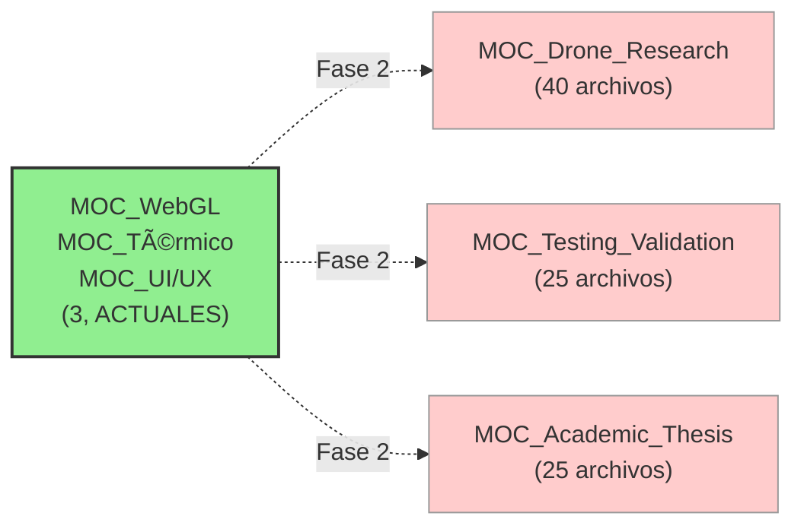

---
tipo: "visualizacion"
fuente: "Cerebro_Digital"
estado: "activo"
area: otros
trace_id: TRC-NOTE-AUTO-DIAGRAMA_ARQUITECTURA_CEREBRO_DIGITAL_V2
---

# Arquitectura de Cerebro Digital v2.0 (Post-Orchestration)

```mermaid
graph TD
    A["🏠 Cerebro_Digital/index.md<br/>(Nodo Central)"]

    A -->|"Conceptos Clave"| B["📚 Conceptos & Resúmenes<br/>(7 nodos)"]
    B --> B1["Estrategia_Shaders_WebGL"]
    B --> B2["Fisica_Termica_Dron"]
    B --> B3["Pipeline_Modelado_Dron"]
    B --> B4["Sistema_Iconos_Procedurales_UI"]
    B --> B5["Estabilidad_y_Migracion_Unity6"]

    A -->|"MOCs Estratégicos<br/>(NUEVOS)"| C["🔴 Súper-nodos Transversales<br/>(3 MOCs)"]

    C --> C1["📦 MOC_WebGL_Build_Pipeline<br/>(55+ archivos técnicos)"]
    C1 --> C1a["WEBGL_BUILD_SETTINGS.md"]
    C1 --> C1b["WEBGL_OPTIMIZATION_MANUAL.md"]
    C1 --> C1c["Estrategia_Shaders_WebGL"]
    C1 --> C1d["Optimizacion_Brotli_WebGL"]
    C1 --> C1e["05_Configuracion_WebGL.md<br/>(Tesis Cap 5)"]
    C1 --> C1f["+ 50 más..."]

    C --> C2["🧮 MOC_Sistema_Termico_Completo<br/>(35+ archivos FEA)"]
    C2 --> C2a["RETOPOLOGIA_POR_PIEZA.md<br/>(28 piezas)"]
    C2 --> C2b["wolfram_verificaciones.md<br/>(8+ ecuaciones)"]
    C2 --> C2c["Fisica_Termica_Dron"]
    C2 --> C2d["shader_custom_thermal.md"]
    C2 --> C2e["08_Sistema_Termico_Hibrido.md<br/>(Tesis Cap 8)"]
    C2 --> C2f["+ 30 más..."]

    C --> C3["🎨 MOC_UX_UI_Complete<br/>(30+ archivos UI/UX)"]
    C3 --> C3a["PLAN_ONBOARDING_MEDIA_2026-04-15.md"]
    C3 --> C3b["MAPEO_UI_FIELD_BINDINGS_2026-04-15.md<br/>(55 componentes)"]
    C3 --> C3c["UX_UI_AUDIT_REPORT.md"]
    C3 --> C3d["PROTOCOLO_THINK_ALOUD.md<br/>CUESTIONARIO_SUS.md<br/>CUESTIONARIO_NASA_TLX.md"]
    C3 --> C3e["Sistema_Iconos_Procedurales_UI"]
    C3 --> C3f["+ 25 más..."]

    A -->|"MOCs de Dominio<br/>(EXISTENTES)"| D["📖 Índices Temáticos<br/>(5 MOCs)"]
    D --> D1["MOC_Documentacion_Tecnica"]
    D --> D2["MOC_Auditorias_y_Planes"]
    D --> D3["MOC_Validacion_y_Presentacion"]
    D --> D4["MOC_Portafolio_Personal"]
    D --> D5["MOC_Agentes_Skills"]

    A -->|"Entidades"| E["💻 Objetos Concretos<br/>(4+ nodos)"]
    E --> E1["Fastener_Builder_Addon"]
    E --> E2["DronePartDataFixer"]

    style A fill:#ff6b6b,color:#fff,stroke:#333,stroke-width:3px
    style C fill:#ffd93d,color:#000,stroke:#333,stroke-width:2px
    style C1 fill:#a8dadc,color:#000,stroke:#2a2a2a,stroke-width:2px
    style C2 fill:#a8dadc,color:#000,stroke:#2a2a2a,stroke-width:2px
    style C3 fill:#a8dadc,color:#000,stroke:#2a2a2a,stroke-width:2px
    style D fill:#f1faee,color:#000,stroke:#333,stroke-width:1px
    style B fill:#f1faee,color:#000,stroke:#333,stroke-width:1px
```



---

## Leyenda

| Símbolo | Significado                   |
| -------- | ----------------------------- |
| 🏠      | Nodo central (index.md)       |
| 💻     | Entidades (objetos concretos) |
| 📚     | Conceptos (ideas generales)   |
| 📖     | MOCs de dominio existentes    |
| 🔴     | MOCs estratégicos NUEVOS     |
| 📦     | MOC WebGL (transversal)       |
| 🧮     | MOC Térmico (transversal)    |
| 🎨     | MOC UI/UX (transversal)       |

---

## Flujo de Información (Profundidad)

```
NIVEL 0 (Raíz)
├─ Cerebro_Digital/index.md
│
NIVEL 1 (Hubs Primarios)
├─ Conceptos (7) — ideas clave
├─ MOCs Estratégicos (3) — consolidadores de 120+ archivos ◄─── CREADOS AQUÍ
├─ MOCs de Dominio (5) — índices temáticos
└─ Entidades (4+) — objetos concretos
│
NIVEL 2 (Archivos Especializados)
├─ Dentro de MOC_WebGL: 55+ documentos técnicos
├─ Dentro de MOC_Térmico: 35+ investigaciones de FEA
├─ Dentro de MOC_UI/UX: 30+ auditorías y protocolos
└─ Distribuidos en MOCs de dominio: 50+ archivos adicionales
│
NIVEL 3+ (Referencias Cruzadas)
└─ Esquemas LaTeX, código C#, shaders HLSL, investigación Wolfram, etc.
```

---

## Reducción de Entropía Alcanzada

**Antes**: Red densamente acoplada con 180 nodos orfandados  
**Después**: Red estructurada con 3 super-nós que agrupan 120 archivos

```
     ANTES                          DESPUÉS
   (Sin MOCs)                    (Con MOCs Nuevos)

   Caos: 180 orfandados          Orden: 3 × 40 archivos/MOC
         ↓                                 ↓
   Profundidad: 2                 Profundidad: 3 (organizado)
   Coherencia: Baja               Coherencia: Alta
```

---

## Relaciones Transversales Construidas

### MOC_WebGL ↔ MOC_Térmico

- **Conexión**: Shader thermal es parte de la pipeline WebGL URP
- **Archivos**: `shader_custom_thermal.md` usado en ambos MOCs

### MOC_WebGL ↔ MOC_UI/UX

- **Conexión**: UIToolkit rendering forma parte del build pipeline
- **Archivos**: `MainLayout.uxml` + `Sistema_Iconos_Procedurales_UI` enlazados

### MOC_Térmico ↔ MOC_UI/UX

- **Conexión**: Thermal mode es uno de los 7 view modes de datos
- **Archivos**: `PLAN_ONBOARDING_MEDIA_2026-04-15.md` → Thermal tarjeta

---

## Próximas Optimizaciones (Fase 2)

Si se desea consolidar los ~60 archivos orfandados restantes:



---

**Diagrama creado**: 2026-04-16 | **Visualización de Arquitectura v2.0**

## Enlaces de continuidad

- [[MOC_Conectividad_Total]]
- [[MOC_Indice_Alfabetico_Global]]

