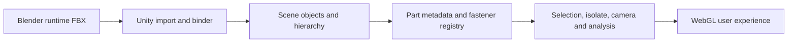

# INF_EST_51 - Guion completo de sustentacion 30 min

> Variante de estudio Obsidian - Articulo 51  
> Version 5.0 - Mayo 08, 2026  
> Estado: guion prospectivo de sustentacion final, escrito como si el proyecto ya estuviera cerrado.  
> Regla de uso: mantener placeholders hasta tener mediciones finales verificadas.

---

## Proposito Del Guion

Este documento sirve como libreto principal para la sustentacion final del proyecto **WebGL Drone Viewer / Visor WebGL interactivo del dron Holybro X500 V2**.

El guion esta escrito en tiempo de proyecto terminado porque la sustentacion debe ensayarse como producto final. Sin embargo, los datos empiricos que dependan del cierre tecnico deben conservar placeholders hasta tener evidencia final:

- `[[FPS_PROMEDIO_FINAL]]`
- `[[PESO_BUILD_WEBGL_FINAL]]`
- `[[TIEMPO_CARGA_FINAL]]`
- `[[CONTEO_PIEZAS_FINAL]]`
- `[[CONTEO_FASTENERS_FINAL]]`
- `[[REDUCCION_POLIGONAL_FINAL]]`
- `[[METRICA_VALIDACION_USUARIO]]`
- `[[FECHA_BUILD_FINAL]]`

La regla academica es simple: el discurso puede decir "se implemento" cuando la funcion existe y fue verificada; debe decir "se midio" solo cuando haya dato medido; y debe usar placeholder cuando el dato todavia depende del freeze final.

---

## Idea Central

El proyecto no nace solamente de querer mostrar un dron en 3D. Nace de una friccion muy concreta: aprender, inspeccionar y explicar sistemas tecnicos complejos usando manuales, listas de partes y capturas 2D obliga al usuario a hacer demasiado trabajo mental.

La idea que conecta con el publico es esta:

> Tengo una pereza muy especifica: la pereza de repetir tareas tediosas que una herramienta podria ayudarme a hacer. Esa pereza no me ha hecho hacer menos; al contrario, me ha empujado a automatizar, ordenar, visualizar y construir sistemas que me faciliten la vida. Lo curioso es que muchas veces construir la herramienta termina siendo mas complejo que la tarea original. Pero justo ahi aparece el aprendizaje de ingenieria.

Esa idea no es solo una frase de motivacion personal. Tambien explica por que este proyecto fue tomando forma como una herramienta de apoyo tecnico y no solo como una visualizacion bonita. Durante el desarrollo aparecieron referencias externas muy utiles en el campo de las instrucciones 3D interactivas, donde CAD de fabricantes se convierte en guias paso a paso con voz, animacion y un enfoque mobile-first. Esa linea de trabajo refuerza una intuicion clave de esta tesis: para tareas complejas, una guia interactiva bien diseñada puede reducir errores, acelerar comprension y volver mas legible el trabajo tecnico.

La misma logica aparece dentro de la propia app: cuando una tarea tecnica exige repetir, buscar, comparar o recordar demasiado, el sistema trata de hacer esa carga mas ligera con selecciones, aislamiento, guia de ensamble, puntos de conexion, medicion y listado de materiales. Ahí la pereza productiva deja de ser una idea abstracta y se convierte en criterio de diseno.

Esa referencia externa de instruccion 3D no se incorpora como comparacion de marca en la sustentacion, sino como una inspiracion implicita para pensar futuras guias tecnicas mas narrativas y asistidas.

Esa "pereza productiva" se convierte en una decision de diseno:

- Si consultar un manual obliga a imaginar la pieza, la app debe mostrarla.
- Si encontrar un tornillo exige revisar nombres y tablas, la app debe aislarlo.
- Si entender una relacion espacial exige desmontar mentalmente el dron, la app debe explotar, filtrar y guiar.
- Si un CAD completo es demasiado pesado para WebGL, el sistema debe optimizar sin perder significado tecnico.

---

## Hilo Conductor

El hilo narrativo recomendado para la sustentacion es:

1. **Friccion humana**: hay tareas tecnicas que no son dificiles por concepto, sino por repetitivas, dispersas y lentas.
2. **Problema de representacion**: los manuales y CAD tradicionales no siempre comunican bien relaciones espaciales, jerarquias y mantenimiento.
3. **Hipotesis de solucion**: un visor WebGL interactivo puede reducir esa friccion si integra modelo optimizado, seleccion semantica, inspeccion, analisis visual y estados del dron.
4. **Desarrollo ingenieril**: no basta importar el CAD; hay que depurar geometria, materiales, jerarquias, fasteners, metadata, texturas, rendimiento y UX.
5. **Producto resultante**: una app que permite explorar el X500 V2 por piezas, grupos, fasteners, modos visuales, corte, explosion, thermal y encendido.
6. **Aporte**: una metodologia replicable para transformar un ensamble CAD tecnico en una experiencia WebGL didactica y mantenible.

---

## Convenciones De Presentacion

- Hablar en primera persona cuando se explique motivacion y decisiones propias.
- Hablar en tercera persona o voz tecnica cuando se describa arquitectura, metodologia y resultados.
- Usar "placeholder" solo internamente; en la diapositiva final debe aparecer el dato real o una etiqueta clara de "pendiente de medicion final" si aun no se ha cerrado.
- No prometer ratios de optimizacion no medidos.
- No afirmar validacion de usuarios si no existe evidencia.
- No ocultar limitaciones: el proyecto gana credibilidad cuando se muestran decisiones y fronteras tecnicas.

---

## Mapa De Tiempo

|        Tiempo | Bloque              | Objetivo                                                          |
| ------------: | ------------------- | ----------------------------------------------------------------- |
|   0:00 - 1:20 | Gancho humano       | Conectar con pereza productiva y automatizacion                   |
|   1:20 - 2:40 | Contexto y problema | Mostrar por que manual/CAD no bastan                              |
|   2:40 - 4:00 | Objetivo y alcance  | Definir que resuelve el visor                                     |
|   4:00 - 6:20 | Fundamento tecnico  | WebGL, CAD, optimizacion, interaccion                             |
|   6:20 - 9:30 | Metodologia         | Pipeline Blender -> Unity -> WebGL                                |
|  9:30 - 12:20 | Modelo y datos      | Jerarquia, metadata, fasteners, texturas                          |
| 12:20 - 23:20 | Demo de app         | Flujo completo: explorar, seleccionar, aislar, encender, analizar |
| 23:20 - 25:20 | Arquitectura        | Como se sostiene tecnicamente                                     |
| 25:20 - 27:30 | Resultados          | Medidas, rendimiento y verificacion                               |
| 27:30 - 29:00 | Aportes y limites   | Que aporta y que queda abierto                                    |
| 29:00 - 30:00 | Cierre              | Volver al hilo humano y tecnico                                   |

---

## Guia De Animaciones Para La Presentacion

Las animaciones deben ayudar a entender. No deben ser decoracion. La regla es: si una animacion no guia la atencion o no explica una transformacion, se elimina.

### Animaciones Recomendadas

| Codigo | Momento          | Animacion                                                                          | Intencion                                     |
| ------ | ---------------- | ---------------------------------------------------------------------------------- | --------------------------------------------- |
| A01    | Gancho           | Lista de tareas tediosas aparece una a una y se transforma en una herramienta      | Conectar pereza productiva con automatizacion |
| A02    | Problema         | Manual 2D se desvanece hacia ensamble 3D                                           | Mostrar salto de representacion               |
| A03    | CAD a WebGL      | Malla pesada se simplifica en tres capas: geometria, materiales, metadata          | Explicar optimizacion                         |
| A04    | Jerarquia        | Partes madre aparecen primero; subpiezas y fasteners entran despues como nodos     | Comunicar estructura de ensamble              |
| A05    | Fasteners        | Muchos tornillos se agrupan por familia y luego se expanden en instancias          | Explicar sistema modular                      |
| A06    | Demo UI          | Hero -> Explore -> seleccion -> bottom sheet aparece por etapas                    | Ordenar el flujo de uso                       |
| A07    | Aislamiento      | Pieza madre queda visible y el resto baja opacidad; sus fasteners quedan incluidos | Explicar aislamiento semantico                |
| A08    | Fastener aislado | Tornillo pasa de proxy a modelo modular detallado                                  | Mostrar detalle bajo demanda                  |
| A09    | Encendido        | Estado OFF -> STARTING -> IDLE -> LOAD -> FLYING con helices acelerando            | Comunicar comportamiento dinamico             |
| A10    | Thermal          | Gradiente termico aparece sobre zonas relevantes con leyenda                       | Mostrar analisis visual, no simulacion FEA    |
| A11    | Corte            | Plano de corte atraviesa el dron de forma lenta                                    | Explicar inspeccion interna                   |
| A12    | Resultados       | Tarjetas de metricas se llenan una a una                                           | Evitar saturar la audiencia                   |

### Ritmo Visual

- Usar apariciones por etapas para jerarquia, pipeline y arquitectura.
- Usar transiciones tipo "morph" solo cuando se explique transformacion: CAD pesado a modelo optimizado, proxy a modular, manual a visor.
- Evitar que todos los elementos entren a la vez.
- Las metricas finales deben aparecer despues de explicar que se midio.
- La demo grabada debe tener pausas visibles entre acciones: seleccionar, aislar, resetear, encender, analizar.

---

# Guion Canonico

## 0:00 - 1:20 - Gancho Inicial: La Pereza Productiva

**Diapositiva:** "De una tarea tediosa a una herramienta interactiva"  
**Visual:** Manual tecnico, lista de piezas, modelo CAD pesado y app final como cuatro capas.

**Guion:**

Buenos dias. Quiero empezar con una confesion tecnica: este proyecto tambien nace de la pereza.

Pero no de la pereza de no hacer. Mas bien de una pereza muy especifica: la pereza de repetir tareas tediosas, de buscar una pieza en un manual, de comparar nombres, de imaginar mentalmente como va ensamblado algo, de abrir un CAD pesado solo para entender un detalle pequeno.

Con el tiempo me di cuenta de que esa pereza puede ser util. Cuando una tarea se vuelve repetitiva o lenta, aparece una pregunta de ingenieria:

> ?Por que no construir una herramienta que haga esa parte mas facil?

Lo ironico es que muchas veces esa herramienta termina siendo mas compleja que la tarea original. Facilitarse la vida puede exigir muchisimo trabajo. Pero ese trabajo deja un sistema, una metodologia y una forma mas clara de entender el problema.

Este proyecto sigue esa logica. En lugar de obligar al usuario a reconstruir mentalmente el dron Holybro X500 V2 desde manuales, tablas y archivos CAD, desarrolle un visor WebGL que permite explorar el ensamble, seleccionar piezas, aislar componentes, inspeccionar fasteners, activar estados del dron y analizar visualmente su estructura.

**Animacion sugerida:** A01. Las tareas "buscar", "imaginar", "comparar", "abrir CAD", "explicar" aparecen como carga cognitiva. Luego se condensan en "automatizar la inspeccion".

---

## 1:20 - 2:40 - Contexto Y Problema

**Diapositiva:** "El problema no es solo ver el dron; es entenderlo rapido"  
**Visual:** Comparacion entre manual PDF, CAD tecnico y visor web.

**Guion:**

El dron usado como caso de estudio es el Holybro X500 V2, una plataforma modular de UAV con multiples placas, brazos, motores, tren de aterrizaje, electronica y tornilleria.

El problema aparece cuando se quiere estudiar, explicar o inspeccionar el ensamble completo. Los manuales son utiles, pero fragmentan la informacion. El CAD contiene la geometria, pero no siempre esta preparado para tiempo real. Y cuando se lleva todo directamente a WebGL, aparecen cuellos de botella: demasiados poligonos, materiales no optimizados, jerarquias poco claras, nombres inconsistentes y piezas repetidas.

Entonces la pregunta de investigacion se puede resumir asi:

> ?Como transformar un ensamble CAD tecnico en una aplicacion WebGL interactiva, ligera y semanticamente util para inspeccion y aprendizaje?

No se trata solo de mostrar un modelo bonito. Se trata de conservar significado tecnico: que una pieza pueda seleccionarse, que un grupo pueda aislarse, que los fasteners conserven metadata, que el usuario entienda relaciones, y que el navegador siga respondiendo.

**Animacion sugerida:** A02. Un manual 2D se divide en piezas dispersas; despues esas piezas se reagrupan como modelo interactivo.

---

## 2:40 - 4:00 - Objetivo Y Alcance

**Diapositiva:** "Objetivo general"  
**Visual:** Diagrama con tres columnas: optimizar, enriquecer, interactuar.

**Guion:**

El objetivo general fue desarrollar un visor WebGL interactivo para el dron Holybro X500 V2, integrando optimizacion 3D, organizacion semantica de piezas y herramientas de inspeccion visual.

El proyecto se organizo alrededor de tres ejes:

- Primero, preparar el modelo 3D para tiempo real: limpiar geometria, reducir carga, hornear texturas y controlar materiales.
- Segundo, estructurar la informacion tecnica: piezas madre, subpiezas, fasteners, metadata, hotspots y estados del dron.
- Tercero, construir una experiencia de usuario que permita explorar, seleccionar, aislar, analizar y entender el dron sin depender del CAD original.

El alcance final no fue crear un simulador fisico completo ni una herramienta FEA. Fue crear una aplicacion interactiva de visualizacion tecnica, con comportamiento coherente, rendimiento medible y una arquitectura extensible.

**Animacion sugerida:** Tres capas entran una por una: modelo optimizado, datos tecnicos, experiencia interactiva.

---

## 4:00 - 6:20 - Fundamento Tecnico

**Diapositiva:** "De CAD tecnico a experiencia WebGL"  
**Visual:** Pipeline CAD -> Blender -> bake -> Unity -> WebGL.

**Guion:**

La base tecnica del proyecto combina tres areas.

La primera es la visualizacion 3D en tiempo real. Un navegador no trabaja igual que un software CAD. En CAD se prioriza precision, historial de operaciones y detalle de manufactura. En WebGL se prioriza respuesta interactiva, triangulacion eficiente, materiales compactos y control de draw calls.

La segunda es la optimizacion de assets. Para que el dron pueda verse en tiempo real, no basta con exportar. Hay que decidir que detalles quedan como geometria, que detalles pasan a mapas de normales, que texturas se empaquetan y que elementos repetidos pueden manejarse como instancias o recetas modulares.

La tercera es la semantica de producto. Un mesh por si solo no sabe que es una placa, un brazo, una tuerca o un tornillo. La app necesita una capa de datos que conecte objetos de escena con informacion tecnica, categorias, grupos, relaciones padre-hijo y comportamiento de UI.

Por eso el proyecto no se resolvio solo como modelado ni solo como programacion. Fue una integracion entre arte tecnico, ingenieria de datos, optimizacion WebGL y diseno de interaccion.

**Animacion sugerida:** A03. El CAD se separa en capas: geometria, textura, metadata y runtime.

---

## 6:20 - 9:30 - Metodologia

**Diapositiva:** "Metodologia de trabajo"  
**Visual:** Ciclo iterativo: auditar -> optimizar -> importar -> validar -> documentar.

**Guion:**

La metodologia fue iterativa. Cada avance del modelo se contrasto con su comportamiento en Unity y con la documentacion del proyecto.

El flujo general fue:

1. Recolectar informacion del dron, manuales, inventarios y estructura CAD.
2. Preparar el modelo en Blender, separando masters, instancias, colecciones runtime y fasteners primitivos.
3. Hornear informacion visual en atlas: color base, normales, AO, roughness, metallic y mask compacta.
4. Importar el FBX final en Unity preservando jerarquia, transformaciones e instancias utiles.
5. Reconstruir seleccion, filtros, isolate, hotspots, fasteners, helices y estados del dron.
6. Validar que la experiencia siga siendo interactiva y que los datos tecnicos se mantengan trazables.

Algo importante es que los masters no se eliminaron. En este ensamble, masters e instancias forman juntos el dron completo. Por eso el runtime debe incluir:

- `BAKE_MASTERS_LOW`
- `ASSEMBLY_INSTANCES_LOW`
- `PRIMITIVE_FASTENER_MASTERS`
- `PRIMITIVE_FASTENER_INSTANCES`

Esa decision evita perder piezas fisicas del ensamble y mantiene una correspondencia mas fiel con el modelo final.

**Animacion sugerida:** Pipeline con checks. El ultimo check dice "validar en app, no asumir".

---

## 9:30 - 12:20 - Modelo, Texturas Y Datos

**Diapositiva:** "El modelo no es solo geometria"  
**Visual:** Modelo del dron con llamadas a atlas, metadata, grupos y fasteners.

**Guion:**

El modelo final se trabajo como una combinacion de geometria optimizada, texturas horneadas y datos tecnicos.

Para materiales, se preparo un atlas 4K para el dron principal. El objetivo fue conservar la apariencia del material de Blender, incluyendo fibra de carbono, metales, plasticos y goma, sin recrear todo desde cero en Unity.

La estrategia final de mapas fue:

- `BaseColor 4K` en sRGB.
- `Normal 4K` como mapa normal en espacio tangente.
- `Mask 4K` en formato compacto: `R=AO`, `G=Roughness`, `B=Curvature`, `A=Metallic`.
- Texturas pequenas separadas para cabezas de fasteners primitivos, por ejemplo atlas de 256 x 256 para AO y normal.

La curvature queda como canal disponible para efectos de lectura visual o shaders custom. Si no se usa en el shader final, no debe inflar complejidad visual innecesaria.

En datos, la app conserva jerarquia de piezas madre, subpiezas, fasteners y hotspots. Esta parte es clave porque permite que el usuario no solo vea objetos, sino que entienda relaciones:

- una placa puede aislarse con sus fasteners correspondientes;
- un fastener puede aislarse individualmente;
- una familia de tornillos puede compartir receta modular;
- una pieza seleccionada puede mostrar metadata tecnica en la interfaz.

**Animacion sugerida:** A04 y A05. Primero jerarquia de piezas; despues los fasteners se agrupan por familia y se expanden por instancia.

---

## 12:20 - 13:20 - Transicion A La Demo

**Diapositiva:** "Del pipeline al uso real"  
**Visual:** Captura limpia de la app en estado inicial.

**Guion:**

Hasta aqui he mostrado el problema y el pipeline. Ahora paso a la aplicacion, porque ahi se ve si las decisiones tecnicas realmente ayudan al usuario.

La demo esta organizada como una historia de uso. No voy a mostrar botones sueltos. Voy a mostrar que ocurre cuando alguien necesita entender el dron: primero entra, luego explora, despues selecciona, aisla, revisa detalles, enciende estados y finalmente analiza.

**Animacion sugerida:** A06. La UI aparece por etapas: Hero, Explore, panel de seleccion, herramientas.

---

## 13:20 - 15:00 - Inicio De App Y Navegacion Base

**Diapositiva:** "Explorar sin abrir CAD"  
**Visual:** Video corto de landing/hero y entrada al visor.

**Guion:**

La aplicacion inicia con una experiencia guiada. El usuario no entra directamente a una escena tecnica saturada; primero entiende que esta viendo el X500 V2 y que puede explorarlo.

Al entrar al visor, el modelo completo aparece en modo realista. Desde ahi se puede orbitar, hacer zoom y pan. La camara se adapta al tamano de lo que se esta observando: no se comporta igual con el dron completo que con una tuerca o un tornillo.

Esta decision fue importante porque en un modelo con escalas tan diferentes, una camara unica se vuelve incomoda. Un fastener necesita sensibilidad fina; el dron completo necesita desplazamiento amplio.

**Demo:** Mostrar dron completo, orbitar suavemente, hacer zoom moderado y resetear vista.

**Animacion sugerida:** Flechas discretas sobre orbit, pan y zoom. No saturar.

---

## 15:00 - 16:40 - Seleccion Y Metadata

**Diapositiva:** "Cada pieza tiene contexto"  
**Visual:** Seleccion de una pieza con bottom sheet abierto.

**Guion:**

La seleccion es uno de los nucleos del proyecto. Cuando el usuario hace hover, la pieza responde visualmente. Cuando la selecciona, la app muestra una ficha con informacion contextual.

La UI evita que el modelo sea solo un conjunto de meshes. Cada objeto seleccionable se conecta con datos: nombre, categoria, descripcion, grupo, parte padre y, cuando aplica, informacion tecnica especifica.

En fasteners, la ficha ya no usa una descripcion generica. Ahora puede mostrar familia, metrica, longitud, tipo de cabeza, subtipo, material, acabado, nombre CAD o Blender y relacion con la pieza madre.

Esto permite responder preguntas concretas:

- ?que estoy mirando?
- ?a que grupo pertenece?
- ?de que pieza depende?
- ?es una pieza estructural, electronica, mecanica o un fastener?

**Demo:** Seleccionar una placa, una pieza electronica y un fastener. Mostrar que la UI cambia segun el tipo.

**Animacion sugerida:** El panel de detalle se construye por bloques: identidad, categoria, datos tecnicos, acciones.

---

## 16:40 - 18:30 - Aislamiento De Piezas Madre, Subpiezas Y Fasteners

**Diapositiva:** "Aislar sin perder relacion de ensamble"  
**Visual:** Pieza madre con subpiezas y fasteners asociados.

**Guion:**

Una funcion critica es el aislamiento. En una app de inspeccion tecnica, aislar una pieza no deberia significar perder su contexto mecanico.

Por eso el sistema distingue entre tres casos:

- Si se aisla una pieza madre, se muestran sus subpiezas y fasteners asociados.
- Si se aisla una subpieza, se puede ver individualmente sin arrastrar objetos que no correspondan.
- Si se aisla un fastener, el fastener queda solo, no unido artificialmente a una placa.

Este punto fue especialmente delicado porque en modelos CAD o Blender es comun que una tornilleria quede agrupada visualmente con placas o colecciones. La app no puede asumir que el parentesco grafico es igual al parentesco tecnico. Por eso se trabajo una capa de relaciones para que el aislamiento responda a la logica del ensamble.

**Demo:** Aislar una pieza madre con sus fasteners; luego aislar un solo fastener; despues hacer click en fondo y verificar que se limpia seleccion y hover.

**Animacion sugerida:** A07. El resto del dron baja opacidad y la pieza aislada queda con sus fasteners.

---

## 18:30 - 20:00 - Fasteners Modulares Y Detalle Bajo Demanda

**Diapositiva:** "Detalle cuando hace falta, ligereza cuando no"  
**Visual:** Proxy de tornillo -> modelo modular.

**Guion:**

La tornilleria plantea un problema muy interesante. Un dron puede tener muchos tornillos, tuercas, standoffs y grommets. Si todos se modelan con detalle alto todo el tiempo, el costo visual aumenta mucho. Pero si se simplifican demasiado, se pierde lectura tecnica.

La solucion implementada fue un sistema modular. En reposo, los fasteners pueden estar representados por geometria ligera. Cuando el usuario aisla un fastener, o cuando el zoom llega a una escala donde el detalle importa, la app reemplaza el proxy por un modelo modular.

Para tornillos, la receta se organiza por partes:

- cabeza;
- seccion media repetible;
- extremo inferior.

Para otros fasteners se usan recetas equivalentes:

- tuercas tipo flange, lock o nyloc;
- standoffs;
- grommets de goma;
- tube stoppers;
- piezas de soporte o separadores.

La ventaja es que el detalle se activa bajo demanda. La escena completa no carga todos los modelos detallados al mismo tiempo, pero el usuario puede acercarse y revisar cada fastener cuando lo necesita.

**Demo:** Seleccionar/aislar un tornillo y mostrar reemplazo modular. Repetir con una tuerca o fastener no tipo tornillo si esta disponible.

**Animacion sugerida:** A08. Proxy se oculta, aparece modelo modular con nombre de familia e instancia.

---

## 20:00 - 21:40 - Encendido Del Dron Y Estados Dinamicos

**Diapositiva:** "El modelo tambien comunica estado"  
**Visual:** Secuencia OFF -> STARTING -> IDLE -> LOAD -> FLYING.

**Guion:**

Ademas de inspeccionar piezas estaticas, la app incluye estados del dron. Esto ayuda a comunicar que el modelo no es solo una maqueta, sino una interfaz interactiva.

El flujo de encendido se presenta como una secuencia:

- `OFF`: el dron esta apagado.
- `STARTING`: el sistema inicia y prepara componentes visuales.
- `IDLE`: el dron esta encendido, pero sin carga de vuelo.
- `LOAD`: se incrementa la exigencia del sistema.
- `FLYING`: las helices muestran giro activo y el estado visual cambia.

Las helices deben girar sobre el eje correcto de cada propeller, no sobre un eje global asumido. Esto es importante porque al importar modelos desde Blender o FBX, las orientaciones locales pueden cambiar. El runtime debe resolver la orientacion real del objeto.

En esta parte tambien se conecta el modo termico. El thermal no se presenta como simulacion fisica exacta, sino como visualizacion educativa de zonas, estados y comportamiento esperado del sistema.

**Demo:** Encender el dron, mostrar aceleracion de helices, activar carga/estado de vuelo y alternar thermal.

**Animacion sugerida:** A09. Estados aparecen como una linea de tiempo; las helices tienen ramp-up progresivo.

---

## 21:40 - 23:20 - Analyze, Corte, Explosion Y Modos Visuales

**Diapositiva:** "Analizar sin desmontar fisicamente"  
**Visual:** Tres capturas: explode, corte, thermal.

**Guion:**

El modulo de analisis concentra herramientas para entender estructura y relaciones espaciales.

El modo explode separa componentes para revelar como se distribuyen. El corte permite inspeccionar interior y atravesar visualmente el modelo. Los modos visuales como X-Ray, Solid y Thermal cambian la forma de leer el ensamble.

Lo importante es que estas herramientas no reemplazan la seleccion ni el catalogo; las complementan. El usuario puede seleccionar una pieza, aislarla, cambiar modo visual, aplicar corte y volver al estado base sin perder consistencia.

El reto tecnico fue mantener la UX estable: hover, color de seleccion, isolate, catalogo, hotspots, explode y thermal debian convivir sin pisarse entre si.

**Demo:** Activar explode, mover corte, cambiar modo visual, volver a realistic.

**Animacion sugerida:** A10 y A11. Thermal aparece con leyenda; corte se desplaza lentamente.

---

## 23:20 - 25:20 - Arquitectura De La App

**Diapositiva:** "Arquitectura runtime"  
**Visual:** Diagrama por capas.

**Guion:**

La arquitectura se puede entender por capas.

En la base esta el modelo importado desde Blender: FBX final, masters, instancias, materiales y texturas externas.

Encima esta la capa de binding runtime. Esta capa sanea jerarquias, detecta piezas, normaliza fasteners, conecta ids y prepara objetos seleccionables.

Luego esta la capa de datos. Incluye definiciones de partes, familias de fasteners, instancias, recetas modulares, catalogo, hotspots y relaciones padre-hijo.

Encima esta la capa de interaccion: seleccion, hover, aislamiento, camara adaptativa, paneles UI, filtros, modes y herramientas de analisis.

Finalmente esta la capa de experiencia: la demo que ve el usuario como producto. Lo importante es que el usuario no necesita saber que hay varias capas; simplemente interactua con el dron.

**Diagrama sugerido:**

**Animacion sugerida:** Cada capa entra desde abajo hacia arriba. Evitar mostrar demasiadas clases a la vez.

---

## 25:20 - 27:30 - Resultados Y Verificacion

**Diapositiva:** "Resultados medidos"  
**Visual:** Tarjetas de metricas con placeholders hasta cierre.

**Guion:**

Los resultados deben separarse en dos grupos: resultados implementados y resultados medidos.

Como resultados implementados, el proyecto entrega:

- visor WebGL interactivo del Holybro X500 V2;
- modelo optimizado con atlas de texturas;
- jerarquia de piezas madre, subpiezas y fasteners;
- seleccion, hover, aislamiento y catalogo;
- modos Realistic, X-Ray, Solid y Thermal;
- herramientas de Analyze como explode y corte;
- flujo de encendido y estados dinamicos;
- sistema modular de fasteners bajo demanda;
- documentacion tecnica, manual de usuario y paquete de sustentacion.

Como resultados medidos, se reportan los valores finales:

- FPS promedio: `[[FPS_PROMEDIO_FINAL]]`.
- Tamano del build WebGL: `[[PESO_BUILD_WEBGL_FINAL]]`.
- Tiempo de carga: `[[TIEMPO_CARGA_FINAL]]`.
- Conteo final de piezas runtime: `[[CONTEO_PIEZAS_FINAL]]`.
- Conteo final de fasteners: `[[CONTEO_FASTENERS_FINAL]]`.
- Reduccion geometrica frente a fuente CAD: `[[REDUCCION_POLIGONAL_FINAL]]`.
- Resultado de validacion de uso: `[[METRICA_VALIDACION_USUARIO]]`.

Si algun valor no ha sido medido al momento de presentar una version preliminar, se debe decir explicitamente:

> Esta metrica queda pendiente de medicion post-freeze y no se reporta como resultado cerrado.

**Animacion sugerida:** A12. Primero "implementado", luego "medido". No mostrar porcentajes antes de explicar su fuente.

---

## 27:30 - 28:30 - Aportes

**Diapositiva:** "Aportes del proyecto"  
**Visual:** Cuatro aportes como tarjetas.

**Guion:**

El aporte principal es una metodologia completa para llevar un ensamble tecnico a una experiencia WebGL interactiva, sin tratar el modelo como un objeto decorativo.

El proyecto aporta:

- una ruta de optimizacion CAD -> Blender -> Unity -> WebGL;
- una estrategia de metadata para piezas, grupos y fasteners;
- un sistema modular para inspeccionar tornilleria sin pagar el costo completo en reposo;
- una experiencia didactica para comprender un dron por seleccion, aislamiento, analisis y estados.

Tambien ya integra herramientas de soporte tecnico que van en la misma linea de esa pereza productiva: guia de ensamble, puntos de conexion, medicion, BOM, anotaciones y checklist. Son capacidades que no solo decoran el proyecto, sino que reducen friccion cuando el usuario necesita entender o verificar el hardware.

Como inspiracion de futuro, las plataformas industriales de instrucciones 3D muestran una direccion interesante para una version posterior de la plataforma: incorporar guias mas narrativas, con secuencias paso a paso, asistencia contextual y soporte para mantenimiento o ensamblaje tecnico de hardware complejo. La diferencia importante es el enfoque: aqui no se busca una guia de consumo general, sino una capa tecnica aplicada al dron y a otros sistemas de ingenieria donde la lectura espacial y la jerarquia de piezas son criticas.

Para mi, el valor esta en que la app convierte informacion dispersa en una experiencia manipulable. Vuelve mas facil una tarea que antes dependia de manuales, CAD pesado y bastante paciencia.

---

## 28:30 - 29:20 - Limites Y Trabajo Futuro

**Diapositiva:** "Limites honestos"  
**Visual:** Lista breve.

**Guion:**

El proyecto tambien tiene limites claros.

No es una simulacion aerodinamica. No reemplaza validacion mecanica ni termica real. El modo thermal es una representacion visual educativa, no una solucion FEA. Algunas metricas dependen del build final y deben medirse despues del freeze tecnico.

Como trabajo futuro quedan:

- reemplazar placeholders modulares por meshes finales de Blender cuando esten listos;
- completar mediciones comparativas de rendimiento;
- fortalecer validacion con usuarios;
- extender datos tecnicos de torque, herramienta y mantenimiento cuando exista fuente confiable;
- mejorar exportacion e importacion automatizada con manifests mas ricos.

Estos limites no debilitan el proyecto. Al contrario, delimitan con precision que hace la app y que no pretende hacer.

Una derivacion natural para trabajo futuro es justamente llevar parte de la experiencia de instruccion guiada que vemos en las plataformas industriales de 3D interactivo hacia un entorno tecnico mas especializado: secuencias de mantenimiento, ayudas para montaje, rutas de inspeccion y microguia contextual para hardware complejo, siempre preservando la trazabilidad de piezas y la precision tecnica.

---

## 29:20 - 30:00 - Cierre

**Diapositiva:** "Facilitar una tarea tambien puede ser ingenieria"  
**Visual:** Volver al contraste inicial: tarea tediosa -> herramienta.

**Guion:**

Quiero cerrar volviendo a la idea inicial.

La pereza productiva no es evitar el trabajo. Es detectar que hay una tarea repetitiva, lenta o innecesariamente dificil, y preguntarse si se puede construir una herramienta para hacerla mejor.

Este proyecto empezo con esa inquietud: ?por que estudiar un dron complejo solo desde manuales, tablas y CAD pesado, si podemos convertirlo en una experiencia interactiva?

El resultado es un visor WebGL que optimiza, organiza y comunica un ensamble tecnico. No solo muestra el X500 V2; permite explorarlo, aislarlo, encenderlo, analizarlo y entenderlo por partes.

Y aunque facilitar la vida termino siendo mas complejo que la tarea original, ese es precisamente el valor del proyecto: convertir una friccion tecnica en un sistema replicable.

Muchas gracias.

---

# Version Ultra Breve Para Ensayo De 5 Minutos

Este proyecto desarrolla un visor WebGL interactivo para el dron Holybro X500 V2.

La motivacion nace de una friccion practica: estudiar un sistema tecnico desde manuales, tablas y CAD pesado exige demasiado trabajo mental. Mi punto de partida fue una forma de pereza productiva: si una tarea es tediosa y repetitiva, vale la pena construir una herramienta que la haga mas clara.

La solucion fue transformar el ensamble del dron en una aplicacion web. Para eso se optimizo el modelo en Blender, se bakearon texturas, se preparo un FBX runtime con masters e instancias, y en Unity se construyo una capa de seleccion, metadata, aislamiento, modos visuales, fasteners modulares, encendido y analisis.

La app permite navegar el dron completo, seleccionar piezas, ver datos tecnicos, aislar piezas madre con sus subpiezas y fasteners, aislar fasteners individualmente, activar modelos modulares bajo demanda, encender el dron, ver helices en movimiento, alternar thermal, aplicar corte y explosion.

El aporte no es solo visual. Es una metodologia para convertir un CAD tecnico en una experiencia WebGL didactica, optimizada y semanticamente estructurada.

Los resultados finales se reportan con metricas medidas: FPS, peso del build, tiempo de carga, conteo de piezas, conteo de fasteners y validacion de uso. Lo que no este medido no se presenta como resultado cerrado.

---

# Checklist De Demo En Vivo

Antes de sustentar, verificar:

- La app abre sin errores bloqueantes.
- El modelo final aparece completo.
- Las helices giran en el eje correcto.
- Hover y seleccion limpian correctamente color y estado.
- El zoom se adapta al dron completo y a piezas pequenas.
- El pan no pierde fasteners pequenos al estar aislados.
- Una pieza madre se aisla con sus fasteners correspondientes.
- Un fastener se puede aislar solo.
- Un fastener aislado activa modelo modular.
- El fondo deselecciona sin dejar hover azul residual.
- Encendido cambia estados visuales.
- Thermal se presenta como visualizacion educativa.
- Explode, corte, catalogo y hotspots no rompen la seleccion.
- Los placeholders de metricas ya fueron reemplazados por datos reales o marcados como pendientes.

---

# Checklist De Placeholders

Reemplazar antes de la sustentacion final:

- `[[FPS_PROMEDIO_FINAL]]`
- `[[PESO_BUILD_WEBGL_FINAL]]`
- `[[TIEMPO_CARGA_FINAL]]`
- `[[CONTEO_PIEZAS_FINAL]]`
- `[[CONTEO_FASTENERS_FINAL]]`
- `[[REDUCCION_POLIGONAL_FINAL]]`
- `[[METRICA_VALIDACION_USUARIO]]`
- `[[FECHA_BUILD_FINAL]]`

---

# Notas Para El Sustentador

- La historia personal de la pereza debe sonar honesta, no comica en exceso. Es una entrada humana hacia una decision de ingenieria.
- La app se debe mostrar en orden de uso, no en orden de implementacion.
- No explicar todos los scripts ni todas las clases. Mostrar capas y decisiones.
- Cuando se hable de fasteners, insistir en la idea de "detalle bajo demanda".
- Cuando se hable de thermal, aclarar que es visualizacion educativa, no simulacion fisica certificada.
- Cuando se hable de resultados, separar implementacion de medicion.
- Si ocurre un bug durante la demo, volver a una captura o video preparado y explicar el comportamiento esperado sin improvisar metricas.
