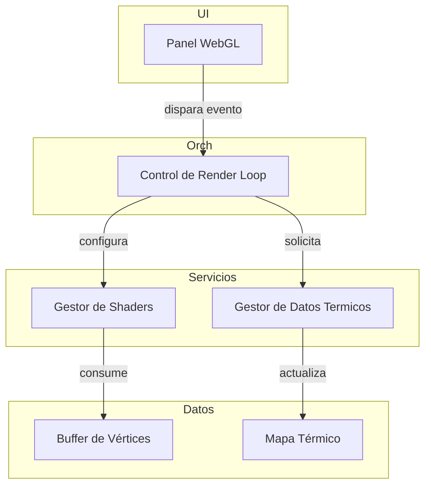
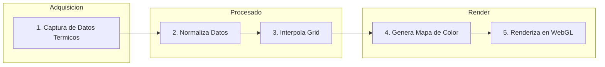
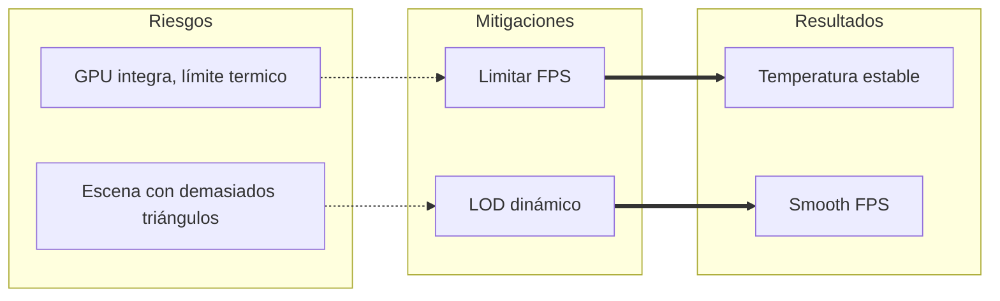
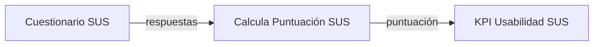
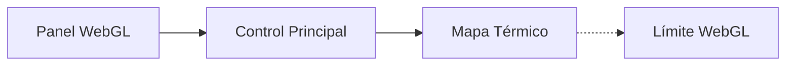
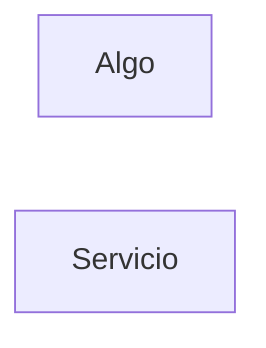

# Actua como principal investigador experto en visualizacion de informacion, diagramacion tecnica y diseno de sistemas visuales para documentacion de ingenieria.

Contexto:

- Proyecto academico de tesis tecnica (ingenieria de software + visualizacion WebGL).
- Ya existen 13 diagramas Mermaid (arquitectura, eventos, estados, flujo de seleccion, shaders, datos, termico, restricciones WebGL, despliegue y plantillas de resultados).
- Necesitamos una investigacion exhaustiva para convertirlos en un sistema visual profesional, coherente y altamente legible.

Objetivo principal:

- Entregar una guia de referencia "state of the art" para construir diagramas Mermaid coherentes, consistentes y especialmente esteticos, con un sistema de diseno reusable donde cada color y estilo tenga semantica estable.

Entregables requeridos:

1) Fundamentos de legibilidad para diagramas tecnicos:

- Principios perceptuales (jerarquia, contraste, agrupacion, direccion visual, densidad).
- Buenas practicas de flujo (minimizar cruces, limitar longitudes, ortogonalidad, agrupacion por capas).
- Criterios medibles de calidad visual.

2) Sistema de diseno Mermaid completo:

- Paleta semantica con tokens (rol de color fijo por tipo de nodo/conexion).
- Tipografia, tamanos, espaciado, grosor de borde, estilo de flechas.
- Reglas de uso de colores para: capa UI, orquestacion, servicios, datos, eventos, estados, riesgo/restriccion, mitigacion, resultados.
- Version clara y version oscura del mismo sistema.

3) Estilo de conexiones:

- Estándar para tipo de flecha por semantica (flujo funcional, evento, dependencia auxiliar, validacion, fallback).
- Convenciones de etiquetas de aristas (verbos permitidos, longitud maxima, formato).

4) Patrones por tipo de diagrama:

- Flowchart arquitectonico.
- Maquina de estados.
- Pipeline secuencial.
- Causa -> mitigacion -> resultado.
- Plantillas de resultados (SUS, NASA-TLX, KPIs).

5) Anti-patrones:

- Errores comunes que afectan legibilidad y coherencia.
- Como detectarlos y corregirlos.

6) Guia de implementacion en Mermaid:

- Bloques init recomendados.
- classDef estandar y nomenclatura de clases visuales.
- Snippets listos para copiar.
- Compatibilidad en VS Code Markdown preview (incluyendo limitaciones de parser).

7) Benchmark visual:

- Comparar 3 estilos de referencia (minimal tecnico, elegante academico, corporativo ingenieria).
- Pros y contras de cada uno.
- Recomendar 1 estilo final para tesis con justificacion.

8) Plan de migracion para 13 diagramas existentes:

- Estrategia paso a paso para aplicar el sistema sin romper semantica.
- Checklist de validacion final por diagrama.

Formato de salida obligatorio:

- Secciones claras y accionables.
- Tablas con tokens de color y semantica.
- Reglas concretas tipo "Si X, usar Y".
- Snippets Mermaid listos para uso inmediato.
- Citas y fuentes recientes y confiables (UX, visualizacion, documentacion tecnica, Mermaid).

Profundidad esperada:

- Nivel deep research.
- Exhaustivo, no superficial.
- Orientado a ejecucion real sobre 13 diagramas de tesis.

---

Sugerencia de cierre para Perplexity:
"Al final, dame una Design System Spec v1.0 en formato checklist implementable en menos de 2 horas sobre diagramas Mermaid existentes."

A continuación tienes una guía “state of the art” y orientada a ejecución para un sistema de diseño Mermaid consistente, semántico y aplicable en tus 13 diagramas en menos de 2 horas.

***

## 1. Fundamentos de legibilidad para diagramas técnicos

### 1.1 Principios perceptuales clave

- **Jerarquía visual y punto de entrada único**
La literatura de visualización enfatiza un punto de entrada claro y pocos niveles jerárquicos, usando tamaño, peso, alineación y color para guiar la atención y reducir carga cognitiva.[^1][^2]
En tus diagramas: un tipo de nodo debe ser visualmente dominante (p.ej. orquestación), y el resto subordinados por tamaño/tono, no todos con el mismo “peso”.
- **Gestalt: proximidad, similitud, continuidad, figura‑fondo**
Los principios Gestalt (proximidad, similitud, continuidad, cierre, figura‑fondo) son base de la organización visual en info‑graphics y diseño de información.[^3][^2][^1]
Para Mermaid: agrupa nodos de una capa por proximidad y estilo, mantén alineaciones horizontales/verticales para favorecer continuidad, y usa un fondo neutro con nodos “flotando” claramente (buena figura‑fondo).
- **Preatención y color**
El color saturado y el contraste fuerte deben reservarse para pocos elementos clave; demasiados colores distintos aumentan la complejidad percibida.[^4][^2]
Regla: máximo 1–2 colores saturados de “alerta” (riesgo/restricción, quizá eventos críticos); el resto en una escala de grises coloreada (variaciones de una paleta).


### 1.2 Buenas prácticas de flujo y layout

- **Minimizar cruces y optimizar layouts tipo Sugiyama**
La literatura sobre layouts jerárquicos (Sugiyama) muestra que la reducción de cruces de aristas es uno de los criterios estéticos que más mejora legibilidad.[^5][^6][^7]
En Mermaid, aunque no controles directamente el algoritmo, puedes ayudar: elige dirección `LR` o `TB` consistente y ordena los nodos en el código en el sentido del flujo para que el layout jerárquico genere menos cruces.
- **Ortogonalidad y alineación**
Layouts con aristas mayormente horizontales/verticales y nodos alineados por “capas” se leen mejor que disposiciones diagonales caóticas.[^6][^5]
Estrategia práctica:
    - Usa `graph LR` para pipelines y causa→mitigación→resultado.
    - Usa `graph TD` para arquitecturas donde “arriba” significa más abstracto/externo.
    - Usa `subgraph` para capas, respetando una banda horizontal por capa.
- **Densidad visual controlada**
Estudios sobre complejidad en visualización sugieren que demasiados elementos sin agrupación generan sensación de saturación aun con pocos datos.[^1][^4]
Regla práctica: en cada diagrama, no más de 7–9 nodos visibles sin algún tipo de agrupación (subgraph) o cluster semántico claro.


### 1.3 Criterios medibles de calidad visual

Puedes transformar los principios en checks cuantificables:

- **Cruces de aristas**:
    - Objetivo: ≤ 2–3 cruces visibles por diagrama para las vistas finales de tesis.[^5][^6]
    - Si hay más, reordena el código o separa en dos subdiagramas.
- **Niveles jerárquicos**:
    - Objetivo: 3–5 “bandas” verticales u horizontales claramente distinguibles (p.ej. UI, orquestación, servicios/datos, infraestructura).
    - Más niveles suelen indicar que debes dividir el diagrama o sintetizar.
- **Paleta y estilos**:
    - Máx. 8–10 tokens de color en el sistema completo (no por diagrama).
    - Por diagrama: idealmente ≤ 6 colores distintos en nodos y aristas.[^1][^2]
- **Consistencia semántica**:
    - Cada color y tipo de flecha debe mapear a **una sola semántica global** (p.ej. rojo siempre riesgo, nunca error y alerta a la vez).
    - Ningún nodo sin clase visual asignada (para evitar “zonas grises” en la semántica).

***

## 2. Sistema de diseño Mermaid: paleta y estilos

### 2.1 Paleta semántica (claro/oscuro) con tokens

Basado en recomendaciones de theming de Mermaid mediante `themeVariables` y `classDef`.[^8][^9][^10][^11]

Usaremos tokens conceptuales (rol) que luego se concretan en hex:


| Token semántico | Uso principal | Hex claro | Hex oscuro | Regla “Si X, usar Y” |
| :-- | :-- | :-- | :-- | :-- |
| `ui` | Capa UI, interacción usuario | `#E3F2FD` | `#1A3A5A` | Si el nodo es UI (pantalla, panel, HUD WebGL), usar clase `ui`. |
| `orch` | Orquestación, control principal | `#E8F5E9` | `#1B3B1F` | Si coordina flujos/estados, usar `orch`. |
| `svc` | Servicios lógicos, controladores, shaders | `#FFF3E0` | `#4E342E` | Si implementa lógica o shader, usar `svc`. |
| `data` | Datos, estructuras, buffers, texturas | `#FFFDE7` | `#3E3A1F` | Si almacena/persistente, usar `data`. |
| `event` | Eventos, señales, mensajes | `#EDE7F6` | `#2E2141` | Si algo se dispara/notifica, usar `event`. |
| `state` | Estados de máquina, modos, fases | `#E0F7FA` | `#004D40` | Si representa un estado, usar `state`. |
| `risk` | Riesgo, restricción, bug, limitación WebGL | `#FFEBEE` | `#611A1A` | Si es problema/limitación, usar `risk`. |
| `mitigation` | Mitigación, workaround, optimización | `#E8EAF6` | `#283593` | Si responde a un `risk`, usar `mitigation`. |
| `result` | Resultados, métricas, SUS, NASA‑TLX, KPIs | `#E0F2F1` | `#004D40` | Si es output medible, usar `result`. |
| `neutral` | Nodos auxiliares, notas técnicas, legendas | `#F5F5F5` | `#424242` | Si no encaja en roles anteriores, usar `neutral`. |

Estos colores están pensados como pastel (claro) y profundos (oscuro), manteniendo buen contraste con texto según prácticas de UI y visualización.[^2][^12]

### 2.2 Tipografía, tamaños, bordes y flechas

Mermaid permite configurar fuente, colores y tamaños vía `themeVariables` y estilos de clase.[^13][^8][^9][^10]

Recomendación:

- **Tipografía**
    - Usar fuente sans (por defecto en Mermaid).
    - En `themeVariables`: `fontFamily: 'system-ui, -apple-system, BlinkMacSystemFont, "Segoe UI", sans-serif'` (cuando el entorno lo soporte).[^8]
- **Tamaño y padding**
    - Tamaño de fuente base: 12–13px para que sea legible en PDF/impresión.
    - Padding de nodos: `8–12px` alrededor del texto para evitar cajas demasiado densas (se controla via `classDef` con `padding` cuando está disponible o jugando con tamaño/peso de texto).[^10]
- **Bordes**
    - Grosor por defecto: `1px`.
    - Nodo de orquestación puede usar `stroke-width:2px` para enfatizar.
    - Esquinas ligeramente redondeadas: `rx:4px, ry:4px` para todos excepto riesgos (pueden ser rectángulos más “duros”).
- **Flechas**
    - Grosor base: `1.5px`.
    - Evitar flechas excesivamente gruesas que dominen los nodos.
    - Usar color de arista neutro (gris oscuro o monocromático) y codificar semántica sobre todo con tipo de línea y etiqueta, salvo en casos de riesgo/mitigación donde puede usarse color rojo/verde moderado.


### 2.3 Init global con tema claro/oscuro

Ejemplo de bloque `init` para aplicar el sistema (tema claro), tomando como base el theme `base`:[^9][^11]

```mermaid
%%{init: {
  "theme": "base",
  "themeVariables": {
    "fontFamily": "system-ui, -apple-system, BlinkMacSystemFont, 'Segoe UI', sans-serif",
    "primaryColor": "#E8F5E9",
    "primaryBorderColor": "#1B5E20",
    "primaryTextColor": "#1B5E20",
    "lineColor": "#424242",
    "textColor": "#212121",
    "background": "#FFFFFF",
    "secondaryColor": "#F5F5F5",
    "tertiaryColor": "#E0E0E0",
    "edgeLabelBackground": "#FFFFFF"
  }
}}%%
```

Para **tema oscuro**, basta con cambiar `background`, `textColor`, `lineColor` y ajustar los tokens hex de la tabla a sus variantes oscuras.[^8][^12]

***

## 3. Estilo de conexiones (aristas)

Mermaid permite distintos tipos de flechas (`-->`, `-.->`, `===`, etc.) y estilos (`linkStyle` y `classDef` para aristas).[^13][^14][^10]

### 3.1 Mapeo semántico de tipos de flecha

| Semántica | Sintaxis Mermaid | Estilo visual recomendado | Regla “Si X, usar Y” |
| :-- | :-- | :-- | :-- |
| Flujo funcional normal | `A --> B` | Línea continua, gris oscuro | Si hay paso normal de datos/control, usar `-->`. |
| Evento/trigger | `A -.-> B` | Línea discontinua, mismo color que eventos | Si es evento (no flujo constante), usar `-.->`. |
| Dependencia auxiliar | `A --- B` | Línea fina, gris claro, sin flecha o con pequeña | Si indica referencia/consulta, usar `---`. |
| Validación / chequeo | `A ==> B` (o `===`) | Línea más gruesa, verde suave | Si es un paso de validación explícito, usar `===`. |
| Fallback / error / riesgo | `A -.-x B` (si se soporta) o `-.->` + color rojo | Línea discontinua roja, etiqueta “fallback” | Si es ruta de error o mitigación alterna, usar estilo rojo discontinuo. |

Nota: Algunos estilos (como `x` en flecha) dependen de la versión de Mermaid; debes ajustarlos a lo soportado en la versión del parser que uses.[^13][^15]

### 3.2 Convenciones de etiquetas de aristas

Basadas en prácticas de claridad textual en diagramas y visualizaciones.[^1][^2]

- **Verbos permitidos (lista corta)**
    - Flujo funcional: `calcula`, `renderiza`, `actualiza`, `envía`, `recibe`, `carga`, `almacena`.
    - Eventos: `dispara`, `notifica`, `emite`, `escucha`.
    - Validación: `valida`, `verifica`, `chequea`.
    - Fallback: `si falla`, `en error`, `fallback`.
- **Reglas de redacción**
    - Longitud máxima: ~3 palabras.
    - Formato: verbo en presente + objeto opcional (`calcula métricas`, `carga textura`).
    - Evitar etiquetas genéricas como “procesa”, “maneja” sin contexto; especificar al menos el tipo de dato (p.ej., `procesa eventos`).

***

## 4. Patrones por tipo de diagrama

### 4.1 Flowchart arquitectónico

Objetivo: mostrar capas y relaciones macro.

Patrón de layout:

- `graph TD` (top‑down) si quieres UI arriba → WebGL → Servicios → Datos → Infraestructura.
- Una **fila/capa por tipo de nodo** (usando `subgraph` para agrupar).
- Flechas `-->` solo en sentido descendente para flujo principal.

Snippet base:




### 4.2 Máquina de estados

Usa `stateDiagram-v2` con estilos de clase para estados, soportados por versiones recientes de Mermaid.[^13][^16]

- Estados principales con clase `state`.
- Estados de error con `risk`.
- Eventos etiquetados con verbos de la lista anterior.

Snippet:

```mermaid
stateDiagram-v2
  [*] --> Idle:::state
  Idle --> Seleccionando:::state: clic modelo
  Seleccionando --> Renderizando:::state: aplica sombra
  Renderizando --> Idle:::state: loop completado
  Renderizando --> ErrorTermico:::risk: excede umbral
  ErrorTermico --> Mitigando:::mitigation: baja calidad
  Mitigando --> Idle:::state: estabilizado
```

Las clases visuales se definen igual que en flowcharts mediante `classDef` (ver sección 6).[^17][^16]

### 4.3 Pipeline secuencial

Ideal para pipelines de datos/shaders.

- Orientación `graph LR`.
- Nodos numerados o con prefijo para indicar orden (`S1`, `S2`, etc.).
- Uso de `subgraph` para separar fases (p.ej. adquisición → procesado → render).




### 4.4 Causa → mitigación → resultado

Patrón para restricciones térmicas/WebGL y sus mitigaciones.

- `graph LR` con tres columnas: causas (`risk`), mitigaciones (`mitigation`), resultados (`result`).
- Hasta 3 causas por mitigación para evitar sobrecarga visual.




### 4.5 Plantillas de resultados (SUS, NASA‑TLX, KPIs)

Para SUS/NASA‑TLX/KPIs, lo importante es mostrar **flujo de medición y agregación**, no cada ítem.

- SUS/NASA‑TLX: pipeline “Cuestionario → Cálculo → Interpretación”.
- KPIs: “Datos crudos → KPIs intermedios → KPIs agregados”.

Ejemplo SUS:




***

## 5. Anti‑patrones y cómo corregirlos

Basados en principios de información mínima eficaz (Tufte, Gestalt, complejidad visual).[^1][^3][^4][^2]

1. **Demasiados colores sin semántica fija**
    - Síntoma: más de 7–8 colores distintos, sin patrón obvio.
    - Corrección: mapear cada color a un tipo de nodo según tabla; recolorear nodos ambiguos a `neutral`.
2. **Flechas con semántica ambigua**
    - Síntoma: `-->`, `-.->`, `---` usados indistintamente sin criterio.
    - Corrección: aplicar la tabla de sección 3.1 y estandarizar; si se duda, usar `-->` (flujo) + etiqueta clara.
3. **Cruces y “nudos” de aristas**
    - Síntoma: cluster central con líneas cruzadas en todas direcciones.
    - Corrección: reordenar nodos en el código siguiendo el flujo; introducir subgraphs; dividir el diagrama en dos niveles si es necesario.[^5][^6][^7]
4. **Texto excesivo dentro de nodos**
    - Síntoma: párrafos o frases largas dentro de cajas.
    - Corrección: usar nombres sintéticos (2–4 palabras) y mover detalle a documentación textual; el diagrama comunica estructura, no todos los detalles.
5. **Mezclar granularidades**
    - Síntoma: un nodo representa “sistema” y otro “función interna” en el mismo nivel.
    - Corrección: separar el sistema en un diagrama macro y otro micro, o crear subgraph para agrupar nodos de granularidad similar.
6. **Inconsistencia entre diagramas**
    - Síntoma: un mismo concepto cambia de color o estilo entre diagramas.
    - Corrección: introducir el sistema de diseño global y refactorizar todas las apariciones de ese concepto a la misma clase Mermaid.

***

## 6. Guía de implementación en Mermaid

### 6.1 Bloques `init` recomendados

Para markdown y VS Code, puedes usar el directive `%%{init: ...}%%` al inicio del bloque Mermaid, tal como sugiere la documentación de theming.[^13][^9][^11]

Ejemplo compacto (tema claro + tokens clave):

```mermaid
%%{init: {
  "theme": "base",
  "themeVariables": {
    "fontFamily": "system-ui, -apple-system, BlinkMacSystemFont, 'Segoe UI', sans-serif",
    "primaryColor": "#E8F5E9",
    "primaryBorderColor": "#1B5E20",
    "primaryTextColor": "#1B5E20",
    "lineColor": "#424242",
    "textColor": "#212121",
    "background": "#FFFFFF"
  }
}}%%
```

Puedes tener una variante oscura cambiando `background`, `textColor`, `lineColor` y adaptando los hex según la tabla de tokens.

### 6.2 `classDef` estándar y nomenclatura

Con base en guías de estilo con `classDef` y su uso con `:::` o `class`.[^17][^14][^10]

```mermaid
%% estilos estándar %%
classDef ui        fill:#E3F2FD,stroke:#1565C0,color:#0D47A1,stroke-width:1px,rx:4px,ry:4px;
classDef orch      fill:#E8F5E9,stroke:#2E7D32,color:#1B5E20,stroke-width:2px,rx:4px,ry:4px;
classDef svc       fill:#FFF3E0,stroke:#EF6C00,color:#E65100,stroke-width:1px,rx:4px,ry:4px;
classDef data      fill:#FFFDE7,stroke:#F9A825,color:#F57F17,stroke-width:1px,rx:4px,ry:4px;
classDef event     fill:#EDE7F6,stroke:#5E35B1,color:#4527A0,stroke-width:1px,rx:4px,ry:4px;
classDef state     fill:#E0F7FA,stroke:#00838F,color:#006064,stroke-width:1px,rx:4px,ry:4px;
classDef risk      fill:#FFEBEE,stroke:#C62828,color:#B71C1C,stroke-width:2px,rx:2px,ry:2px;
classDef mitigation fill:#E8EAF6,stroke:#3949AB,color:#283593,stroke-width:1px,rx:4px,ry:4px;
classDef result    fill:#E0F2F1,stroke:#00796B,color:#004D40,stroke-width:1px,rx:4px,ry:4px;
classDef neutral   fill:#F5F5F5,stroke:#9E9E9E,color:#424242,stroke-width:1px,rx:4px,ry:4px;
```

Uso:



También puedes aplicar clases con `class`:



Para **estado**, desde versiones recientes se soporta `classDef` en `stateDiagram-v2`.[^13][^16]

### 6.3 Snippets listos para copiar

1. **Snippet base para cualquier diagrama (tema + clases)**
Un bloque Mermaid que puedes pegar arriba de cada diagrama y reutilizar:
```mermaid
%%{init: {
  "theme": "base",
  "themeVariables": {
    "fontFamily": "system-ui, -apple-system, BlinkMacSystemFont, 'Segoe UI', sans-serif",
    "background": "#FFFFFF",
    "lineColor": "#424242",
    "textColor": "#212121"
  }
}}%%
%% estilos %%
classDef ui        fill:#E3F2FD,stroke:#1565C0,color:#0D47A1,stroke-width:1px,rx:4px,ry:4px;
classDef orch      fill:#E8F5E9,stroke:#2E7D32,color:#1B5E20,stroke-width:2px,rx:4px,ry:4px;
classDef svc       fill:#FFF3E0,stroke:#EF6C00,color:#E65100,stroke-width:1px,rx:4px,ry:4px;
classDef data      fill:#FFFDE7,stroke:#F9A825,color:#F57F17,stroke-width:1px,rx:4px,ry:4px;
classDef event     fill:#EDE7F6,stroke:#5E35B1,color:#4527A0,stroke-width:1px,rx:4px,ry:4px;
classDef state     fill:#E0F7FA,stroke:#00838F,color:#006064,stroke-width:1px,rx:4px,ry:4px;
classDef risk      fill:#FFEBEE,stroke:#C62828,color:#B71C1C,stroke-width:2px,rx:2px,ry:2px;
classDef mitigation fill:#E8EAF6,stroke:#3949AB,color:#283593,stroke-width:1px,rx:4px,ry:4px;
classDef result    fill:#E0F2F1,stroke:#00796B,color:#004D40,stroke-width:1px,rx:4px,ry:4px;
classDef neutral   fill:#F5F5F5,stroke:#9E9E9E,color:#424242,stroke-width:1px,rx:4px,ry:4px;

graph LR
  ui1[Panel WebGL]:::ui
  orch1[Control Render]:::orch
  svc1[Gestor Shaders]:::svc
  data1[Buffer]:::data

  ui1 -->|dispara evento| orch1
  orch1 --> svc1
  svc1 --> data1
```

2. **Snippet de máquina de estados con clases**
```mermaid
%% init + classDef como arriba %%
stateDiagram-v2
  [*] --> Idle:::state
  Idle --> Seleccionando:::state: clic modelo
  Seleccionando --> Renderizando:::state: aplica shader
  Renderizando --> Idle:::state: frame ok
  Renderizando --> Overheat:::risk: supera umbral
  Overheat --> Mitigando:::mitigation: baja detalle
  Mitigando --> Idle:::state
```


### 6.4 VS Code Markdown preview y limitaciones

- Extensión oficial “Markdown Preview Mermaid Support” para VS Code soporta Mermaid 11.12.0 y se integra con el preview nativo de markdown.[^15]
- El plugin “Mermaid Viewer” añade un panel dedicado y permite cambiar temas y sincronizar con el tema de VS Code.[^18]
- La guía de Mermaid Chart / Mermaid plugin para VS Code indica que el render se hace directamente desde bloques ````mermaid` en markdown sin pasos extra.[]

Limitaciones y recomendaciones:

- Algunas extensiones de Mermaid pueden entrar en conflicto (varios renderizadores compitiendo); hay reportes de problemas cuando están instaladas varias extensiones Mermaid a la vez, como se comenta en hilos de Reddit.[]
- Si ves que un diagrama no se renderiza, revisa la consola de desarrollador de VS Code para ver errores de la preview.[]
- Asegúrate de que la versión de Mermaid usada por el plugin soporte: `stateDiagram-v2`, `classDef` en estados y `%%{init}%%` (Mermaid ≥ 8.7.0).[][][]

***

## 7. Benchmark visual de estilos

Basado en prácticas de diagramas técnicos, documentación académica y guías de UI/visualización.[][][][]


| Estilo | Características clave | Pros | Contras |
| :-- | :-- | :-- | :-- |
| Minimal técnico | Gris + 1–2 colores, líneas finas, tipografía neutra, poco uso de adornos. | Máxima legibilidad, fácil de imprimir, poco “ruido”. | Puede verse demasiado sobrio/poco “tesis” si no se cuida jerarquía. |
| Elegante académico | Paleta suave, énfasis en jerarquía, más espacio en blanco, etiquetas claras y concisas. | Se percibe profesional y cuidado, alineado con libros y papers. | Requiere disciplina en el uso de espacios y tamaños. |
| Corporativo ingeniería | Colores corporativos fuertes (azul, verde), cajas con sombras/sutiles, énfasis en nodos clave de negocio. | Conecta bien con documentación de industria e informes ejecutivos. | Puede competir con el contenido si hay demasiada “marca visual”. |

Para una tesis técnica con WebGL y visualización:

- Recomiendo **“Elegante académico”** como estilo dominante, porque:
    - Está alineado con principios de información eficiente (Tufte/gestalt) donde forma sigue a función.[][][]
    - Permite introducir algo de color para roles (UI, orquestación, riesgo, etc.) sin parecer un brochure corporativo.

Puedes usar un subset del estilo corporativo (ej. un azul principal) en portadas o figuras clave, pero mantener el interior bajo el patrón “elegante académico”.

***

## 8. Plan de migración para los 13 diagramas existentes

Pensado para que puedas ejecutarlo en < 2 horas sobre 13 diagramas.

### 8.1 Estrategia paso a paso

1. **Inventario rápido (10–15 min)**
    - Lista cada diagrama y márcalo con tipo: `arquitectura`, `eventos`, `estado`, `pipeline`, `causa-mitigación`, `plantilla resultados`.
    - Para cada uno, anota los tipos de entidades que contiene (UI, servicios, datos, eventos, restricciones, etc.).
2. **Insertar snippet base en todos (15–20 min)**
    - Copia el bloque `%%{init}%%` y las `classDef` estándar en cada diagrama (o en un include compartido si tu pipeline lo permite).[][][]
    - Verifica en VS Code que todos los diagramas siguen renderizando tras añadir el bloque.
3. **Asignar clases de nodo por rol (30 min)**
    - Para cada diagrama:
        - UI → `:::ui`
        - Orquestación/control principal → `:::orch`
        - Servicios/shaders → `:::svc`
        - Datos/Buffers/Mapas → `:::data`
        - Eventos → `:::event`
        - Estados → `:::state`
        - Riesgos/restricciones WebGL/térmicas → `:::risk`
        - Mitigaciones → `:::mitigation`
        - Resultados (SUS, NASA‑TLX, KPIs) → `:::result`
        - Otros → `:::neutral`
4. **Normalizar tipos de flecha y etiquetas (20–25 min)**
    - Recorre los diagramas y:
        - Cambia flujos funcionales principales a `-->`.
        - Cambia notificaciones/eventos a `-.->`.
        - Marca dependencias auxiliares como `---`.
        - Usa `===` o una convención destacada para pasos de validación.
        - Ajusta etiquetas a verbos de la lista y longitud ≤ 3 palabras.
5. **Corregir layout y cruces (20–30 min)**
    - Para cada diagrama:
        - Asegúrate de usar `graph LR` o `graph TD` coherente con el tipo.
        - Reordena la secuencia de nodos en el código para seguir el flujo.
        - Introduce `subgraph` para separar capas (UI, orquestación, servicios, datos).
        - Revisa visualmente el número de cruces; si hay demasiados, separa en dos diagramas o reordena.
6. **Check de consistencia global (10–15 min)**
    - Revisa una muestra de nodos con mismo rol en diagramas distintos: deben tener mismo color y borde.
    - Asegúrate de que `risk` y `mitigation` se usen siempre con los mismos estilos y que nunca haya riesgos coloreados como `neutral`.

### 8.2 Checklist de validación final por diagrama

Para cada diagrama, responde “sí/no”:

1. ¿Hay un punto de entrada claro y una dirección dominante del flujo?
2. ¿Se distinguen claramente las capas (UI, orquestación, servicios, datos, infraestructura)?
3. ¿Cada nodo tiene asignada una clase visual (`ui`, `orch`, `svc`, `data`, `event`, `state`, `risk`, `mitigation`, `result`, `neutral`)?
4. ¿Cada color representa siempre la misma semántica?
5. ¿El tipo de flecha (continua, discontinua, etc.) corresponde a su semántica (flujo, evento, dependencia, validación, fallback)?
6. ¿Hay ≤ 2–3 cruces de aristas visibles?
7. ¿Las etiquetas de aristas usan verbos claros y concisos, ≤ 3 palabras?
8. ¿El número de colores distintos en el diagrama es ≤ 6?
9. ¿No hay bloques de texto excesivamente largos dentro de nodos?
10. ¿El diagrama se renderiza correctamente en VS Code preview y es legible en la resolución objetivo (PDF/captura para tesis)?

***

## 9. Design System Spec v1.0 (Checklist ejecutable en < 2 horas)

Usa esta checklist como “contrato” práctico para aplicar el sistema a tus 13 diagramas.

### 9.1 Configuración global

- [ ] En cada diagrama Mermaid, añadir un bloque `%%{init}%%` con:
    - `theme: "base"`
    - `themeVariables.fontFamily` configurada a una fuente sans.
    - `background`, `lineColor`, `textColor` definidos (claro u oscuro).
- [ ] Incluir el bloque estándar de `classDef` con las 10 clases: `ui`, `orch`, `svc`, `data`, `event`, `state`, `risk`, `mitigation`, `result`, `neutral`.
- [ ] Verificar que todos los diagramas siguen renderizando después de añadir el bloque.


### 9.2 Mapeo semántico de nodos

- [ ] Para cada diagrama, identificar UI, orquestación, servicios, datos, eventos, estados, riesgos, mitigaciones y resultados.
- [ ] Asignar:
    - [ ] UI → `:::ui`
    - [ ] Orquestación → `:::orch`
    - [ ] Servicios/shaders → `:::svc`
    - [ ] Datos/buffers/mapas → `:::data`
    - [ ] Eventos → `:::event`
    - [ ] Estados → `:::state`
    - [ ] Riesgos/restricciones → `:::risk`
    - [ ] Mitigaciones → `:::mitigation`
    - [ ] Resultados (SUS, NASA‑TLX, KPIs) → `:::result`
    - [ ] Otros → `:::neutral`


### 9.3 Mapeo semántico de aristas

- [ ] Establecer en todo el proyecto:
    - [ ] Flujo funcional principal → `-->`
    - [ ] Evento/trigger → `-.->`
    - [ ] Dependencia auxiliar → `---`
    - [ ] Validación/chequeo crítico → `===`
    - [ ] Fallback/error → línea discontinua + color de riesgo (cuando sea viable).
- [ ] Para cada arista, revisar la etiqueta:
    - [ ] Verbo en presente, máximo 3 palabras.
    - [ ] Usar verbos de lista: `calcula`, `renderiza`, `envía`, `recibe`, `carga`, `almacena`, `dispara`, `notifica`, `valida`, `verifica`, `fallback`, etc.


### 9.4 Layout y jerarquía

- [ ] Elegir orientación por tipo:
    - [ ] Flowchart arquitectónico: `graph TD` con capas verticales.
    - [ ] Pipelines: `graph LR`.
    - [ ] Causa→mitigación→resultado: `graph LR` con tres columnas.
- [ ] Agrupar por capas usando `subgraph` cuando haya más de 5–6 nodos.
- [ ] Reordenar nodos en el código para que sigan el flujo principal de izquierda a derecha o de arriba abajo.
- [ ] Reducir cruces de aristas a ≤ 2–3, reordenando nodos o dividiendo el diagrama si es necesario.


### 9.5 Patrones por tipo de diagrama

- [ ] Flowchart arquitectónico:
    - [ ] Capas: UI → orquestación → servicios → datos → infraestructura.
    - [ ] Flechas `-->` descendentes para flujo principal.
- [ ] Máquina de estados:
    - [ ] Usar `stateDiagram-v2`.
    - [ ] Estados normales → `:::state`; errores → `:::risk`; mitigaciones → `:::mitigation`.
    - [ ] Eventos en transiciones etiquetados con verbos claros.
- [ ] Pipeline secuencial:
    - [ ] Nodos numerados o con prefijo.
    - [ ] Fases agrupadas en `subgraph`.
- [ ] Causa→mitigación→resultado:
    - [ ] Columna izquierda: riesgos (`risk`).
    - [ ] Centro: mitigaciones (`mitigation`).
    - [ ] Derecha: resultados (`result`).
- [ ] Plantillas de resultados (SUS, NASA‑TLX, KPIs):
    - [ ] Diagrama muestra flujo “Datos/Respuestas → Cálculo → KPI/Resultado”.
    - [ ] Nodos de KPI siempre con clase `result`.


### 9.6 Anti‑patrones (control final)

Para cada diagrama:

- [ ] ≤ 6 colores distintos visibles.
- [ ] Ningún nodo sin clase (`:::...`).
- [ ] Ningún color reutilizado para significados distintos.
- [ ] Ninguna flecha con semántica ambigua (tipo de línea y etiqueta coherentes).
- [ ] Textos de nodos cortos (2–4 palabras).
- [ ] No se mezclan niveles de granularidad (sistema vs función) en el mismo nivel.


### 9.7 Validación en VS Code / entorno objetivo

- [ ] Previsualizar todos los diagramas en VS Code con la extensión Mermaid Markdown (o Mermaid Viewer) activada.[][][]
- [ ] Confirmar que `%%{init}%%` y `classDef` funcionan en tu versión de Mermaid.
- [ ] Revisar una exportación (PDF/captura) representativa para comprobar legibilidad en tamaño final de tesis.

Con esta spec v1.0 y los snippets incluidos, deberías poder refactorizar tus 13 diagramas Mermaid a un sistema visual coherente, semántico y estéticamente consistente en una sesión intensiva de menos de 2 horas.
<span style="display:none">[^19][^20][^21][^22][^23][^24][^25][^26][^27][^28][^29][^30][^31][^32][^33][^34][^35][^36][^37][^38][^39][^40][^41][^42][^43][^44][^45][^46][^47][^48][^49][^50][^51][^52]</span>

<div align="center">⁂</div>

[^1]: https://ixdf.org/literature/topics/information-visualization?page=4

[^2]: https://www.studocu.com/en-nz/document/university-of-auckland/data-visualisation/lecture-notes/122856710

[^3]: https://dhq-static.digitalhumanities.org/pdf/000406.pdf

[^4]: https://arxiv.org/html/2510.08332v1

[^5]: https://www.scitepress.org/Papers/2022/108338/108338.pdf

[^6]: https://arxiv.org/html/2406.11393v1

[^7]: https://www.sciencedirect.com/science/article/abs/pii/S1045926X13000943

[^8]: https://mermaid.ai/open-source/config/theming.html

[^9]: https://daobook.github.io/mermaid/theming.html

[^10]: https://www.freecodecamp.org/news/use-mermaid-javascript-library-to-create-flowcharts/

[^11]: https://github.com/squidfunk/mkdocs-material/discussions/4582

[^12]: https://www.mdpi.com/2076-3417/14/7/2850/pdf?version=1711628771

[^13]: https://mermaid.js.org/intro/syntax-reference.html

[^14]: https://stackoverflow.com/questions/74894540/mermaid-js-flow-chart-full-list-of-available-options-to-style-a-node

[^15]: https://marketplace.visualstudio.com/items?itemName=bierner.markdown-mermaid

[^16]: https://github.com/mermaid-js/mermaid/issues/3742

[^17]: https://discourse.joplinapp.org/t/how-to-guide-for-mermaid-styling/18119

[^18]: https://marketplace.visualstudio.com/items?itemName=onlyutkarsh.mermaid-diagram-lens

[^19]: https://www.semanticscholar.org/paper/a493fbda60fd71313c220757b93fb2b73a007d4e

[^20]: https://jpp.fkip.unila.ac.id/index.php/jpp/article/view/181

[^21]: https://link.springer.com/10.1007/s00192-024-05725-3

[^22]: https://thecrsss.com/index.php/Journal/article/view/520

[^23]: https://www.emerald.com/ci/article/25/5/1345/1252783/Towards-digital-approach-for-managing-request-for

[^24]: http://sma.org/southern-medical-journal/article/exploration-of-the-intersection-between-infant-feeding-and-postpartum-contraception-in-western-north-carolina-perspectives-of-postpartum-individuals-and-providers

[^25]: https://www.semanticscholar.org/paper/34e69fc483198b6e1ce3a02bc9d96be008033c6b

[^26]: https://linkinghub.elsevier.com/retrieve/pii/S1939865423019239

[^27]: https://linkinghub.elsevier.com/retrieve/pii/S0266613821001182

[^28]: http://www.emerald.com/qae/article/30/4/523-538/360965

[^29]: https://arxiv.org/pdf/1710.00202.pdf

[^30]: https://arxiv.org/html/2407.21621v1

[^31]: https://www.itm-conferences.org/articles/itmconf/pdf/2018/03/itmconf_ics2018_03003.pdf

[^32]: http://arxiv.org/pdf/2307.00146.pdf

[^33]: http://arxiv.org/pdf/2406.11393.pdf

[^34]: https://arxiv.org/pdf/2101.07902.pdf

[^35]: http://arxiv.org/pdf/2310.12128.pdf

[^36]: https://arxiv.org/pdf/2501.01515.pdf

[^37]: https://mermaid.ai/open-source/syntax/classDiagram.html

[^38]: https://blog.korny.info/2025/03/14/mermaid-js-revisited

[^39]: https://github.com/mjbvz/vscode-markdown-mermaid/issues/210

[^40]: https://blog.starmorph.com/blog/mermaid-js-tutorial

[^41]: https://www.reddit.com/r/vscode/comments/1s584uk/native_md_previewer_doesnt_show_embedded_mermaid/

[^42]: http://arxiv.org/pdf/2102.10222.pdf

[^43]: https://dl.acm.org/doi/pdf/10.1145/3649836

[^44]: http://arxiv.org/pdf/2407.06885.pdf

[^45]: http://arxiv.org/pdf/2404.05475.pdf

[^46]: http://arxiv.org/pdf/2409.00921.pdf

[^47]: https://arxiv.org/pdf/2209.04916.pdf

[^48]: https://github.com/mermaid-js/mermaid/issues/1874

[^49]: https://stackoverflow.com/questions/49535327/change-mermaid-theme-in-markdown

[^50]: https://rtsys.informatik.uni-kiel.de/~biblio/downloads/papers/ivapp22.pdf

[^51]: https://mermaid.ai/docs/blog/posts/the-essential-guide-to-mermaid-chart-plugin-for-vs-code-08-2025

[^52]: https://mkdocs-mermaid2.readthedocs.io/en/latest/tips/

