# Mermaid P0 - Diagramas Prioritarios + Guion de Exposicion

Fecha: 2026-04-07
Base tecnica validada contra codigo real en Assets/Scripts.

---

## 1) Arquitectura por Capas (C4 simplificado)

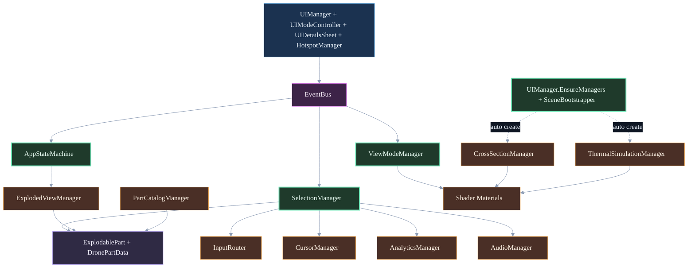

### Guion de exposicion

Este diagrama define la vista estructural de alto nivel del sistema y separa dos tipos de relacion: dependencia funcional y creacion en runtime.
Primero se debe leer el nodo BOOT, porque resume el mecanismo de inicializacion automatica de managers (UIManager.EnsureManagers y SceneBootstrapper). Ese detalle explica por que algunos subsistemas parecen globales o transversales.
La segunda lectura va de UI hacia EventBus: la interfaz no ejecuta logica de negocio profunda en cascada, sino que delega coordinacion por eventos para mantener bajo acoplamiento.
La tercera lectura recorre orquestacion y servicios: AppStateMachine, SelectionManager y ViewModeManager gobiernan estado, seleccion y visualizacion; luego InputRouter, CursorManager, AnalyticsManager y AudioManager agregan capacidades transversales.
Por ultimo, la capa de datos y render (ExplodablePart/DronePartData y Shader Materials) aparece como destino tecnico de varias rutas, lo que justifica su posicion inferior en el diagrama.
Mensaje clave para defensa: la arquitectura privilegia desacoplamiento por eventos y managers singleton, con bootstrap explicito para robustez de escena.

### Desglose completo - Diagrama 1

Nodos y significado exacto:

| Nodo | Significado en la app                                             | Rol en el proyecto                                                     |
| ---- | ----------------------------------------------------------------- | ---------------------------------------------------------------------- |
| BOOT | Mecanismo de creacion/validacion de managers en runtime           | Garantiza que el sistema no falle por ausencia de componentes criticos |
| UI   | Capa visual principal y control de interaccion                    | Entrada de usuario y coordinacion de paneles/modos                     |
| EBUS | Bus de eventos del dominio                                        | Desacopla productores y consumidores                                   |
| ASM  | Maquina de estados global de aplicacion                           | Gobernanza de estados mayores de experiencia                           |
| SEL  | Logica central de hover/click/seleccion                           | Punto de origen de eventos de seleccion                                |
| VMM  | Gestor de modos de visualizacion (Realistic, XRay, Thermal, etc.) | Control de salida visual de materiales                                 |
| INP  | Enrutamiento de entrada de usuario                                | Normaliza y distribuye input                                           |
| CUR  | Estado del cursor y feedback de puntero                           | Coherencia de UX durante hover/seleccion                               |
| ANA  | Telemetria y analitica                                            | Medicion de uso e interacciones                                        |
| AUD  | Feedback sonoro                                                   | Refuerzo de accion del usuario                                         |
| EVM  | Gestion de vista explotada                                        | Separacion espacial de piezas                                          |
| CSM  | Gestion de corte/seccion                                          | Control de clipping global                                             |
| PCM  | Catalogo/listado de partes                                        | Estructuracion de contenido navegable                                  |
| THR  | Simulacion termica runtime                                        | Calculo de estados termicos                                            |
| PART | Entidad de pieza y datos tecnicos                                 | Modelo de dominio de cada componente                                   |
| SHD  | Materiales y shaders aplicados                                    | Capa final de representacion grafica                                   |

Conexiones y significado exacto:

| Conexion                    | Que representa                                              | Implicacion                                         |
| --------------------------- | ----------------------------------------------------------- | --------------------------------------------------- |
| BOOT -. auto create .-> CSM | Creacion automatica condicional de CrossSectionManager      | Dependencia de inicializacion, no de negocio        |
| BOOT -. auto create .-> THR | Creacion automatica condicional de ThermalSimulationManager | Servicio global disponible sin configuracion manual |
| UI --> EBUS                 | La UI publica/dispara eventos de interaccion                | La UI no acopla directamente con todos los managers |
| EBUS --> ASM                | Eventos que impactan el estado global                       | Cambios de modo gobernados por eventos              |
| EBUS --> SEL                | Eventos consumidos/emitidos por seleccion                   | Sincronizacion de hover/click con resto del sistema |
| EBUS --> VMM                | Eventos que alteran representacion visual                   | Cambio de modo visual desacoplado                   |
| SEL --> INP                 | Integracion de seleccion con flujo de entrada               | Seleccion parte de input semantico                  |
| SEL --> CUR                 | Actualizacion de cursor segun objetivo                      | Feedback inmediato al usuario                       |
| SEL --> ANA                 | Registro de seleccion para analitica                        | Trazabilidad de comportamiento                      |
| SEL --> AUD                 | Disparo de audio de confirmacion                            | Refuerzo perceptivo                                 |
| ASM --> EVM                 | Estado global condiciona vista explotada                    | Coherencia entre modo y geometria                   |
| SEL --> PART                | Resolucion de objeto seleccionado a entidad de dominio      | Seleccion con contenido tecnico real                |
| VMM --> SHD                 | Cambio de modo visual aplica materiales/shaders             | Variacion visual controlada                         |
| CSM --> SHD                 | Corte modifica clipping en shaders                          | Efecto de seccion en render                         |
| EVM --> PART                | ExplodedView opera sobre piezas concretas                   | Transformacion espacial por componente              |
| PCM --> PART                | Catalogo referencia entidades de parte                      | Navegacion y filtrado de contenido                  |
| THR --> SHD                 | Simulacion termica influye visual termica                   | Estado fisico expresado en color/material           |

Semantica de flechas usada:

- `-->` indica dependencia o flujo funcional directo.
- `-. ... .->` indica relacion auxiliar o de inicializacion, no pipeline principal de negocio.

---

## 2) Flujo de Comunicacion EventBus (Publish/Subscribe)

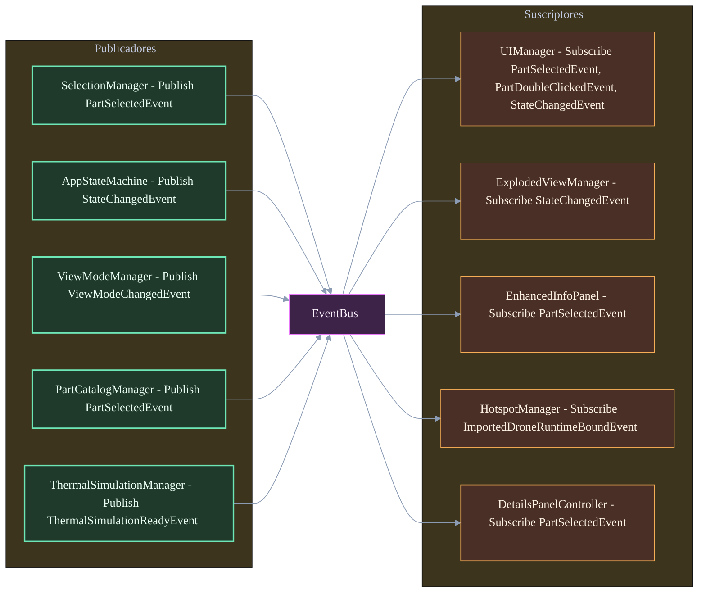

### Guion de exposicion

Este diagrama formaliza el patron publish/subscribe implementado en la app.
La lectura correcta es izquierda -> centro -> derecha: productores de eventos, bus de transporte y consumidores.
El aporte tecnico central es el desacoplamiento temporal y estructural: quien publica no necesita conocer quien escucha ni en que orden se ejecutaran las reacciones.
En terminos de mantenibilidad, este patron permite agregar nuevos suscriptores (por ejemplo telemetria o UI adicional) sin editar la logica del productor original.
En terminos de trazabilidad, la semantica por evento (PartSelectedEvent, StateChangedEvent, etc.) deja clara la intencion de cada flujo y reduce dependencias ocultas.
Mensaje clave para defensa: EventBus no reemplaza reglas de negocio; solamente distribuye hechos del sistema para coordinar modulos de forma extensible.

### Desglose completo - Diagrama 2

Publicadores (lado izquierdo):

| Nodo                     | Evento publicado            | Que significa en el proyecto                    |
| ------------------------ | --------------------------- | ----------------------------------------------- |
| SelectionManager         | PartSelectedEvent           | Cambio de contexto de pieza activa              |
| AppStateMachine          | StateChangedEvent           | Transicion de estado global                     |
| ViewModeManager          | ViewModeChangedEvent        | Cambio de modo de representacion visual         |
| PartCatalogManager       | PartSelectedEvent           | Seleccion desde catalogo y no solo desde escena |
| ThermalSimulationManager | ThermalSimulationReadyEvent | Disponibilidad de resultados termicos           |

Suscriptores (lado derecho):

| Nodo                   | Eventos que consume                                          | Efecto observable                   |
| ---------------------- | ------------------------------------------------------------ | ----------------------------------- |
| UIManager              | PartSelectedEvent, PartDoubleClickedEvent, StateChangedEvent | Actualizacion de interfaz y paneles |
| ExplodedViewManager    | StateChangedEvent                                            | Ajuste de geometria al modo activo  |
| EnhancedInfoPanel      | PartSelectedEvent                                            | Presentacion de informacion tecnica |
| HotspotManager         | ImportedDroneRuntimeBoundEvent                               | Reubicacion/activacion de hotspots  |
| DetailsPanelController | PartSelectedEvent                                            | Sincronizacion de ficha de detalle  |

Conexiones del diagrama:

| Conexion | Tipo         | Interpretacion                               |
| -------- | ------------ | -------------------------------------------- |
| P1 --> E | Publicacion  | SelectionManager emite evento al bus         |
| P2 --> E | Publicacion  | AppStateMachine emite cambio de estado       |
| P3 --> E | Publicacion  | ViewModeManager informa cambio visual        |
| P4 --> E | Publicacion  | Catalogo publica seleccion alternativa       |
| P5 --> E | Publicacion  | Termica publica disponibilidad de simulacion |
| E --> S1 | Distribucion | UI responde a eventos del dominio            |
| E --> S2 | Distribucion | ExplodedView se alinea al estado             |
| E --> S3 | Distribucion | Panel de info se refresca                    |
| E --> S4 | Distribucion | Hotspots se recalculan/actualizan            |
| E --> S5 | Distribucion | Panel de detalle mantiene consistencia       |

Semantica de palabras clave:

- `Publish` significa emitir un hecho al bus.
- `Subscribe` significa registrar reaccion ante un hecho.
- `EventBus` es el canal de entrega, no la logica final.

---

## 3) Maquina de Estados de la Aplicacion (AppStateMachine)

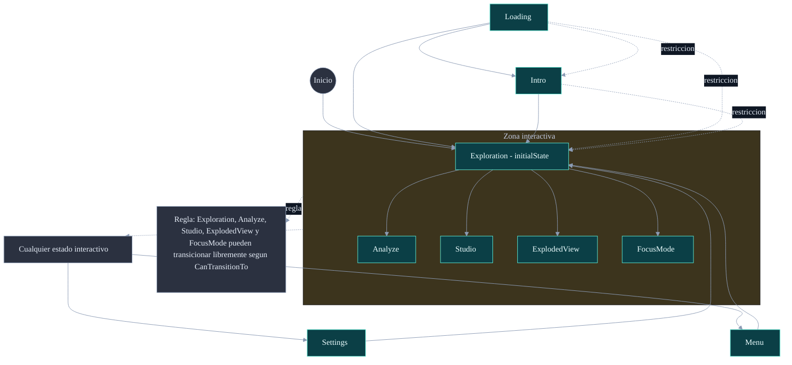

### Guion de exposicion

Este diagrama representa exclusivamente estados globales de AppStateMachine, no herramientas internas de UI.
La fase de arranque queda acotada a Loading -> Intro -> Exploration, lo que facilita explicar la entrada controlada al flujo interactivo.
Luego se modela una zona interactiva con cinco estados operativos: Exploration, Analyze, Studio, ExplodedView y FocusMode.
Para evitar una malla ilegible de transiciones, la regla de libre transicion entre estados interactivos se expresa como nota semantica, manteniendo precision sin saturar flechas.
Settings y Menu se muestran como estados auxiliares que interrumpen temporalmente la interaccion y retornan a Exploration.
Mensaje clave para defensa: este diagrama responde a gobernanza de estado global; corte, filtro, info, power y termico pertenecen a otra capa semantica (submodos, overlays o controladores).

### Desglose completo - Diagrama 3

Nodos y significado:

| Nodo            | Significado exacto                                      |
| --------------- | ------------------------------------------------------- |
| Start           | Punto conceptual de lectura del flujo                   |
| Loading         | Estado de carga inicial                                 |
| Intro           | Estado de introduccion/presentacion                     |
| Exploration     | Estado base de interaccion general                      |
| Analyze         | Estado global para herramientas tecnicas                |
| Studio          | Estado global para entorno/iluminacion/visual           |
| ExplodedView    | Estado global para inspeccion con separacion de partes  |
| FocusMode       | Estado global para inspeccion focalizada                |
| AnyInteractive  | Nodo abstracto para resumir estados interactivos        |
| Settings        | Estado auxiliar de configuracion                        |
| Menu            | Estado auxiliar de menu                                 |
| InteractiveRule | Nota semantica que evita dibujar todas las transiciones |

Conexiones y significado:

| Conexion                                  | Que indica                                             |
| ----------------------------------------- | ------------------------------------------------------ |
| Start --> Exploration                     | La app operativa arranca en Exploration (initialState) |
| Loading --> Intro                         | Camino normal de salida de carga                       |
| Loading --> Exploration                   | Atajo permitido por regla de transicion                |
| Intro --> Exploration                     | Salida autorizada desde intro                          |
| Exploration --> Analyze                   | Activacion de modo global Analyze                      |
| Exploration --> Studio                    | Activacion de modo global Studio                       |
| Exploration --> ExplodedView              | Entrada directa a inspeccion explotada                 |
| Exploration --> FocusMode                 | Entrada directa a inspeccion focal                     |
| AnyInteractive --> Settings               | Apertura de configuracion desde contexto interactivo   |
| AnyInteractive --> Menu                   | Apertura de menu desde contexto interactivo            |
| Settings --> Exploration                  | Retorno a estado base tras configuracion               |
| Menu --> Exploration                      | Retorno a estado base tras menu                        |
| Loading -. restriccion .-> Intro          | Restriccion formal de transicion permitida             |
| Loading -. restriccion .-> Exploration    | Restriccion formal de transicion permitida             |
| Intro -. restriccion .-> Exploration      | Restriccion formal de transicion permitida             |
| CoreModes -. semantica .-> AnyInteractive | Abstraccion de grupo interactivo                       |
| CoreModes -. regla .-> InteractiveRule    | Referencia a regla de transicion libre                 |

Convenciones de lectura:

- Los nodos con texto de estado son estados de AppStateMachine.
- Los nodos auxiliares (AnyInteractive, InteractiveRule) son metanodos de documentacion, no estados runtime.
- Las flechas punteadas anotadas como `restriccion` y `regla` son explicativas, no transiciones ejecutadas literalmente por ese nombre.

### Aclaracion de alcance (por tu duda)

- Si entra modo corte, pero como herramienta de Analyze (CrossSectionManager / AnalyzeModeHandler), no como AppState.
- Si entra filtro, pero como subpanel de Analyze (FilterSubPanel / SetCategoryFilter), no como AppState.
- Si entra info, pero como overlay de UI (UIDetailsSheet.ShowInfo), no como AppState.
- Si entra power on/load, pero como control de DroneStateController desde InspectModeHandler, no como AppState.
- Si entra termico, pero en dos niveles: ViewMode.Thermal (visual) y ThermalSimulationManager (simulacion), tampoco como AppState.
- Por eso el diagrama de estados globales no los lista como "modos hermanos" de Analyze o Studio: pertenecen a otra capa semantica.

---

## 4) Flujo de Seleccion de Piezas (Input -> Raycast -> Evento -> UI)

```mermaid
%%{init: {'theme':'base','themeVariables': {
  'fontFamily':'system-ui, -apple-system, Segoe UI, sans-serif',
  'background':'#0b0f17',
  'primaryColor':'#151b2b',
  'primaryTextColor':'#e6edf7',
  'primaryBorderColor':'#7dd3fc',
  'lineColor':'#8b9bb4',
  'textColor':'#e6edf7',
  'edgeLabelBackground':'#0f1724'
}}}%%
flowchart LR
    subgraph I1[Entrada y validacion]
      direction TB
      A[Usuario mueve o clickea puntero]
      B{Input bloqueado por UI?}
      Z[Ignorar seleccion en este frame]
    end

    subgraph I2[Deteccion de objetivo]
      direction TB
      C[SelectionManager.HandleHover]
      D[Raycast sobre selectionLayer]
      E{Impacta objeto seleccionable?}
      F[ClearHover + cursor default]
      G[Hover valido + HighlightSystem.OnHoverEnter]
    end

    subgraph I3[Resolucion de click]
      direction TB
      H{Click primario?}
      I{Doble click en umbral?}
      J[Publish PartDoubleClickedEvent]
      K{Hover es null al click?}
      L[Deselect, publish PartSelectedEvent null]
      M[SelectObject, apply Highlight OnSelect]
      N[Resolve ExplodablePart data]
      P[Publish PartSelectedEvent data]
    end

    subgraph I4[Reacciones del sistema]
      direction TB
      Q[UIManager + EnhancedInfoPanel + DetailsPanelController]
      R[AnalyticsManager.TrackPartSelected]
      S[AudioManager.PlayClick]
      T[Acciones avanzadas por doble click: focus o aislamiento segun contexto]
    end

    A --> B
    B -- Si --> Z
    B -- No --> C
    C --> D
    D --> E
    E -- No --> F
    E -- Si --> G
    G --> H
    H -- No --> C
    H -- Si --> I
    I -- Si --> J
    J --> T
    I -- No --> K
    K -- Si --> L
    K -- No --> M
    M --> N
    N --> P

    P --> Q
    P --> R
    P --> S

    classDef ui fill:#1b3250,stroke:#7cc8ff,color:#f0f8ff,stroke-width:1px;
    classDef orch fill:#1f3a2b,stroke:#6ee7b7,color:#ecfff6,stroke-width:2px;
    classDef svc fill:#4a2f26,stroke:#f6ad55,color:#fff4e6,stroke-width:1px;
    classDef data fill:#2f2a44,stroke:#c4b5fd,color:#f5f3ff,stroke-width:1px;
    classDef event fill:#3d2348,stroke:#e879f9,color:#fdf4ff,stroke-width:1px;
    classDef state fill:#0b3f46,stroke:#5eead4,color:#ecfeff,stroke-width:1px;
    classDef risk fill:#5a1c1c,stroke:#f87171,color:#fff1f2,stroke-width:2px;
    classDef mitigation fill:#223a76,stroke:#7dd3fc,color:#f0f8ff,stroke-width:1px;
    classDef result fill:#145f54,stroke:#34d399,color:#ecfdf5,stroke-width:1px;
    classDef neutral fill:#2b3140,stroke:#8b9bb4,color:#e6edf7,stroke-width:1px;

    class A,Q ui;
    class C,D,G,M,N orch;
    class B,E,H,I,K neutral;
    class Z,F,T mitigation;
    class J,P event;
    class L state;
    class R result;
    class S svc;
```

### Guion de exposicion

Este diagrama describe el pipeline completo de seleccion en cuatro etapas: entrada, deteccion, resolucion y reacciones.
La primera etapa protege coherencia de UX: si la UI bloquea input, la seleccion se ignora y no se dispara logica accidental.
La segunda etapa resuelve objetivo con raycast sobre selectionLayer y separa claramente no-hit (limpieza de hover) de hit valido (feedback visual inmediato).
La tercera etapa modela la decision de click: doble click publica un evento especifico para acciones avanzadas, mientras click simple deriva a deseleccion o seleccion efectiva con datos de pieza.
La cuarta etapa evidencia el valor del evento PartSelectedEvent(data): no solo actualiza paneles, tambien dispara analitica y audio de forma desacoplada.
Mensaje clave para defensa: la seleccion no es un acto aislado de render, sino un flujo de dominio observable y trazable que sincroniza UI, estado y telemetria.

### Desglose completo - Diagrama 4

Nodos y significado exacto por etapa:

| Nodo | Significado exacto en la app                                                             |
| ---- | ---------------------------------------------------------------------------------------- |
| A    | Entrada fisica del usuario (movimiento/click de puntero)                                 |
| B    | Guardia de bloqueo por UI para evitar interaccion sobre escena cuando hay overlay activo |
| Z    | Rama de descarte: no se procesa seleccion en ese ciclo                                   |
| C    | Metodo de gestion de hover en SelectionManager                                           |
| D    | Raycast sobre capa de objetos seleccionables                                             |
| E    | Decision de impacto valido o no                                                          |
| F    | Limpieza de hover/cursor al no encontrar objetivo                                        |
| G    | Activacion de feedback visual de hover                                                   |
| H    | Verificacion de click primario                                                           |
| I    | Verificacion de doble click dentro del umbral temporal                                   |
| J    | Publicacion de evento de doble click                                                     |
| K    | Decision de nulidad de hover en el momento de click                                      |
| L    | Deseleccion y publicacion de PartSelectedEvent(null)                                     |
| M    | Seleccion efectiva del objeto y highlight de seleccion                                   |
| N    | Resolucion de datos de dominio de pieza                                                  |
| P    | Publicacion de PartSelectedEvent(data)                                                   |
| Q    | Reaccion de UI y paneles de informacion                                                  |
| R    | Reaccion de analitica de uso                                                             |
| S    | Reaccion de audio de feedback                                                            |
| T    | Rama avanzada de doble click (focus/aislamiento segun estado)                            |

Conexiones y su interpretacion funcional:

| Conexion      | Interpretacion                                    |
| ------------- | ------------------------------------------------- |
| A --> B       | Todo input pasa primero por validacion de bloqueo |
| B -- Si --> Z | Si UI bloquea, se corta pipeline                  |
| B -- No --> C | Si no hay bloqueo, se procesa hover               |
| C --> D       | HandleHover ejecuta raycast de deteccion          |
| D --> E       | Resultado del raycast alimenta decision           |
| E -- No --> F | Sin impacto: limpieza de estado visual            |
| E -- Si --> G | Con impacto: hover valido y highlight             |
| G --> H       | Solo con objetivo valido se evalua click          |
| H -- No --> C | Sin click primario, vuelve al ciclo de hover      |
| H -- Si --> I | Con click primario, evalua doble click            |
| I -- Si --> J | Doble click dispara evento especializado          |
| J --> T       | Evento deriva en accion avanzada                  |
| I -- No --> K | Click simple sigue rama de seleccion normal       |
| K -- Si --> L | Si no hay hover real, se deselecciona             |
| K -- No --> M | Con hover valido, se confirma seleccion           |
| M --> N       | Tras seleccionar, se resuelven datos de la pieza  |
| N --> P       | Se publica evento con payload de datos            |
| P --> Q       | UI consume evento para mostrar informacion        |
| P --> R       | Analitica consume evento para trazabilidad        |
| P --> S       | Audio consume evento para feedback                |

Semantica exacta de textos del diagrama:

- `Input bloqueado por UI?` significa prioridad de interfaz sobre escena 3D.
- `selectionLayer` significa filtro de fisica para seleccionar solo objetivos validos.
- `PartSelectedEvent(null)` significa deseleccion explicita.
- `PartSelectedEvent(data)` significa seleccion semantica con contexto de dominio.
- `doble click` implica via alternativa orientada a inspeccion avanzada y no al panel simple.

---

## 5) Pipeline de Shaders por Modo de Visualizacion

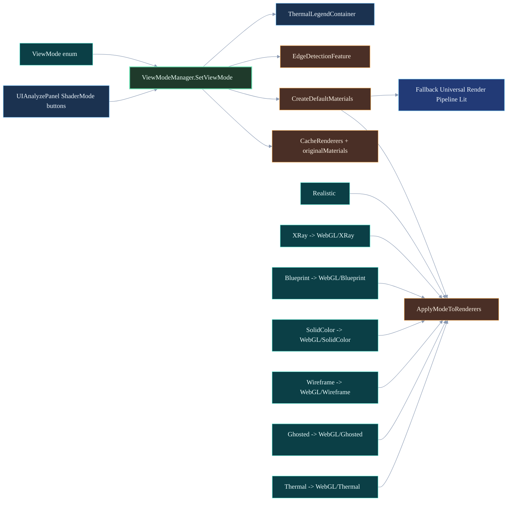

### Guion de exposicion

Este diagrama explica como se transforma una seleccion de modo visual en un resultado de render concreto.
La entrada ocurre en UIAnalyzePanel, donde los botones ShaderMode disparan el cambio en ViewModeManager.
ViewModeManager coordina tres tareas: asegurar cache de renderers, preparar materiales por modo y aplicar el modo activo sobre la escena.
Los siete modos visuales convergen en un mismo punto de aplicacion, pero cada uno mapea a shaders distintos (XRay, Blueprint, Thermal, etc.).
Si algun shader no esta disponible en runtime, el sistema cae en material fallback URP/Lit para evitar fallo visual.
Blueprint activa soporte de borde en EdgeDetectionFeature y Thermal sincroniza la leyenda termica de UI.

### Desglose completo - Diagrama 5

Nodos principales:

| Nodo   | Significado                                                     |
| ------ | --------------------------------------------------------------- |
| UI     | Origen de seleccion de modo desde la UI                         |
| VMM    | Orquestador del cambio de modo visual                           |
| MODE   | Enumeracion oficial de modos de visualizacion                   |
| CACHE  | Registro de renderers y materiales originales para restauracion |
| MAT    | Construccion/carga de materiales por shader                     |
| APPLY  | Aplicacion final del material al renderer                       |
| EDGE   | Postproceso de bordes para Blueprint                            |
| LEGEND | Leyenda termica visible solo en modo Thermal                    |
| FB     | Ruta de respaldo cuando falta shader especializado              |

Conexiones clave:

| Conexion         | Interpretacion                                          |
| ---------------- | ------------------------------------------------------- |
| UI --> VMM       | La accion de usuario dispara SetViewMode                |
| MODE --> VMM     | El enum define estado objetivo del modo                 |
| VMM --> CACHE    | Se garantiza contexto de restauracion/material original |
| VMM --> MAT      | Se resuelve pipeline de materiales por modo             |
| MAT --> APPLY    | Material listo para aplicacion en escena                |
| M1..M7 --> APPLY | Cada modo termina en una ruta comun de aplicacion       |
| MAT --> FB       | Fallback para robustez de build WebGL                   |
| VMM --> EDGE     | Blueprint habilita contornos tecnicos                   |
| VMM --> LEGEND   | Thermal sincroniza leyenda de temperaturas              |

---

## 6) Flujo de Datos DronePartData

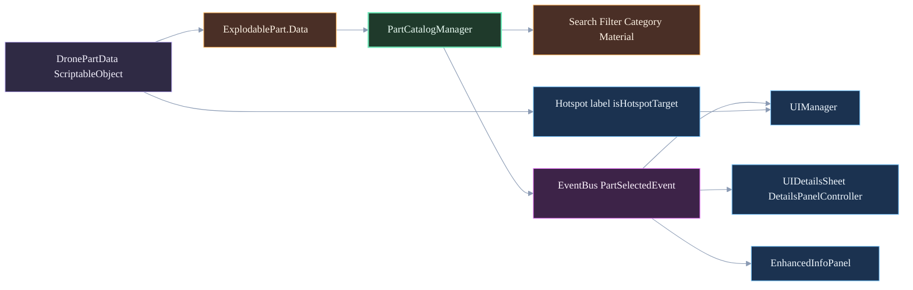

### Guion de exposicion

Este diagrama muestra la ruta de datos de una pieza desde el asset hasta la interfaz de usuario.
DronePartData concentra la definicion tecnica de cada componente (nombre, categoria, material, datos termicos, iconografia y metadatos).
ExplodablePart referencia ese asset y permite que el catalogo trabaje con entidades reales de escena.
PartCatalogManager aplica filtros de busqueda/categoria/material y publica eventos de seleccion para mantener desacoplamiento.
Los paneles de UI (UIManager, details y panel de info avanzada) consumen el mismo evento para mostrar informacion consistente.
El flujo de hotspots se alimenta de datos del asset y se conecta con la misma experiencia de seleccion.

### Desglose completo - Diagrama 6

Nodos principales:

| Nodo | Significado                                 |
| ---- | ------------------------------------------- |
| SO   | Fuente de verdad de datos por pieza         |
| EXP  | Vinculo de asset a objeto interactivo 3D    |
| CAT  | Catalogo, busqueda y filtrado de piezas     |
| FIL  | Criterios de filtrado operativos en runtime |
| EVT  | Evento semantico de seleccion               |
| UI   | Capa de coordinacion de interfaz            |
| DET  | Vista de detalle tecnico                    |
| ENH  | Vista extendida de informacion              |
| HOT  | Etiquetas y objetivos de hotspot            |

Conexiones clave:

| Conexion           | Interpretacion                                                |
| ------------------ | ------------------------------------------------------------- |
| SO --> EXP         | El objeto de escena hereda metadata del asset                 |
| EXP --> CAT        | El catalogo opera sobre piezas con datos asociados            |
| CAT --> FIL        | El catalogo ejecuta criterios de filtro                       |
| CAT --> EVT        | Seleccion publicada como evento desacoplado                   |
| EVT --> UI/DET/ENH | Multiples vistas se sincronizan con un mismo hecho de dominio |
| SO --> HOT         | Datos del asset alimentan el sistema de hotspots              |
| HOT --> UI         | Hotspots actualizan experiencia de UI                         |

---

## 7) Subsistema Termico Hibrido (V1)

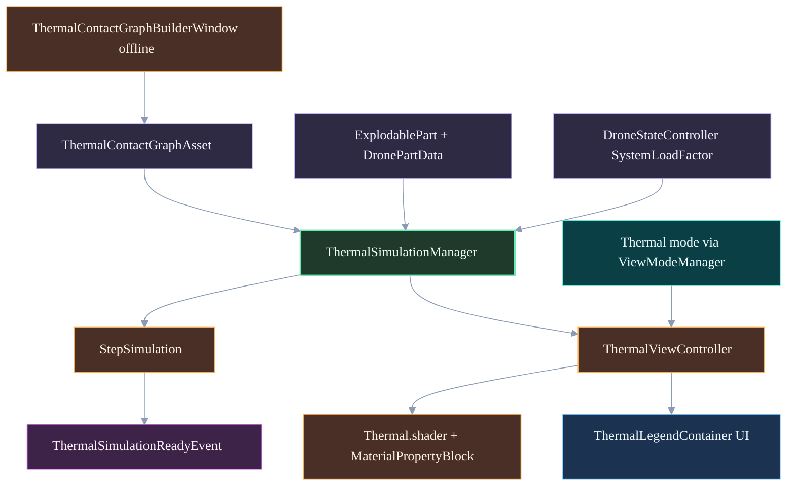

### Guion de exposicion

Este diagrama formaliza la arquitectura termica hibrida usada en la V1 del proyecto.
La capa de authoring offline genera un grafo canonico de contactos termicos para reducir costo en runtime WebGL.
En runtime, ThermalSimulationManager integra tres entradas: estado de carga del dron, piezas con datos termicos y grafo de contactos.
La simulacion avanza por pasos discretos y publica eventos de disponibilidad del sistema.
ThermalViewController toma el estado termico, lo convierte en parametros de shader y actualiza tanto visual de piezas como leyenda UI.
La activacion visual depende del modo Thermal del ViewModeManager, separando fisica de presentacion.

### Desglose completo - Diagrama 7

Nodos principales:

| Nodo    | Significado                                              |
| ------- | -------------------------------------------------------- |
| LOAD    | Variable de carga energetica usada como driver termico   |
| SIM     | Solver termico por nodos y enlaces                       |
| GRAPH   | Grafo canonico serializado de conduccion                 |
| BUILDER | Herramienta editor para construir grafo fuera de runtime |
| PARTS   | Fuente de nodos y propiedades termicas por pieza         |
| STEP    | Integrador temporal de la simulacion                     |
| EVT     | Evento de estado operativo del subsistema                |
| VIEW    | Puente solver-render en runtime                          |
| SHD     | Materializacion visual de temperatura                    |
| VM      | Condicion de activacion por modo de visualizacion        |
| LEG     | Indicador visual de rango termico para usuario           |

Conexiones clave:

| Conexion          | Interpretacion                                        |
| ----------------- | ----------------------------------------------------- |
| BUILDER --> GRAPH | El grafo se autoriza fuera de runtime para eficiencia |
| GRAPH --> SIM     | El solver usa conectividad termica explicita          |
| PARTS --> SIM     | Las piezas entregan propiedades termicas              |
| LOAD --> SIM      | La carga del dron altera equilibrio termico           |
| SIM --> STEP      | Ejecucion temporal del modelo                         |
| STEP --> EVT      | Publicacion de estado/ready termico                   |
| SIM --> VIEW      | Transferencia de temperaturas al render bridge        |
| VM --> VIEW       | Solo en modo Thermal se presenta salida visual        |
| VIEW --> SHD      | Temperatura convertida a parametros de shader         |
| VIEW --> LEG      | Sincronizacion de leyenda en UI                       |

---

## 8) Restricciones WebGL y Mitigaciones

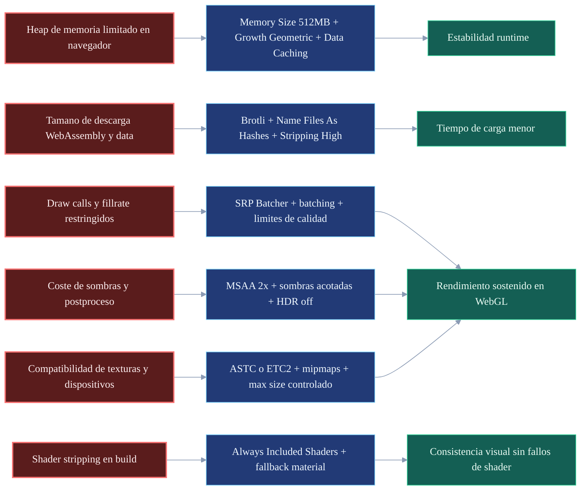

### Guion de exposicion

Este diagrama resume la logica de ingenieria aplicada para operar dentro de las restricciones de WebGL 2.0.
Cada restriccion tecnica relevante se conecta con una mitigacion concreta configurada en Player/Quality/Graphics settings o en pipeline de assets.
El enfoque no es una optimizacion aislada, sino una cadena causa-accion-resultado medible.
Las mitigaciones de memoria y compresion atacan estabilidad y tiempo de carga.
Las mitigaciones de render y texturas atacan frame time, draw calls y compatibilidad de dispositivos.
Las mitigaciones de shaders evitan errores por stripping en builds de produccion.

### Desglose completo - Diagrama 8

Restricciones:

| Nodo | Significado                                       |
| ---- | ------------------------------------------------- |
| R1   | Heap limitado por entorno navegador               |
| R2   | Peso de descarga de artefactos WebGL              |
| R3   | Presupuesto restringido de draw/fillrate          |
| R4   | Coste alto de sombras y post effects              |
| R5   | Riesgo de eliminar shaders usados en runtime      |
| R6   | Variabilidad de soporte de compresion de texturas |

Mitigaciones:

| Nodo | Significado                                       |
| ---- | ------------------------------------------------- |
| M1   | Politica de memoria y cache para evitar OOM       |
| M2   | Compresion y empaquetado para acelerar carga      |
| M3   | Estrategia de batching y perfil de calidad        |
| M4   | Balance visual-rendimiento de pipeline URP        |
| M5   | Garantia de disponibilidad de shaders en build    |
| M6   | Estrategia de texturas para compatibilidad y VRAM |

Resultados:

| Nodo | Significado                              |
| ---- | ---------------------------------------- |
| K1   | Mayor estabilidad de ejecucion           |
| K2   | Menor tiempo de carga percibido          |
| K3   | Mejor rendimiento sostenido en navegador |
| K4   | Menos fallos visuales por shader missing |

Conexiones clave:

| Conexion  | Interpretacion                                  |
| --------- | ----------------------------------------------- |
| Rn --> Mn | Cada limitacion tiene accion tecnica concreta   |
| Mn --> Kn | Cada accion se justifica por impacto observable |

---

## 9) Herramientas de Ensamblaje Proyectadas (Estado por Modulo)

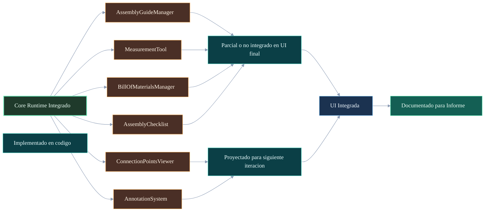

### Guion de exposicion

Este diagrama deja explicito el estado real de las herramientas de ensamblaje para evitar sobredeclaraciones en el informe.
La lectura comienza en el bloque Core Runtime Integrado, donde aparecen los modulos detectados en codigo.
Luego cada modulo se clasifica por nivel de madurez: implementado, parcial o proyectado.
La convergencia hacia UI Integrada representa la brecha real entre funcionalidad codificada y experiencia final disponible al usuario.
Finalmente se conecta con el bloque de documentacion para reforzar trazabilidad academica entre estado tecnico y redaccion de tesis.

### Desglose completo - Diagrama 9

Nodos principales:

| Nodo   | Significado                                                |
| ------ | ---------------------------------------------------------- |
| CORE   | Base tecnica que ya existe en runtime/codigo               |
| A1..A6 | Modulos de ensamblaje identificados en arquitectura        |
| ST1    | Modulo implementado y utilizable sin bloqueos              |
| ST2    | Modulo con implementacion parcial o integracion incompleta |
| ST3    | Modulo planificado para iteracion futura                   |
| UI     | Superficie final de uso para usuario                       |
| DOC    | Evidencia escrita en informe y anexos                      |

Conexiones clave:

| Conexion        | Interpretacion                                            |
| --------------- | --------------------------------------------------------- |
| CORE --> A1..A6 | Los modulos nacen de la base tecnica existente            |
| A* --> ST*      | Clasificacion de madurez por modulo                       |
| ST2/ST3 --> UI  | El gap principal esta en integracion de interfaz          |
| UI --> DOC      | El estado de UI define lo que puede afirmarse formalmente |

---

## 10) Despliegue y Artefactos (Build a Hosting)

```mermaid
%%{init: {'theme':'base','themeVariables': {
  'fontFamily':'system-ui, -apple-system, Segoe UI, sans-serif',
  'background':'#0b0f17',
  'primaryColor':'#151b2b',
  'primaryTextColor':'#e6edf7',
  'primaryBorderColor':'#7dd3fc',
  'lineColor':'#8b9bb4',
  'textColor':'#e6edf7',
  'edgeLabelBackground':'#0f1724'
}}}%%
flowchart LR
  U[Unity Project]
  B[Build Settings WebGL2 IL2CPP]
  O[Optimizations Brotli Stripping Hashes Cache]
  ART[Artefactos: wasm data framework index]
  DOCS[docs Build TemplateData]
  GIT[GitHub repository]
  GH[GitHub Pages]
  ALT[Vercel o Netlify]
  QA[Smoke test browser mobile desktop]

  U --> B --> O --> ART
  ART --> DOCS
  DOCS --> GIT
  GIT --> GH
  GIT --> ALT
  GH --> QA
  ALT --> QA

  classDef ui fill:#1b3250,stroke:#7cc8ff,color:#f0f8ff,stroke-width:1px;
  classDef orch fill:#1f3a2b,stroke:#6ee7b7,color:#ecfff6,stroke-width:2px;
  classDef svc fill:#4a2f26,stroke:#f6ad55,color:#fff4e6,stroke-width:1px;
  classDef data fill:#2f2a44,stroke:#c4b5fd,color:#f5f3ff,stroke-width:1px;
  classDef event fill:#3d2348,stroke:#e879f9,color:#fdf4ff,stroke-width:1px;
  classDef state fill:#0b3f46,stroke:#5eead4,color:#ecfeff,stroke-width:1px;
  classDef risk fill:#5a1c1c,stroke:#f87171,color:#fff1f2,stroke-width:2px;
  classDef mitigation fill:#223a76,stroke:#7dd3fc,color:#f0f8ff,stroke-width:1px;
  classDef result fill:#145f54,stroke:#34d399,color:#ecfdf5,stroke-width:1px;
  classDef neutral fill:#2b3140,stroke:#8b9bb4,color:#e6edf7,stroke-width:1px;

  class U orch;
  class B,GIT,GH,ALT svc;
  class O mitigation;
  class ART,DOCS data;
  class QA result;
```

### Guion de exposicion

Este diagrama resume la cadena de despliegue desde el proyecto Unity hasta un entorno publico verificable.
La primera mitad del flujo se centra en build reproducible: configuracion WebGL, optimizaciones y generacion de artefactos.
La segunda mitad se centra en entrega: ubicacion de build en docs, versionado en git y publicacion en hosting.
Se incluyen dos destinos de despliegue para cubrir estrategia principal y alternativa.
El cierre obligatorio es el smoke test en navegador y dispositivos, que valida que el build publicado coincide con lo documentado.

### Desglose completo - Diagrama 10

Nodos principales:

| Nodo | Significado                                     |
| ---- | ----------------------------------------------- |
| U    | Fuente de compilacion del producto              |
| B    | Parametros de build WebGL                       |
| O    | Ajustes de optimizacion para peso y rendimiento |
| ART  | Archivos generados por compilacion              |
| DOCS | Carpeta destino para servir el build            |
| GIT  | Control de versiones y trazabilidad             |
| GH   | Canal principal de despliegue                   |
| ALT  | Canal alternativo de despliegue                 |
| QA   | Verificacion final funcional                    |

Conexiones clave:

| Conexion              | Interpretacion                              |
| --------------------- | ------------------------------------------- |
| U --> B --> O --> ART | Cadena de construccion reproducible         |
| ART --> DOCS --> GIT  | Publicacion de artefacto versionado         |
| GIT --> GH/ALT        | Multiples canales de entrega                |
| GH/ALT --> QA         | Todo despliegue debe terminar en validacion |

---

## 11) Plantilla de Resultados SUS (Capitulo 5)

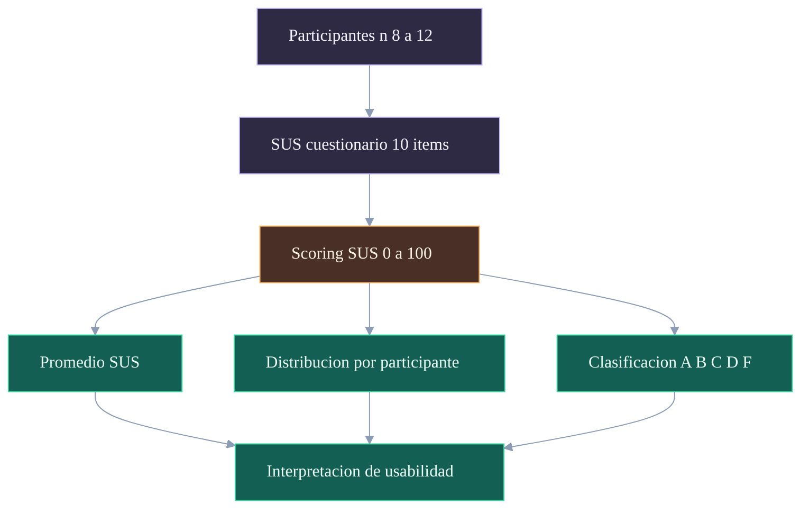

### Guion de exposicion

Este diagrama define la ruta metodologica para reportar SUS cuando se disponga de datos reales.
Se inicia con el grupo de participantes y la aplicacion del cuestionario SUS estandar de 10 items.
Luego se transforma la respuesta cruda a puntaje normalizado 0-100.
Desde ese puntaje se derivan tres salidas analiticas: promedio global, distribucion individual y clasificacion cualitativa.
La interpretacion final integra los tres niveles para evitar conclusiones basadas en un unico indicador.

### Desglose completo - Diagrama 11

| Nodo | Significado                                  |
| ---- | -------------------------------------------- |
| P    | Muestra evaluada en validacion de usabilidad |
| Q    | Instrumento SUS aplicado                     |
| S    | Transformacion a escala estandarizada        |
| B1   | Tendencia central del sistema                |
| B2   | Variabilidad entre usuarios                  |
| B3   | Lectura cualitativa de aceptacion            |
| I    | Conclusion de usabilidad defendible          |

---

## 12) Plantilla de Resultados NASA-TLX (Capitulo 5)

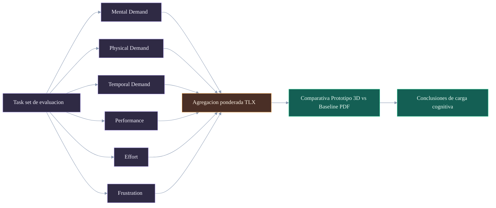

### Guion de exposicion

Este diagrama establece como estructurar el reporte de carga cognitiva con NASA-TLX.
Las tareas evaluadas alimentan las seis dimensiones oficiales del instrumento.
Las dimensiones convergen en una agregacion ponderada que refleja carga total.
La comparativa con baseline permite justificar mejora o regresion frente a referencia no inmersiva.
La salida final son conclusiones de carga cognitiva alineadas con evidencia cuantitativa.

### Desglose completo - Diagrama 12

| Nodo   | Significado                                      |
| ------ | ------------------------------------------------ |
| T      | Conjunto de tareas medido de forma equivalente   |
| N1..N6 | Dimensiones canonicas NASA-TLX                   |
| AG     | Integracion ponderada de dimensiones             |
| CMP    | Lectura comparativa entre condiciones            |
| COG    | Interpretacion final para capitulo de resultados |

---

## 13) Plantilla de KPIs Tecnicos (Capitulo 5)

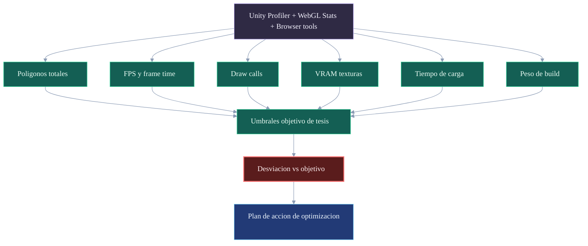

### Guion de exposicion

Este diagrama define la estructura de medicion tecnica para el capitulo de resultados.
Las fuentes de datos se consolidan en seis KPIs operativos de rendimiento y footprint.
Cada KPI se contrasta contra umbrales objetivo predefinidos para evitar evaluaciones subjetivas.
La desviacion obtenida determina acciones concretas de optimizacion y cierre de iteracion.
Con esto, el capitulo 5 puede mostrar no solo valores, sino tambien criterio de aceptacion y plan correctivo.

### Desglose completo - Diagrama 13

| Nodo   | Significado                               |
| ------ | ----------------------------------------- |
| SRC    | Instrumentacion real de medicion          |
| K1..K6 | Indicadores tecnicos cuantitativos        |
| TH     | Criterios objetivo definidos por proyecto |
| GAP    | Brecha entre estado actual y meta         |
| ACT    | Medidas de mejora priorizadas             |

Conexiones clave:

| Conexion           | Interpretacion                                           |
| ------------------ | -------------------------------------------------------- |
| SRC --> K\*        | Toda medicion debe provenir de herramientas verificables |
| K\* --> TH         | KPI sin umbral no permite conclusion objetiva            |
| TH --> GAP --> ACT | Evaluacion tecnica termina en decisiones ejecutables     |

---

## Nota de estilo y uso

- Diagramas completados en este archivo: P0-1 a P0-4, P1-5 a P1-8, P2-9 y P2-10.
- Plantillas de resultados completadas: SUS, NASA-TLX y KPIs tecnicos (listas para rellenar con datos reales).
- Pendiente unico para cierre academico de Cap. 5: cargar mediciones reales y generar graficos/tablas finales con resultados observados.
