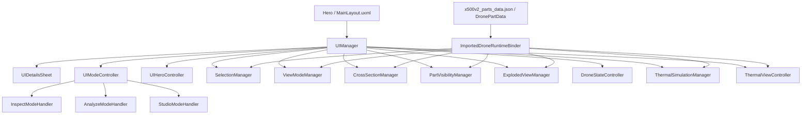

# Arquitectura del Sistema

Este documento describe la arquitectura real del visor documentado para el cierre del trabajo de grado. La fuente canonica de la app es:

- `MainScene_Final`
- `EditorBuildSettings.asset`
- `ImportedDroneRuntimeBinder.cs`
- `UIManager.cs`
- `MainLayout.uxml`
- `x500v2_parts_data.json`
- `VALIDACION_FUNCIONAL_FINA_2026-04-09.md`

## 1. Convenciones canonicas

### Piezas
- `28` piezas canonicas de investigacion
- `30` anchors de escena (`28` + `x500v2_fastener_group` + `x500v2_misc_group`)
- `257` renderers/colliders auditados
- `257` assets `.asset` generados en `Assets/Core/Data/X500V2Generated`

### Scripts
- `95` runtime propios en `Assets/Scripts` excluyendo `Editor/Tests`
- `103` scripts bajo `Assets` excluyendo tests
- `129` `.cs` totales incluyendo editor/plugins

## 2. Flujo visible del producto

```text
Hero -> Explore -> seleccion de pieza -> bottom sheet -> Inspect / Analyze / Studio
```

Funciones visibles:
- hotspots
- isolate
- power/load
- explode
- cross-section
- filtros por categoria
- render modes visibles de Studio
- leyenda thermal

## 3. Arquitectura por capas



### Presentacion
- `MainLayout.uxml`
- USS del sistema de interfaz
- `UIDetailsSheet`
- paneles de modos

### Orquestacion
- `UIManager`
- `UIModeController`
- `AppStateMachine`
- `UIHeroController`

### Servicios runtime
- `SelectionManager`
- `ViewModeManager`
- `CrossSectionManager`
- `PartVisibilityManager`
- `ExplodedViewManager`
- `DroneStateController`
- `ThermalSimulationManager`
- `ThermalViewController`
- `HotspotManager`
- `EnvironmentController`

### Datos
- `DronePartData`
- assets generados de piezas
- grafo termico
- catalogo canonico JSON

## 4. Bootstrap real

El runtime usa dos rutas complementarias:

1. `UIManager.EnsureManagers()`
   - crea managers minimos si faltan
   - asegura `ImportedDroneRuntimeBinder` en el root del dron

2. `ImportedDroneRuntimeBinder`
   - resuelve anchors por `id`
   - reubica huerfanos
   - sintetiza grupos para fasteners y misc
   - reconstruye caches dependientes
   - publica el evento de runtime bound

## 5. Estados de aplicacion

`AppStateMachine` define estos estados:
- `Loading`
- `Intro`
- `Exploration`
- `ExplodedView`
- `FocusMode`
- `Settings`
- `Menu`
- `Analyze`
- `Studio`

No todos los estados deben venderse como pantallas visibles independientes; algunos son estados internos de orquestacion.

## 6. Modos funcionales

### Expuesto en UI final
- `Inspect`
- `Analyze`
- `Studio`

### Implementado pero oculto
- `MeasurementTool`
- algunos view modes/shaders
- partes del sistema termico avanzado

### Legacy o no integrado
- `PartCatalogUI`
- `SettingsPanel`
- `LoadingController`
- parte de `EnhancedInfoPanel`
- suite de ensamblaje/BOM/anotaciones/connections

## 7. Studio y render modes

`ViewModeManager` implementa:
- `Realistic`
- `XRay`
- `Blueprint`
- `SolidColor`
- `Wireframe`
- `Ghosted`
- `Thermal`

La UI final visible no expone todos esos modos al mismo tiempo. `Realistic` funciona como modo base; la tarjeta visible principal permite alternar `XRay`, `SolidColor` y `Thermal`, mientras otros modos quedan implementados pero ocultos.

## 8. Tooling de editor

Herramientas de editor que si son defendibles:
- `ProjectSetupWizard`
- `ImportedDroneCoverageAudit`
- `ThermalContactGraphBuilderWindow`
- `WebGLBuildFixer` y fixers asociados

## 9. Modulos que no deben figurar como activos finales

No documentar como componentes activos del cierre:
- `ViewModeToolbar`
- `WebGLOptimizer`
- `ScreenshotManager`
- `KeyboardShortcuts`
- `PerformanceMonitor`
- `RuntimeConsole`
- `SceneTransitionManager`
- `TooltipSystem`

## 10. Regla editorial

La narrativa principal del informe y los manuales debe describir solo la build visible final. Lo oculto, experimental o futuro se relega a anexos, limitaciones o trabajo futuro.
