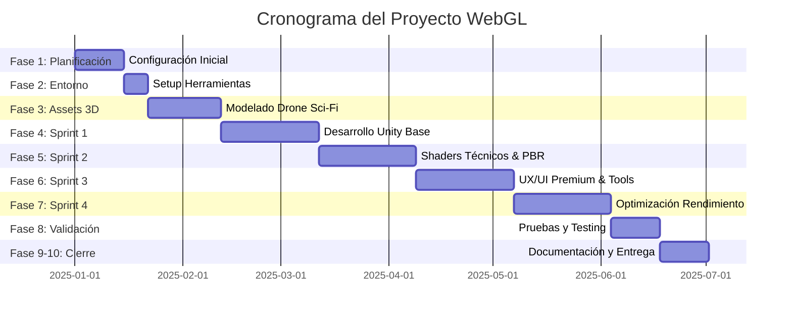

# 🚀 Hoja de Ruta Detallada - Prototipo Web 3D Interactivo

## 📋 Información del Proyecto

**Título:** Diseño y Desarrollo de un Prototipo Web 3D Interactivo para la Visualización Técnica y Análisis Estructural de Hardware de Alto Rendimiento mediante Pipelines de Optimización Gráfica y WebAssembly

**Estudiante:** Alexander Woodcock Salomón  
**Programa:** Ingeniería Multimedia - UNAD  
**Duración:** 6 meses  
**Metodología:** Design Science Research + Desarrollo Ágil (Sprints de 4 semanas)

---

## 🎯 Objetivos del Proyecto

### Objetivo General
Diseñar, desarrollar y evaluar un prototipo web 3D interactivo basado en Unity WebGL que optimice la visualización técnica de hardware de alto rendimiento mediante pipelines de optimización gráfica avanzados y WebAssembly.

### KPIs Cuantitativos
- **Presupuesto de Polígonos:** < 100,000 polígonos totales
- **Rendimiento Móvil:** > 30 FPS en dispositivos mid-range
- **Tiempo de Carga Shell:** < 3 segundos
- **Tiempo de Carga Completa:** < 10 segundos
- **VRAM Usage:** Optimizado para dispositivos móviles
- **Draw Calls:** Minimizados mediante batching y atlasing

---

## 📅 Cronograma General (6 Meses)

---

## 🔬 Fase 0: Investigación y Selección Técnica (Completada)

### Selección del Modelo 3D: Drone de Alto Rendimiento (Sci-Fi / Industrial)
**Justificación:**
- **Portfolio Tech Art:** Los drones combinan superficies duras complejas (hard surface), materiales variados (fibra de carbono, metal, lentes, plásticos) y mecanismos funcionales, siendo el estándar de oro para demostrar habilidades técnicas.
- **Complejidad Técnica:** Permite demostrar optimización agresiva (baking de muchos detalles mecánicos en normal maps) y jerarquías complejas para vistas explosionadas.
- **Estrategia de Creación:** **Modelado Propio basado en Curso Especializado (ej. Blender Bros).**
  - *Por qué no descargar:* Descargar un modelo impide demostrar el flujo de trabajo completo (High to Low poly baking) que es crucial para un Tech Artist.
  - *Recurso:* Curso "Hard Surface Drone Design" o similar para asegurar topología profesional.

### Definición de Features Técnicos (Tech Art)
1.  **Vista Explosionada Interactiva (Exploded View):**
    -   *Implementación:* Script C# usando `DOTween` para interpolación suave de `LocalPosition` de componentes hijos.
    -   *Tech:* Manipulación de transformaciones en tiempo real, no vertex displacement (para mantener precisión técnica).
2.  **Modo Rayos X (X-Ray Shader):**
    -   *Implementación:* Shader Graph personalizado con efecto Fresnel invertido y Z-Test manipulado (Always draw).
    -   *Tech:* Shader Graph, Render Queues.
3.  **Delineado Técnico (Technical Outline):**
    -   *Implementación:* URP Renderer Feature (Screen Space Outlines) basado en Depth y Normals.
    -   *Tech:* Post-processing stack, Custom Renderer Features.
4.  **Corte Transversal (Cross-Section):**
    -   *Implementación:* Shader con Clipping Plane global controlado por material properties.
    -   *Tech:* Shader Graph, Global Shader Variables.

### Definición UX/UI: "Premium Technical"
-   **Estilo:** Glassmorphism (paneles semitransparentes con blur), tipografía técnica (Rajdhani o Inter), acentos de color neón cian/naranja sobre oscuro.
-   **Feedback:** Micro-interacciones en hover, sonidos sutiles de UI "tech", transiciones suaves entre estados.

---

## � Estrategias de Aceleración e Investigación

Para cumplir con el cronograma y elevar la calidad visual, se recomienda investigar e integrar las siguientes herramientas:

### 1. Aceleración de Modelado (Kitbashing)
En lugar de modelar cada tornillo y pistón desde cero, usar librerías de partes mecánicas de alta calidad para detalles secundarios.
-   **Investigar:** Sets de *Oleg Ushenok* o *JROTools* (Hard Surface Kitbash).
-   **Beneficio:** Reducción del 40% en tiempo de modelado de detalles mecánicos complejos.

### 2. Texturizado Asistido por IA
Uso de herramientas de IA para generar mapas de imperfecciones y variaciones de materiales realistas rápidamente.
-   **Investigar:** *Polycam AI Texture Generator* o *Auto Painter* para Blender.
-   **Uso:** Generar texturas de "desgaste", "rayaduras" o "metal oxidado" tileables en segundos.

### 3. Optimización WebGL Automatizada
Herramientas para analizar y reducir el tamaño del build final sin prueba y error manual.
-   **Investigar:** *CrazyGames WebGL Optimizer* (Open Source) y *Unity Asset Transformer*.
-   **Técnica Clave:** Compresión de texturas **ASTC** (Adaptive Scalable Texture Compression) para balance calidad/peso en móvil.

### 4. Visualización Técnica
Herramientas nativas de Unity para anotaciones dinámicas.
-   **Investigar:** *Unity Line Renderer* para dibujar líneas de conexión dinámicas entre etiquetas y componentes 3D.

---

## �🔧 Fase 1: Planificación y Configuración Inicial (2 semanas)

### Objetivos
- Establecer estructura organizacional del proyecto
- Validar documentación académica existente
- Definir arquitectura técnica detallada

### Tareas
- [x] Crear carpeta `desarrollo` en repositorio
- [ ] **Setup del Curso de Modelado:** Adquirir/iniciar curso de Hard Surface (Blender).
- [ ] **Moodboard Técnico:** Recopilar referencias de UI de juegos como *Star Citizen*, *Elite Dangerous* o software CAD moderno.

---

## 🛠️ Fase 2: Configuración del Entorno de Desarrollo (1 semana)

### Objetivos
- Instalar y configurar todas las herramientas necesarias
- Validar funcionamiento del pipeline de desarrollo

### Tareas
- [ ] **Unity 6 LTS + URP:** Configurar pipeline para soportar *Depth Texture* y *Opaque Texture* (necesarios para shaders de efectos).
- [ ] **Paquetes Esenciales:**
  - `com.unity.render-pipelines.universal`
  - `com.unity.shadergraph`
  - `DOTween` (para animaciones procedurales suaves)
  - `Cinemachine` (para cámaras dinámicas)

---

## 🎨 Fase 3: Modelado y Optimización de Assets 3D (3 semanas)

### Objetivos
- Crear modelo de Drone Sci-Fi High-Poly y Low-Poly
- Baking de mapas técnicos para texturizado PBR

### Tareas
- [ ] **Modelado High-Poly (Blender):**
  - Fuselaje central (formas orgánicas + hard surface)
  - Motores y rotores (detalles mecánicos)
  - Sensores y cámaras (lentes, cristal)
- [ ] **Retopología Low-Poly:**
  - Target estricto: < 50k tris para el cuerpo, < 10k por motor.
  - UV Unwrapping con texel density uniforme.
- [ ] **Texturizado PBR (Substance/Blender):**
  - Atlas de texturas: Dividir en `Body_Mat`, `Mechanics_Mat`, `Glass_Mat`.
  - Canales optimizados: Packing (Occlusion, Roughness, Metallic) en una sola textura RGB.

---

## 🎮 Fase 4: Desarrollo Unity - Sprint 1 (Base) (4 semanas)

### Objetivos
- Configurar proyecto Unity WebGL optimizado
- Implementar sistema de cámara 3D interactiva
- Integrar assets 3D con LODs y Asset Bundles

### Tareas
- [ ] **Importación y Setup:**
  - Configurar prefabs con jerarquía correcta para animación (Pivotes en puntos de rotación reales).
- [ ] **Controlador de Cámara (Cinemachine):**
  - Orbital Camera con damping suave.
  - Zoom con límites y FOV dinámico.

---

## 💡 Fase 5: Desarrollo Unity - Sprint 2 (Shaders & Tech Art) (4 semanas)

### Objetivos
- Implementar shaders técnicos avanzados (Blueprint, X-Ray, Clipping)
- Configurar iluminación PBR realista

### Tareas
- [ ] **Shader: Technical Outline:**
  - Crear URP Renderer Feature para dibujar líneas de contorno basadas en profundidad y normales.
  - Exponer parámetros: Grosor, Color, Umbral.
- [ ] **Shader: X-Ray / Ghost Mode:**
  - Shader Graph con efecto Fresnel.
  - Control de transparencia y color emisivo.
- [ ] **Shader: Clipping Plane:**
  - Implementar lógica de descarte de píxeles basada en posición mundial.
  - Crear script controlador para mover el plano de corte.
- [ ] **Iluminación:**
  - Configurar Reflection Probes para metales realistas.
  - Bake de Lightmaps para oclusión estática.

---

## 🖱️ Fase 6: Desarrollo Unity - Sprint 3 (UX/UI & Interactividad) (4 semanas)

### Objetivos
- Implementar UI Premium y sistema de vista explosionada
- Asegurar experiencia de usuario fluida (60 FPS UI)

### Tareas
- [ ] **Sistema de Vista Explosionada (Exploded View):**
  - Script `ExplodedViewManager`: Almacenar posiciones iniciales y finales de cada parte.
  - Usar `DOTween` para transiciones elásticas suaves (EaseOutBack).
  - Slider UI para controlar el porcentaje de explosión (0% a 100%).
- [ ] **UI Design (Canvas):**
  - Implementar estilo "Glassmorphism" (Blur shader en UI).
  - Etiquetas flotantes (World Space UI) que siguen a los componentes.
  - Líneas conectoras (`LineRenderer`) dinámicas.
- [ ] **Sistema de Selección:**
  - Hover effect (highlight shader).
  - Click para aislar componente (Focus Mode).

---

## ⚡ Fase 7: Desarrollo Unity - Sprint 4 (Optimización) (4 semanas)

### Objetivos
- Profiling exhaustivo y optimización para WebGL móvil

### Tareas
- [ ] **Optimización Gráfica:**
  - Ajustar *Render Scale* dinámicamente según DPI del dispositivo.
  - Configurar *LOD Bias*.
- [ ] **Carga de Assets:**
  - Implementar *Addressables* para carga bajo demanda de texturas 4K (si se usan).
- [ ] **WebAssembly Tuning:**
  - Habilitar *Linker Wizard* para reducir tamaño de código.
  - Perfilado de memoria (Memory Profiler).

---

## 🧪 Fase 8: Validación y Pruebas (2 semanas)

### Objetivos
- Validar UX y Rendimiento

### Tareas
- [ ] **Pruebas de Usabilidad:**
  - Tarea específica: "Localiza el sensor X y visualiza su estructura interna usando la herramienta de corte".
  - Medir tiempo y errores.
- [ ] **Pruebas de Estrés:**
  - Ejecutar en dispositivos gama baja (simulación de carga).

---

## 📚 Fase 9: Documentación Final (1.5 semanas)

### Objetivos
- Documentar pipelines técnicos para el manual

### Tareas
- [ ] **Manual Técnico:** Incluir capturas de los Shader Graphs y configuración de URP.
- [ ] **Breakdowns:** Crear GIFs del proceso de "Explosión" para el portafolio.

---

## 🎓 Fase 10: Entrega y Presentación (0.5 semanas)

### Objetivos
- Deployment final

### Tareas
- [ ] **Hosting:** GitHub Pages con compresión Brotli habilitada.

---

## 📊 Métricas de Éxito del Proyecto

### KPIs Técnicos (Cuantitativos)
| Métrica | Target | Crítico |
|---------|--------|---------|
| Presupuesto de Polígonos | < 100,000 | ✅ |
| FPS Móvil (mid-range) | > 30 FPS | ✅ |
| Tiempo Carga Shell | < 3 segundos | ✅ |
| Tiempo Carga Completa | < 10 segundos | ✅ |
| Tamaño Build (comprimido) | < 100 MB | ⚠️ |
| Draw Calls | < 50 | ✅ |
| VRAM Usage | < 200 MB | ✅ |

### KPIs de Usabilidad (Cualitativos)
| Métrica | Target | Instrumento |
|---------|--------|-------------|
| Puntaje SUS | > 70 (Bueno) | System Usability Scale |
| Carga Cognitiva | < 50 (Moderada) | NASA-TLX |
| Tasa de Éxito en Tareas | > 80% | Observación directa |
| Satisfacción del Usuario | > 4/5 | Cuestionario post-test |

---

## 🛠️ Stack Tecnológico Final

### Desarrollo
- **Motor 3D:** Unity 6 LTS (WebGL)
- **Pipeline Gráfico:** Universal Render Pipeline (URP)
- **Lenguaje:** C# (.NET Standard 2.1)
- **IDE:** Visual Studio Code + C# Extension
- **Librerías Clave:** DOTween (Animación), Cinemachine (Cámara)

### Modelado y Texturizado
- **Modelado 3D:** Blender 4.x (Hard Surface Workflow)
- **Texturizado PBR:** Substance Painter (Recomendado) o Blender
- **Baking:** Marmoset Toolbag (Opcional) o Blender Cycles

### Control de Versiones
- **VCS:** Git
- **LFS:** Git LFS (para archivos binarios)
- **Hosting:** GitHub

### Testing y Profiling
- **Profiling:** Unity Profiler, Unity Memory Profiler
- **WebGL Debugging:** Spector.js, Chrome DevTools
- **Cross-Browser Testing:** BrowserStack (opcional)

### Deployment
- **Hosting:** GitHub Pages / Netlify / Vercel
- **Compresión:** Brotli
- **CDN:** Cloudflare (opcional)

---

**Última actualización:** 2025-11-30  
**Versión:** 1.1 (Refinada con Selección Técnica)  
**Estado:** En Planificación
