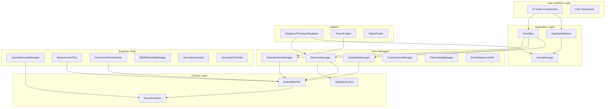
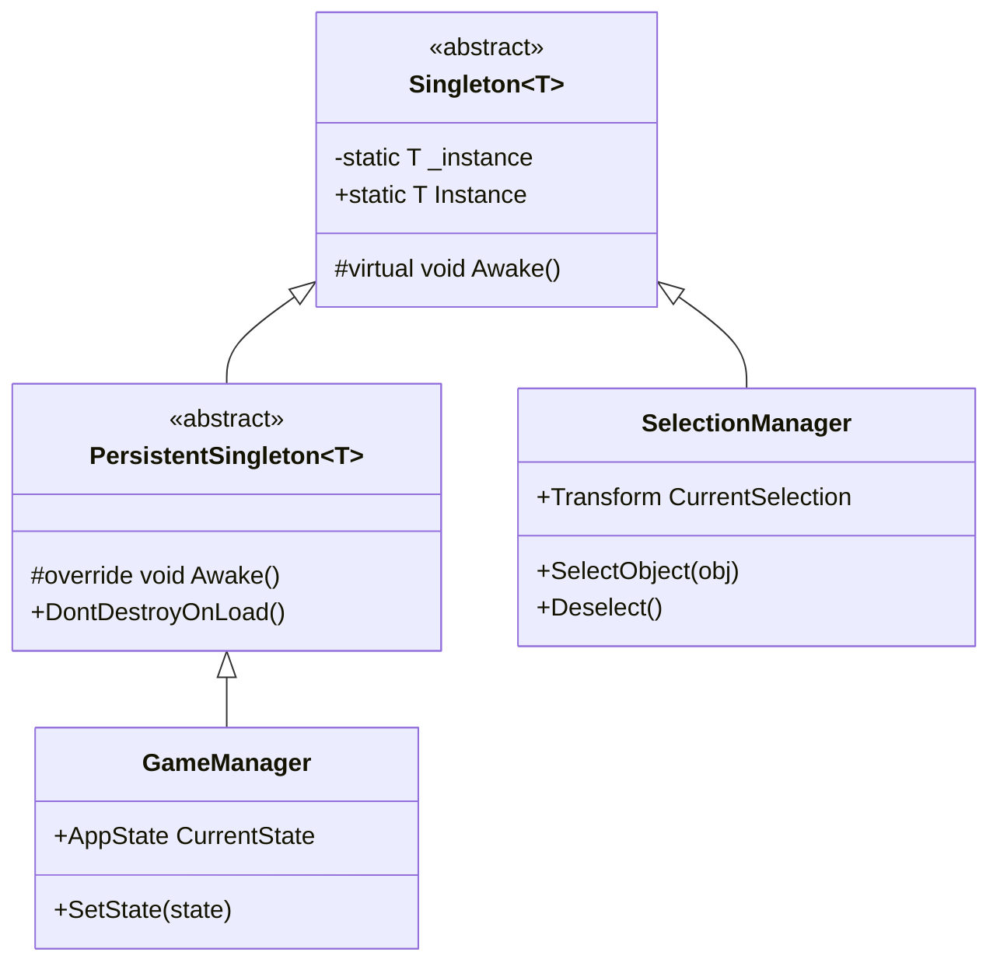
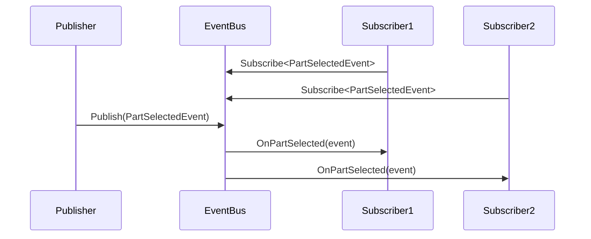
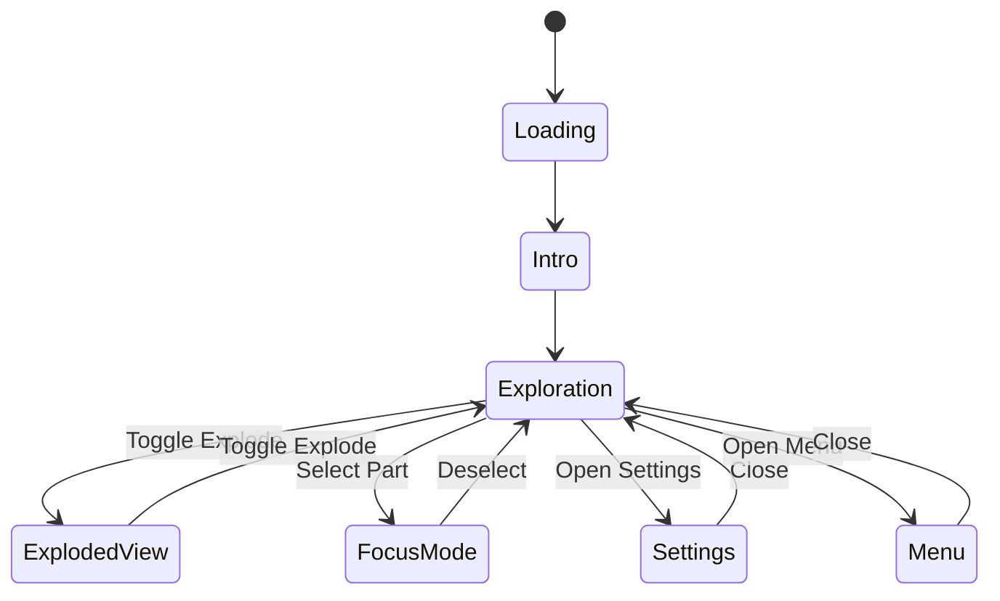
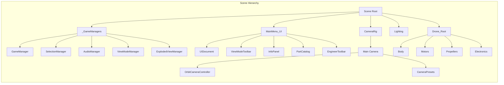
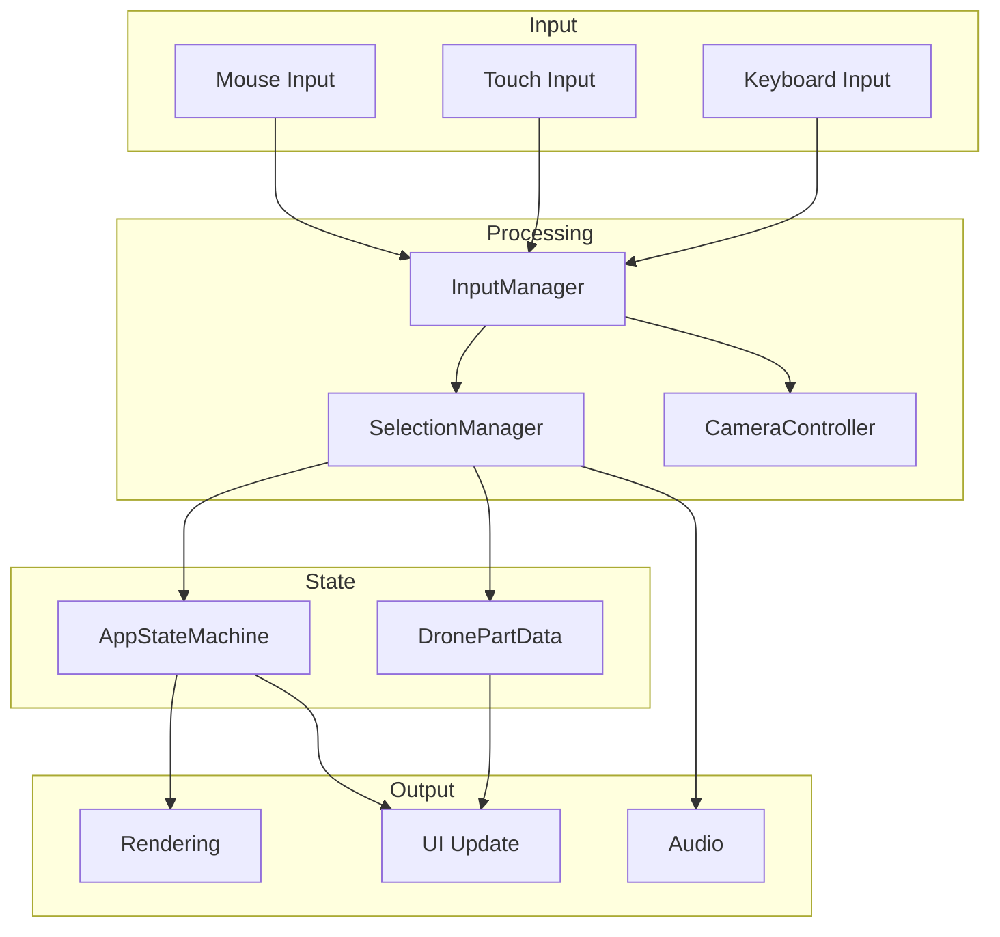
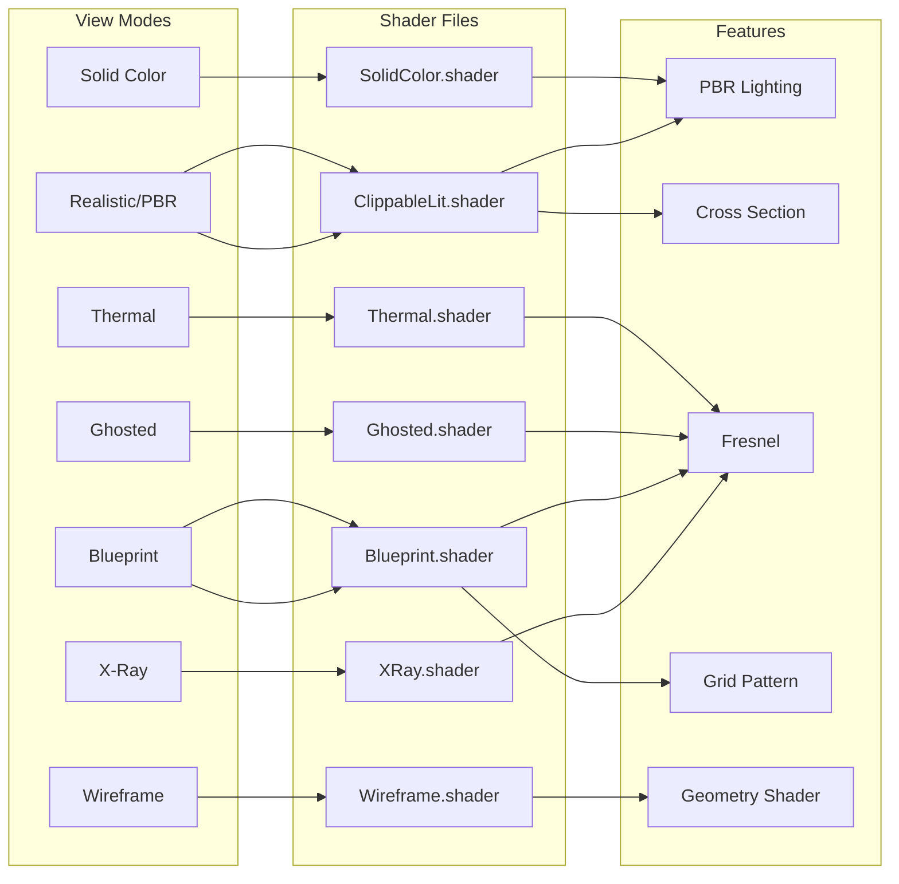
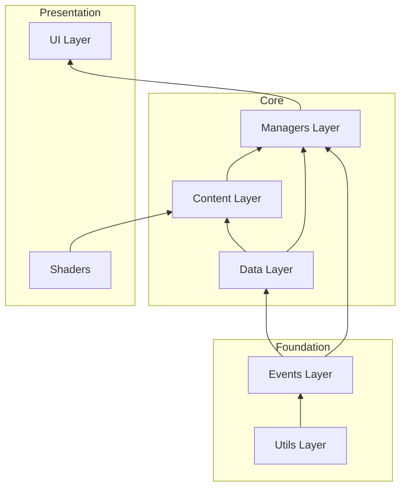

# WebGL Drone Viewer - System Architecture

This document describes the technical architecture of the WebGL Drone Viewer application.

## High-Level Architecture



## Design Patterns

### 1. Singleton Pattern



### 2. Event Bus Pattern



### 3. State Machine



## Component Hierarchy



## Data Flow



## Shader Pipeline



## Module Dependencies



## File Organization

```
Assets/
├── Scripts/
│   ├── Core/
│   │   ├── Content/        # Scene components (ExplodablePart, etc.)
│   │   ├── Data/           # ScriptableObjects
│   │   ├── Events/         # EventBus, event definitions
│   │   ├── Managers/       # Singleton managers
│   │   └── Utils/          # Helpers (Singleton, TweenEngine)
│   ├── UI/                 # UI Toolkit components
│   └── Tests/              # Unit tests
│       └── Editor/
├── Shaders/                # Custom HLSL shaders
├── UI/
│   └── Styles/             # USS stylesheets
└── Data/
    └── Parts/              # DronePartData assets
```

## Key Metrics

| Metric | Value |
|--------|-------|
| Total Scripts | 70+ |
| Lines of Code | ~10,000 |
| Managers | 18 |
| Shaders | 7 |
| View Modes | 7 |
| Engineer Tools | 6 |
| Unit Tests | 2 files |

## Technologies

- **Engine**: Unity 6.0 LTS
- **Render Pipeline**: Universal Render Pipeline (URP)
- **UI Framework**: UI Toolkit
- **Target**: WebGL 2.0 / WebAssembly
- **Language**: C# 11
- **Shader Language**: HLSL
