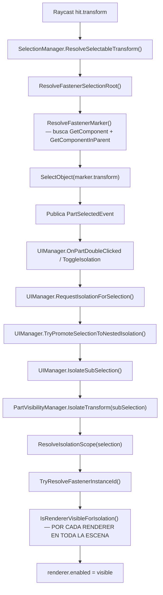

# Auditoría Técnica: Bug de Aislamiento de Fasteners por Instancia

## Contexto del Problema

El flujo esperado es: **seleccionar pieza madre → aislarla → seleccionar fastener dentro → aislar solo ese fastener → volver atrás por capas**. El bug: al aislar un fastener dentro de una pieza madre aislada, se muestran **múltiples fasteners** en vez de una sola instancia.

---

## 1. Trazado Completo del Pipeline (Click → Visibilidad Final)



---

## 2. Los 6 Puntos Exactos Donde Se Pierde Identidad por Instancia

### ❌ PUNTO 1: `RendererBelongsToAssociatedFastener` en full-part isolation (Línea 245-249, PartVisibilityManager)

```csharp
if (!string.IsNullOrWhiteSpace(selectedCanonicalPartId) &&
    RendererBelongsToAssociatedFastener(rendererTransform, selectedCanonicalPartId))
{
    return true;  // ← HACE VISIBLES *TODOS* los fasteners asociados a esa pieza madre
}
```

Cuando aislas la pieza madre (`x500v2_arm_FL`), el paso `IsolateTransform` calcula:
- `isFastenerIsolation = false` (no es fastener)
- `includeAssociatedFasteners = true` (es full part isolation)
- `selectedCanonicalPartId = "x500v2_arm_FL"`

Resultado: **todos** los renderers con `ParentCanonicalPartId == "x500v2_arm_FL"` quedan visibles. Esto es correcto para el nivel 1 de aislamiento (ver la pieza madre con sus fasteners).

**Pero cuando luego seleccionas un fastener individual y pides aislarlo**, el segundo `IsolateTransform` debería aislar solo ese. Aquí viene el bug.

### ❌ PUNTO 2: `GetComponentInParent<FastenerRuntimeMarker>` contamina la resolución (Líneas 261-265, PartVisibilityManager)

```csharp
FastenerRuntimeMarker rendererMarker = rendererTransform.GetComponent<FastenerRuntimeMarker>();
if (rendererMarker == null)
{
    rendererMarker = rendererTransform.GetComponentInParent<FastenerRuntimeMarker>();
}
```

Esto está en `RendererBelongsToFastenerInstance()`. Si el renderer reparentado está bajo un transform que tiene un `FastenerRuntimeMarker` padre, el `GetComponentInParent` puede resolver el marker **de otro fastener vecino** que tenga el marker en un ancestro compartido.

**Escenario concreto**: ImportedDroneRuntimeBinder reparenta el renderer de `cap_screw_M25x10_000` bajo `x500v2_arm_FL`. Si la pieza `x500v2_arm_FL` tiene renderers de fasteners como hijos directos (porque fueron reparentados ahí), y el sel marker está en un ancestro compartido, el `GetComponentInParent` podría capturar markers incorrectos.

### ❌ PUNTO 3: `FastenerRuntimeMarker` tiene `[DisallowMultipleComponent]` pero `SealMarker` lo agrega donde ya puede existir (FastenerRegistry.cs:156-159)

```csharp
FastenerRuntimeMarker marker = target.GetComponent<FastenerRuntimeMarker>();
if (marker == null)
{
    marker = target.gameObject.AddComponent<FastenerRuntimeMarker>();
}
marker.Configure(...);  // ← Sobrescribe el marker existente con diferentes metadata
```

Si un renderer ya tiene un marker (del fastener original al que pertenece) y *luego* `SealInheritedFastenerMarker` o `ConfigureAnchor` llama a `SealMarker` con metadata diferente (del anchor padre), el marker **se sobreescribe con metadata incorrecta**.

> [!CAUTION]
> `[DisallowMultipleComponent]` solo previene múltiples instancias del mismo componente en un GO. Si existe, `SealMarker` lo reutiliza y lo **sobreescribe**.  Esto puede hacer que un renderer de `cap_screw_000` termine con el instanceId del anchor padre, o viceversa.

### ❌ PUNTO 4: Reparenting rompe la relación `transform.IsChildOf(isolationScope)` (PartVisibilityManager.cs:233-237)

```csharp
if (rendererTransform == isolationScope ||
    rendererTransform.IsChildOf(isolationScope))
{
    return true;
}
```

Después de `ImportedDroneRuntimeBinder.ReparentNestedOrphansByType()`, los renderers de fasteners ya no son hijos del transform del marker original. Un fastener cuyo marker original está en `x500v2_fastener_group/x500v2_fastener.cap_screw_M25x10_000` pero cuyo renderer visible fue reparentado a `x500v2_arm_FL/...` **fallará este check jerárquico**.

La aislamiento del fastener individual depende entonces **completamente** del fallback por `RendererBelongsToFastenerInstance()`, que a su vez depende de que el marker del renderer visible tenga el `fastenerInstanceId` correcto. Si el marker fue sobreescrito por el Punto 3, esto falla.

### ❌ PUNTO 5: `RendererBelongsToAssociatedFastener` usa `ParentCanonicalPartId` — incluye *todos* los siblings (PartVisibilityManager.cs:271-287)

Cuando aislas un fastener individual, el código calcula:
- `isFastenerIsolation = true`
- `includeAssociatedFasteners = false`

Entonces el check de `selectedCanonicalPartId` **no debería activarse**. Sin embargo, el Punto 2 (GetComponentInParent) puede hacer que el `fastenerInstanceId` del renderer apunte al de un ancestro compartido, haciendo match con *múltiples* renderers que heredan ese mismo marker.

### ❌ PUNTO 6: `FastenerInspectionManager.CollectIsolatedFasteners` usa `parentCanonicalPartId` del isolation scope

```csharp
// FastenerInspectionManager.cs:136-152
string parentCanonicalPartId = ResolveCanonicalPartId(isolatedTransform);
if (!string.IsNullOrWhiteSpace(parentCanonicalPartId) &&
    !fastenersByParentCanonical.TryGetValue(parentCanonicalPartId, out List<Transform> associatedFasteners))
{
    return;
}

for (int i = 0; i < associatedFasteners.Count; i++)
{
    targets.Add(fastenerRoot);  // ← Agrega TODOS los fasteners de esa pieza madre
}
```

Cuando el isolation scope es una pieza madre, esto crea detail visuals para **todos** los fasteners asociados, reforzando la percepción visual del bug.

---

## 3. Evaluación: ¿Es `Renderer.enabled` Suficiente?

> [!IMPORTANT]
> **`Renderer.enabled` ES suficiente si y solo si cada instancia de fastener tiene su propio GameObject con su propio Renderer.** Ese es actualmente el caso en esta arquitectura — el JSON muestra que cada fastener tiene su propio `sceneObjectName` que corresponde a un GO independiente.

El problema **no es batching/mesh-grouping de múltiples instancias en un solo Renderer**. El catálogo muestra 4040 líneas con ~160 instancias, cada una con su propio `sceneObjectName` y `hierarchyPath` apuntando a un GO independiente bajo `x500v2_fastener_group`.

**El problema real es una cadena de fallos en la resolución de identidad:**
1. El reparenting mueve renderers desde su GO original hacia la pieza madre
2. `SealMarker` sobreescribe markers o les añade metadata incorrecta
3. `GetComponentInParent` captura markers de ancestros/vecinos
4. La composición de estos errores hace que `RendererBelongsToFastenerInstance()` haga match con renderers que no pertenecen al fastener seleccionado

---

## 4. Propuestas de Solución (3 Tiers)

### Tier 1: Mínima Invasiva — Fix del Sellado y Resolución de Markers

**Problema raíz inmediato**: `SealMarker` y `GetComponentInParent` sobreescriben/resuelven markers incorrectos.

#### Cambios:

##### [MODIFY] [FastenerRegistry.cs](file:///e:/WebGL_tesis/desarrollo/unity_project/Assets/Scripts/Core/Managers/FastenerRegistry.cs)

```diff
 public void SealMarker(Transform target, FastenerMetadata metadata)
 {
     if (target == null || metadata == null) return;

     FastenerRuntimeMarker marker = target.GetComponent<FastenerRuntimeMarker>();
+    // NEVER overwrite an existing marker that already has a valid instanceId
+    // unless we're sealing with the SAME instanceId. This prevents the ancestor
+    // anchor's metadata from clobbering a child renderer's own identity.
+    if (marker != null && !string.IsNullOrWhiteSpace(marker.FastenerInstanceId)
+        && !string.IsNullOrWhiteSpace(metadata.instanceId)
+        && !string.Equals(marker.FastenerInstanceId, metadata.instanceId, StringComparison.OrdinalIgnoreCase))
+    {
+        return; // Preserve existing identity
+    }
     if (marker == null)
     {
         marker = target.gameObject.AddComponent<FastenerRuntimeMarker>();
     }
     marker.Configure(...);
 }
```

##### [MODIFY] [PartVisibilityManager.cs](file:///e:/WebGL_tesis/desarrollo/unity_project/Assets/Scripts/Core/Managers/PartVisibilityManager.cs)

```diff
 private static bool RendererBelongsToFastenerInstance(Transform rendererTransform, string fastenerInstanceId)
 {
-    FastenerRuntimeMarker rendererMarker = rendererTransform.GetComponent<FastenerRuntimeMarker>();
-    if (rendererMarker == null)
-    {
-        rendererMarker = rendererTransform.GetComponentInParent<FastenerRuntimeMarker>();
-    }
+    // ONLY use GetComponent — never GetComponentInParent.
+    // Ancestor markers belong to SIBLING fasteners and cause multi-instance leaks.
+    FastenerRuntimeMarker rendererMarker = rendererTransform.GetComponent<FastenerRuntimeMarker>();

     return rendererMarker != null &&
            string.Equals(rendererMarker.FastenerInstanceId, fastenerInstanceId, StringComparison.OrdinalIgnoreCase);
 }
```

Mismo cambio para `RendererBelongsToAssociatedFastener` (ambas sobrecargas) — eliminar `GetComponentInParent`.

##### [MODIFY] [SelectionManager.cs](file:///e:/WebGL_tesis/desarrollo/unity_project/Assets/Scripts/Core/Managers/SelectionManager.cs)

```diff
 private static FastenerRuntimeMarker ResolveFastenerMarker(Transform target)
 {
     if (target == null) return null;

     FastenerRuntimeMarker marker = target.GetComponent<FastenerRuntimeMarker>();
     if (marker != null) return marker;

-    marker = target.GetComponentInParent<FastenerRuntimeMarker>();
-    if (marker != null) return marker;
+    // Walk parents manually, but STOP at the first ExplodablePart boundary.
+    // This prevents capturing a sibling fastener's marker on a shared ancestor.
+    Transform current = target.parent;
+    while (current != null)
+    {
+        if (current.GetComponent<ExplodablePart>() != null) break; // boundary
+        marker = current.GetComponent<FastenerRuntimeMarker>();
+        if (marker != null) return marker;
+        current = current.parent;
+    }

     return null;
 }
```

**Impacto estimado**: Soluciona el caso principal. ~30 líneas de cambio.

---

### Tier 2: Intermedia — Índice `Renderer → instanceId` como fuente de verdad

Crear un reverse-index en `FastenerRegistry` que mapee `Renderer` → `instanceId` de forma explícita, construido una sola vez después de que el binder termine.

##### [MODIFY] [FastenerRegistry.cs](file:///e:/WebGL_tesis/desarrollo/unity_project/Assets/Scripts/Core/Managers/FastenerRegistry.cs)

```csharp
// Nuevo reverse-index
private readonly Dictionary<Renderer, string> rendererToInstanceId = 
    new Dictionary<Renderer, string>();

public void RegisterRendererForInstance(Renderer renderer, string instanceId)
{
    if (renderer != null && !string.IsNullOrWhiteSpace(instanceId))
    {
        rendererToInstanceId[renderer] = instanceId;
    }
}

public bool TryGetInstanceIdForRenderer(Renderer renderer, out string instanceId)
{
    instanceId = null;
    return renderer != null && rendererToInstanceId.TryGetValue(renderer, out instanceId);
}

public bool IsRendererMultiInstance(Renderer renderer)
{
    // Check if multiple instanceIds map to the same renderer
    // (would indicate a shared mesh problem)
    return false; // For now — implement if needed
}
```

##### [MODIFY] [ImportedDroneRuntimeBinder.cs](file:///e:/WebGL_tesis/desarrollo/unity_project/Assets/Scripts/Core/Utils/ImportedDroneRuntimeBinder.cs)

Después del binding, registrar cada renderer visible:

```csharp
// In ConfigureAnchor, after sealing:
if (registry != null && visibleFastenerMetadata != null)
{
    registry.RegisterRendererForInstance(renderer, visibleFastenerMetadata.instanceId);
}
```

##### [MODIFY] [PartVisibilityManager.cs](file:///e:/WebGL_tesis/desarrollo/unity_project/Assets/Scripts/Core/Managers/PartVisibilityManager.cs)

```csharp
private static bool RendererBelongsToFastenerInstance(Transform rendererTransform, string fastenerInstanceId)
{
    // PRIMARY: Use registry reverse-index (most reliable)
    Renderer renderer = rendererTransform.GetComponent<Renderer>();
    if (renderer != null && FastenerRegistry.Instance != null)
    {
        if (FastenerRegistry.Instance.TryGetInstanceIdForRenderer(renderer, out string registeredId))
        {
            return string.Equals(registeredId, fastenerInstanceId, StringComparison.OrdinalIgnoreCase);
        }
    }
    
    // FALLBACK: Direct marker on this transform only
    FastenerRuntimeMarker marker = rendererTransform.GetComponent<FastenerRuntimeMarker>();
    return marker != null && string.Equals(marker.FastenerInstanceId, fastenerInstanceId, StringComparison.OrdinalIgnoreCase);
}
```

**Impacto estimado**: Soluciona incluso los edge cases. ~60 líneas de cambio.

---

### Tier 3: Ideal/Arquitectónica — `IsolationStack` Formal

Implementar el patrón de `IsolationStack` del documento de Perplexity. Cada nivel de aislamiento es un `IsolationContext` inmutable. `PartVisibilityManager` calcula la visibilidad final como la **intersección** del stack completo.

```csharp
public sealed class IsolationContext
{
    public string Id;
    public HashSet<string> VisibleInstanceIds;  // instanceIds + partIds
    public IsolationMode Mode;
    
    public static IsolationContext ForFullPart(ExplodablePart part, FastenerRegistry registry) { ... }
    public static IsolationContext ForFastenerInstance(string instanceId) { ... }
}

public sealed class IsolationStack
{
    private readonly Stack<IsolationContext> _stack = new();
    
    public void Push(IsolationContext ctx) { _stack.Push(ctx); NotifyChanged(); }
    public IsolationContext Pop() { var ctx = _stack.Pop(); NotifyChanged(); return ctx; }
    public int Depth => _stack.Count;
    
    public HashSet<string> ComputeVisibleSet()
    {
        if (_stack.Count == 0) return null; // all visible
        return _stack.Peek().VisibleInstanceIds; // top of stack wins
    }
    
    public event Action OnStackChanged;
}
```

`PartVisibilityManager.ApplyVisibility()` sería stateless: lee el top del stack y aplica.

**Beneficios**: Eliminación completa de la duplicación de estado entre UIManager y PartVisibilityManager. La lógica de "volver atrás" es trivial (`Pop()`). No hay posibilidad de inconsistencia.

**Impacto estimado**: ~200 líneas nuevas + refactor de UIManager isolation state. Significativo pero clean.

---

## 5. Estrategia de Debugging Concreta

### Logs a Añadir (activar con `EnableDebugLogs = true`)

#### En `SelectionManager.SelectObject()`:
```csharp
Debug.Log($"[SelectionManager] SelectObject: sel={selection.name} fullSel={fullSelection?.name} " +
    $"isSub={!isFullPartSelection} " +
    $"marker={(ResolveFastenerMarker(selection)?.FastenerInstanceId ?? "NONE")} " +
    $"rawHov={hoveredRawTransform?.name}");
```

#### En `PartVisibilityManager.IsolateTransform()`:
```csharp
Debug.Log($"[PVM.IsolateTransform] selection={selection.name} " +
    $"isolationScope={isolationScope?.name} " +
    $"isFastener={isFastenerIsolation} " +
    $"fastenerInstanceId={isolatedFastenerInstanceId} " +
    $"includeAssociatedFasteners={includeAssociatedFasteners} " +
    $"selectedCanonicalPartId={selectedCanonicalPartId}");
```

#### En `IsRendererVisibleForIsolation()`:
```csharp
// Activar solo en modo debug — agrega un counter
int visibleCount = 0;
foreach (var p in allParts)
{
    foreach (var renderer in p.GetComponentsInChildren<Renderer>(true))
    {
        bool visible = IsRendererVisibleForIsolation(...);
        if (visible)
        {
            visibleCount++;
            Debug.Log($"[PVM.VISIBLE] renderer={renderer.name} " +
                $"GO={renderer.gameObject.name} " +
                $"markerOnRenderer={renderer.GetComponent<FastenerRuntimeMarker>()?.FastenerInstanceId ?? "NONE"} " +
                $"markerOnParent={renderer.GetComponentInParent<FastenerRuntimeMarker>()?.FastenerInstanceId ?? "NONE"} " +
                $"isChildOfScope={renderer.transform.IsChildOf(isolationScope)}");
        }
    }
}
Debug.Log($"[PVM.IsolateTransform] Total visible renderers: {visibleCount}");
```

### Invariantes a Validar (Debug Assertions)

```csharp
// En ImportedDroneRuntimeBinder, después del binding completo:
void ValidateFastenerIdentityInvariants()
{
    var allMarkers = FindObjectsByType<FastenerRuntimeMarker>(FindObjectsSortMode.None);
    var idToMarkerCount = new Dictionary<string, int>();
    
    foreach (var marker in allMarkers)
    {
        if (string.IsNullOrWhiteSpace(marker.FastenerInstanceId)) continue;
        
        if (!idToMarkerCount.ContainsKey(marker.FastenerInstanceId))
            idToMarkerCount[marker.FastenerInstanceId] = 0;
        idToMarkerCount[marker.FastenerInstanceId]++;
    }
    
    foreach (var kvp in idToMarkerCount)
    {
        if (kvp.Value > 1)
        {
            Debug.LogError($"[INVARIANT VIOLATION] instanceId '{kvp.Key}' appears on {kvp.Value} markers!");
        }
    }
}

// En PartVisibilityManager — después de aplicar isolation:
void ValidateIsolationResult(string expectedInstanceId)
{
    int visibleFastenerRenderers = 0;
    HashSet<string> visibleInstanceIds = new HashSet<string>();
    
    foreach (var p in allParts)
    {
        foreach (var r in p.GetComponentsInChildren<Renderer>(true))
        {
            if (!r.enabled) continue;
            var marker = r.GetComponent<FastenerRuntimeMarker>();
            if (marker != null && !string.IsNullOrWhiteSpace(marker.FastenerInstanceId))
            {
                visibleFastenerRenderers++;
                visibleInstanceIds.Add(marker.FastenerInstanceId);
            }
        }
    }
    
    if (!string.IsNullOrWhiteSpace(expectedInstanceId) && visibleInstanceIds.Count > 1)
    {
        Debug.LogError($"[ISOLATION BUG] Expected 1 fastener instance, got {visibleInstanceIds.Count}: " +
            $"{string.Join(", ", visibleInstanceIds)}");
    }
}
```

---

## 6. Detección de Batching / Mesh Grouping

> [!NOTE]
> Basado en el catálogo JSON (4040 líneas, ~160 instancias, cada una con `sceneObjectName` único y `hierarchyPath` propio), **NO sospecho batching de múltiples instancias en un solo Renderer**. Cada fastener tiene su propio `GameObject`.

### Cómo Confirmarlo Definitivamente:

```csharp
void DiagnoseMeshSharing()
{
    var renderers = FindObjectsByType<Renderer>(FindObjectsSortMode.None);
    var meshToRenderers = new Dictionary<Mesh, List<string>>();
    
    foreach (var r in renderers)
    {
        var mf = r.GetComponent<MeshFilter>();
        if (mf == null || mf.sharedMesh == null) continue;
        
        if (!meshToRenderers.ContainsKey(mf.sharedMesh))
            meshToRenderers[mf.sharedMesh] = new List<string>();
        meshToRenderers[mf.sharedMesh].Add(r.gameObject.name);
    }
    
    // Renderers sharing the SAME Mesh instance are fine IF each has its own Renderer.
    // This is normal GPU instancing behavior — not a problem for Renderer.enabled isolation.
    // The problem would be if MULTIPLE instance-identity fasteners map to ONE Renderer object.
    
    foreach (var kvp in meshToRenderers)
    {
        if (kvp.Value.Count > 1)
        {
            Debug.Log($"[MeshSharing] Mesh '{kvp.Key.name}' ({kvp.Key.vertexCount}v) " +
                $"shared by {kvp.Value.Count} renderers: {string.Join(", ", kvp.Value.Take(5))}...");
        }
    }
}
```

Si confirmas que cada instancia tiene su propio Renderer, el problema es **puramente de resolución de identidad**, no de mesh grouping. En ese caso, **Tier 1 es suficiente**.

---

## 7. Resumen de Cambios por Archivo

| Archivo | Cambio | Tier |
|---------|--------|------|
| [FastenerRegistry.cs](file:///e:/WebGL_tesis/desarrollo/unity_project/Assets/Scripts/Core/Managers/FastenerRegistry.cs) | Proteger `SealMarker` contra sobreescritura de instanceId existente | 1 |
| [PartVisibilityManager.cs](file:///e:/WebGL_tesis/desarrollo/unity_project/Assets/Scripts/Core/Managers/PartVisibilityManager.cs) | Eliminar `GetComponentInParent` en `RendererBelongsToFastenerInstance` y `RendererBelongsToAssociatedFastener` | 1 |
| [SelectionManager.cs](file:///e:/WebGL_tesis/desarrollo/unity_project/Assets/Scripts/Core/Managers/SelectionManager.cs) | Limitar `ResolveFastenerMarker` para que no cruce boundaries de ExplodablePart | 1 |
| [FastenerRegistry.cs](file:///e:/WebGL_tesis/desarrollo/unity_project/Assets/Scripts/Core/Managers/FastenerRegistry.cs) | Agregar reverse-index `Renderer → instanceId` | 2 |
| [ImportedDroneRuntimeBinder.cs](file:///e:/WebGL_tesis/desarrollo/unity_project/Assets/Scripts/Core/Utils/ImportedDroneRuntimeBinder.cs) | Registrar renderers en el reverse-index después del binding | 2 |
| [UIManager.cs](file:///e:/WebGL_tesis/desarrollo/unity_project/Assets/Scripts/UI/UIManager.cs) | Sin cambios en Tier 1-2 (UIManager delega correctamente a PartVisibilityManager) | - |

---

## User Review Required

> [!IMPORTANT]
> **¿Quieres que implemente Tier 1 ahora?** Es la solución mínima invasiva: 3 archivos, ~30 líneas de cambio, soluciona el caso principal.

> [!WARNING]
> El Tier 1 asume que cada instancia de fastener tiene su propio `Renderer` en un `GameObject` separado. Si la validación de mesh sharing revela instancias que comparten `Renderer`, necesitaríamos Tier 2 o una estrategia de detail-visual (el `FastenerInspectionManager` ya la tiene parcialmente implementada).

## Verification Plan

### Automated Tests
1. Agregar los logs de debugging en `PartVisibilityManager.IsolateTransform`
2. Ejecutar el invariant check `ValidateFastenerIdentityInvariants()` al final de `BindRuntime()`
3. Reproducir el flujo: aislar `x500v2_arm_FL` → click en un cap_screw → aislar → contar renderers visibles

### Manual Verification
1. En el build WebGL de desarrollo, confirmar que al aislar un fastener individual solo se ve 1 renderer
2. Confirmar que "volver atrás" restaura la vista correcta de la pieza madre con todos sus fasteners
3. Probar con diferentes familias de fasteners (cap_screw, nut, standoff)
