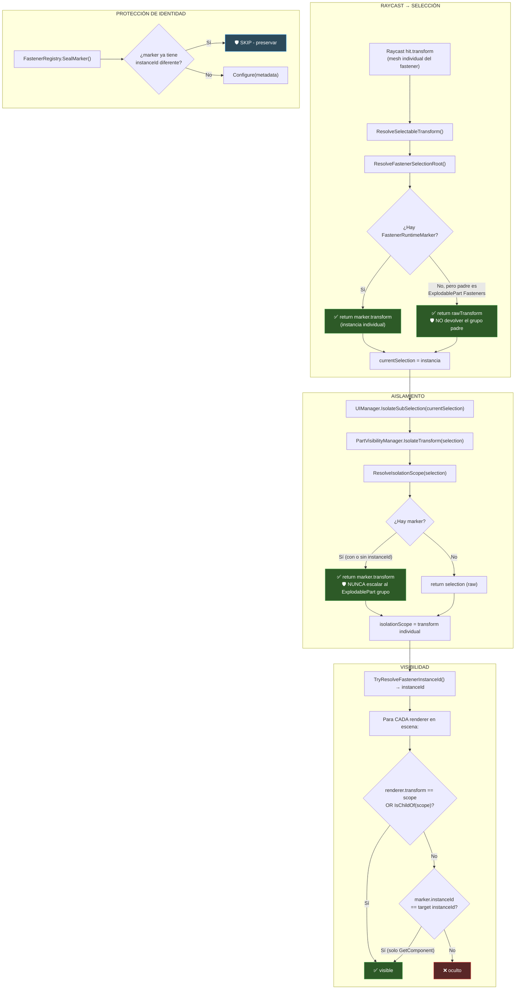

# Walkthrough: Fastener Isolation Bug — Fix Completo

## Resumen

El Tier 1 original (protección de `SealMarker` + eliminación de `GetComponentInParent`) **no fue suficiente**. La auditoría encontró 2 bugs adicionales más profundos que causaban el aislamiento grupal:

### Root Cause Real (descubierta en round 2)

> [!CAUTION]
> El bug principal NO era contaminación de markers. Era **escalamiento a grupo** en dos puntos:
> 1. `PartVisibilityManager.ResolveIsolationScope()` escalaba al `ExplodablePart` con categoría `Fasteners` cuando el marker no tenía `instanceId`, haciendo que `IsChildOf(isolationScope)` matcheara TODOS los siblings.
> 2. `SelectionManager.ResolveFastenerSelectionRoot()` devolvía el `ExplodablePart` grupo como selection root, colapsando la identidad individual.

---

## Diagrama: Pipeline Corregido (Versión Final)



---

## Todos los Cambios Aplicados (6 archivos)

### Round 1 (Tier 1 — insuficiente solo):
| Archivo | Cambio |
|---------|--------|
| **FastenerRegistry.cs** | `SealMarker()` protege instanceIds existentes |
| **PartVisibilityManager.cs** | `GetComponentInParent` → `GetComponent` en `RendererBelongsToFastenerInstance` y `RendererBelongsToAssociatedFastener` (x3 overloads) |
| **PartVisibilityManager.cs** | `ResolveFastenerMarker` → boundary-aware walk |
| **SelectionManager.cs** | `ResolveFastenerMarker` → boundary-aware walk |
| **FastenerInspectionManager.cs** | `ResolveFastenerMarker` → boundary-aware walk |
| **ImportedDroneRuntimeBinder.cs** | `ValidateFastenerIdentityInvariants()` post-binding |

### Round 2 (Root cause real):
| Archivo | Cambio |
|---------|--------|
| **PartVisibilityManager.cs** | `ResolveIsolationScope` — eliminado el fallback que escalaba al `ExplodablePart` grupo |
| **SelectionManager.cs** | `ResolveFastenerSelectionRoot` — devuelve `rawTransform` en vez del grupo padre |
| **SelectionManager.cs** | Restaurado `IsFastenerPart` helper |
| **UIManager.cs** | `ResolveFastenerMarker` — boundary-aware walk (se había olvidado en round 1) |

### Diffs

render_diffs(file:///e:/WebGL_tesis/desarrollo/unity_project/Assets/Scripts/Core/Managers/FastenerRegistry.cs)

render_diffs(file:///e:/WebGL_tesis/desarrollo/unity_project/Assets/Scripts/Core/Managers/PartVisibilityManager.cs)

render_diffs(file:///e:/WebGL_tesis/desarrollo/unity_project/Assets/Scripts/Core/Managers/SelectionManager.cs)

render_diffs(file:///e:/WebGL_tesis/desarrollo/unity_project/Assets/Scripts/UI/UIManager.cs)

render_diffs(file:///e:/WebGL_tesis/desarrollo/unity_project/Assets/Scripts/Core/Managers/FastenerInspectionManager.cs)

render_diffs(file:///e:/WebGL_tesis/desarrollo/unity_project/Assets/Scripts/Core/Utils/ImportedDroneRuntimeBinder.cs)

---

## Verificación

### En Unity Console al arrancar:
```
[FastenerIdentity] All N fastener instanceIds are unique. Identity invariant OK.
```

### Test funcional:
1. Seleccionar `x500v2_arm_FL` → doble click → aislar → **pieza + fasteners visibles**
2. Click en un cap_screw individual → doble click → aislar
3. **Resultado esperado**: **solo 1 fastener** visible
4. Doble click en background → restaurar pieza madre con todos sus fasteners
5. Doble click en background → restaurar vista completa

### Si aún hay problemas:
- El fastener clickeado puede no tener `FastenerRuntimeMarker` → el `ResolveFastenerMarker` boundary-aware no encontrará nada → el isolation scope será el `rawTransform` (el mesh GO) → `IsChildOf` no matcheará con otros fasteners → **debería funcionar** igualmente (aislará solo ese mesh GO).
- Si el mesh GO del fastener no tiene `Renderer` propio, el `IsolateTransform` caerá al fallback `IsolatePart` → verificar en consola si aparece `[PartVisibility] Isolated transform:` o el fallback.
