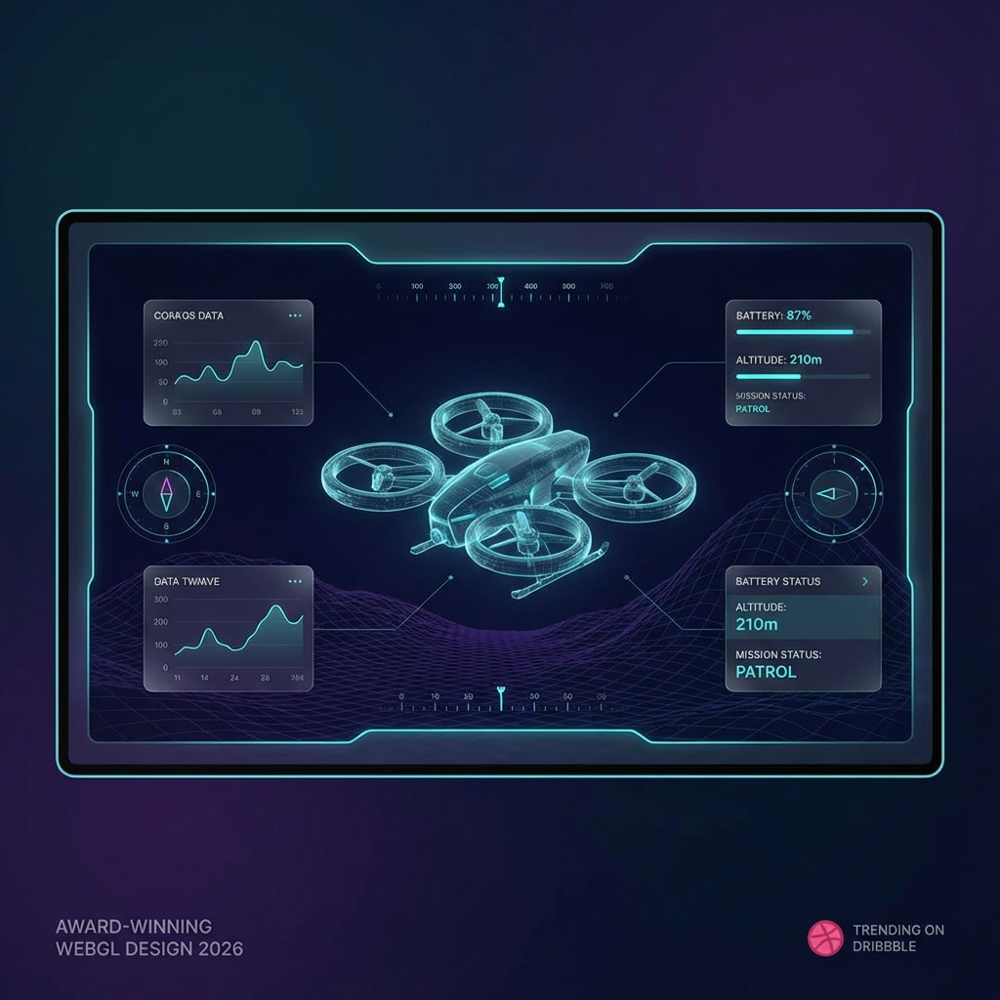
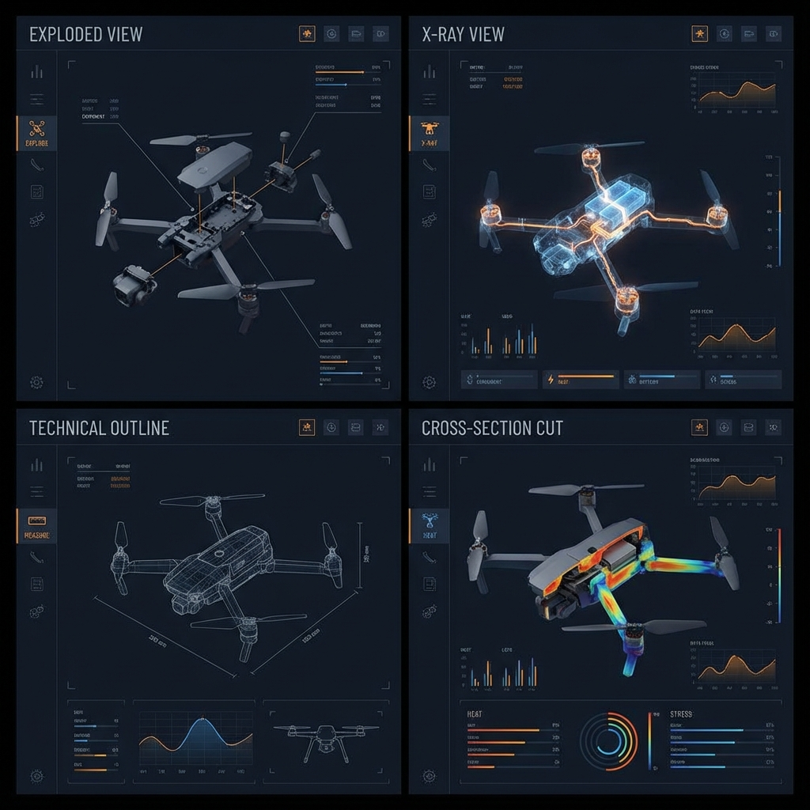
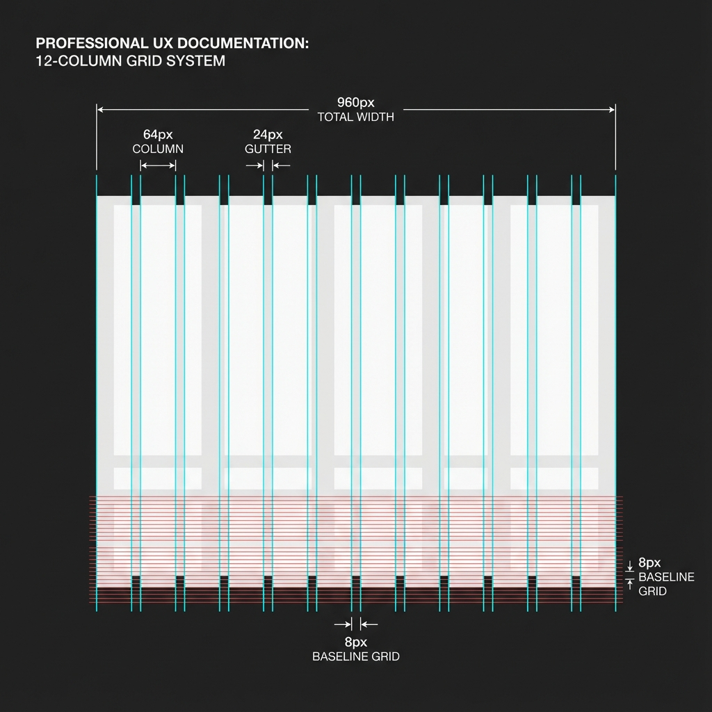
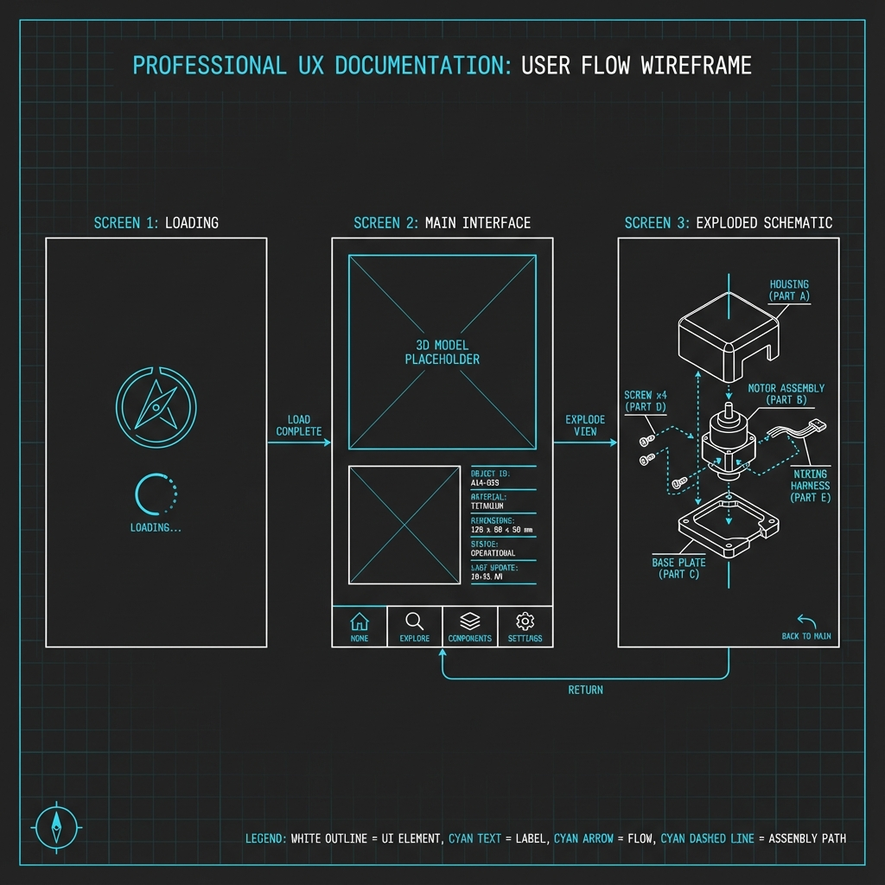
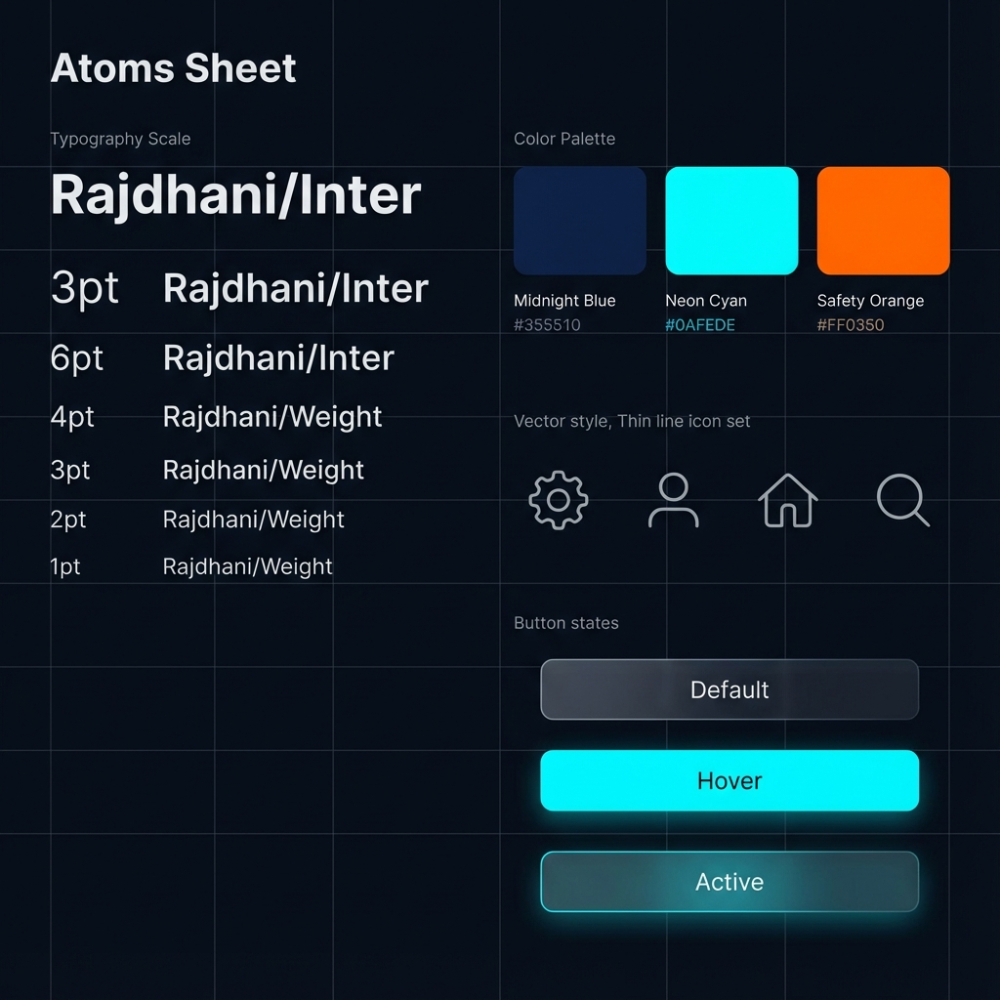

# 🎨 Estudio de Diseño UX/UI: "Aero-Glass 2026"

**Fecha:** 30 de Noviembre, 2025  
**Autor:** Alexander Woodcock Salomón  
**Proyecto:** Tesis de Ingeniería - Prototipo WebGL  
**Concepto:** "Spatial Technical Elegance"

---

## 1. Resumen Ejecutivo
Este documento define el lenguaje visual y la experiencia de usuario para el prototipo. Basado en las tendencias proyectadas para 2026 (Spatial UI, Bento Grids), el diseño busca un equilibrio entre **estética de premio** (Awwwards/FWA) y **funcionalidad de ingeniería**.

**Pilar Central:** La interfaz no debe competir con el modelo 3D, sino *envolverlo*.

---

## 2. Tendencias de Diseño 2026 (Investigación)
El análisis de tendencias futuras indica un movimiento hacia interfaces "inmersivas" y "líquidas".

### 2.1. Spatial UI (Interfaz Espacial)
En lugar de pegar botones 2D planos sobre la pantalla, los elementos de UI (etiquetas, cotas) flotan en el espacio 3D y reaccionan a la cámara.
*   **Aplicación:** Las etiquetas de los componentes del drone estarán ancladas al objeto 3D (`World Space UI`), ocultándose dinámicamente cuando el objeto rota.

### 2.2. Bento Grids (Modularidad)
Popularizado por Apple y Linear, este layout organiza la información densa en "cajas" o módulos rectangulares auto-contenidos.
*   **Aplicación:** El panel de "Datos Técnicos" (derecha) usará un Bento Grid para mostrar: [Estado Motor] | [Batería] | [Dimensiones].

### 2.3. Glassmorphism 2.0 (Frosted Noise)
Evolución del vidrio esmerilado. No es solo transparente; tiene textura de ruido sutil y desenfoque dinámico de fondo.
*   **Aplicación:** Todos los paneles de control tendrán un fondo `rgba(10, 10, 20, 0.6)` con `backdrop-filter: blur(20px)`.

---

## 3. Sistema de Diseño (Design System)

### 3.1. Paleta de Colores "Midnight Neon"
Diseñada para pantallas OLED y alto contraste técnico.

| Color | Hex | Uso |
| :--- | :--- | :--- |
| **Deep Void** | `#050505` | Fondo General (Vignette) |
| **Glass Surface** | `rgba(255,255,255,0.05)` | Paneles UI |
| **Neon Cyan** | `#00F0FF` | Acción Principal / Hover / Energía |
| **Safety Orange** | `#FF4D00` | Alertas / Modo Rayos X / Calor |
| **Technical White** | `#E0E0E0` | Texto Principal |
| **Muted Grey** | `#606060` | Texto Secundario / Líneas de Grid |

### 3.2. Tipografía
Combinación de legibilidad y carácter técnico.

*   **Títulos / Datos (Display):** `Rajdhani` (Google Fonts). Geométrica, cuadrada, futurista.
    *   *Uso:* Encabezados H1-H3, Números de telemetría.
*   **Cuerpo (Body):** `Inter` o `Satoshi`. Limpia, neutral, altamente legible en tamaños pequeños.
    *   *Uso:* Descripciones, párrafos, tooltips.

---

## 4. Conceptos Visuales (Generados por IA)

### 4.1. Vista Principal (Hero Shot)
*Concepto de la interfaz principal mostrando el drone en un entorno oscuro con paneles flotantes.*

### 4.2. Panel de Análisis Técnico (Bento Grid)
*Layout mostrando las capacidades de análisis: Vista Explosionada, Rayos X y Datos.*

---

## 5. Componentes de Interacción (UX)

### 5.1. La "Dock" de Control (Inferior)
Inspirada en macOS, una barra flotante central en la parte inferior.
*   **Botones:** Iconos minimalistas (SVG) con un "glow" sutil al pasar el mouse.
*   **Funciones:**
    1.  🔄 **Reset:** Volver a vista inicial.
    2.  💥 **Explode:** Slider para separar piezas.
    3.  💀 **X-Ray:** Toggle para ver interior.
    4.  📏 **Measure:** Activar modo de cotas.
    5.  ✂️ **Cut:** Activar plano de corte.

### 5.2. Micro-interacciones
*   **Hover:** Al pasar el mouse sobre una pieza del drone, esta se ilumina (Outline Shader) y aparece una etiqueta flotante.
*   **Click:** La cámara hace un zoom suave (`DOTween`) hacia la pieza seleccionada y el panel lateral muestra sus detalles.
*   **Sonido:** Clics mecánicos sutiles y sonidos de "aire" al mover sliders.

---

## 6. Diagramación y Arquitectura de Información

Para garantizar una implementación robusta, se ha definido una estructura base antes del diseño visual final.

### 6.1. Grid System (Retícula)
Se utiliza una retícula de **12 columnas** con gutters de 24px para asegurar alineación perfecta en pantallas de escritorio. Los módulos "Bento" se ajustan a esta rejilla.

### 6.2. Flujo de Usuario (Wireframe)
El flujo es lineal y simple: `Carga -> Exploración Libre -> Análisis Detallado`.

### 6.3. Átomos de Diseño (Componentes)
Definición de los elementos indivisibles del sistema: tipografía, paleta y estados de botones.

---

## 7. Visualización Final de Escritorio (Target)

*Nota: Esta visualización se generará una vez restablecida la cuota de la API de imagen, utilizando los parámetros de coherencia definidos.*

**Especificación de Diseño (Prompt):**
> "High-Fidelity Desktop UI Mockup. 1920x1080. Dark Mode (#1E1E1E background). Layout matches the 12-column grid previously defined. Left: 3D Viewport. Bottom: Dock with 5 icons (Reset, Explode, X-Ray, Measure, Cut). Right: Bento Grid Data Panel (3 modules: Status, Battery, Signal). Style: Glassmorphism 2.0, Neon Cyan borders, Rajdhani typography. Professional, coherent with previous diagrams."

---

## 8. Conclusión
Este diseño cumple con los requisitos de "Award Winning" al adoptar tendencias futuras (2026) sin sacrificar la claridad necesaria para una tesis de ingeniería. La combinación de **Glassmorphism**, **Tipografía Técnica** y **Visualización 3D de Alta Fidelidad** creará una experiencia memorable para los jurados.
