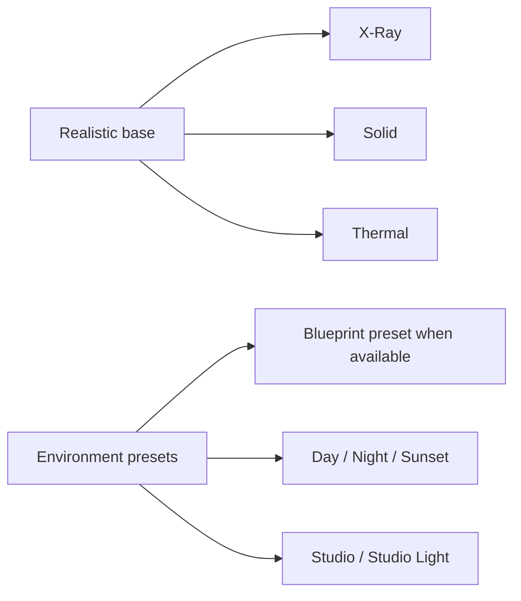
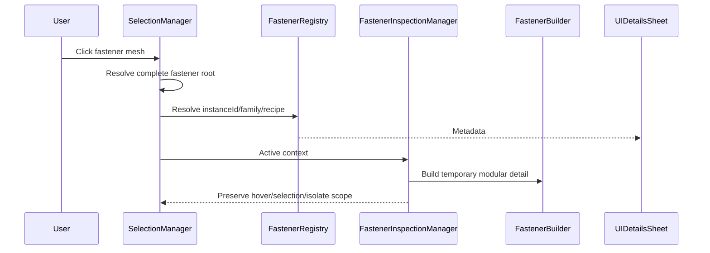
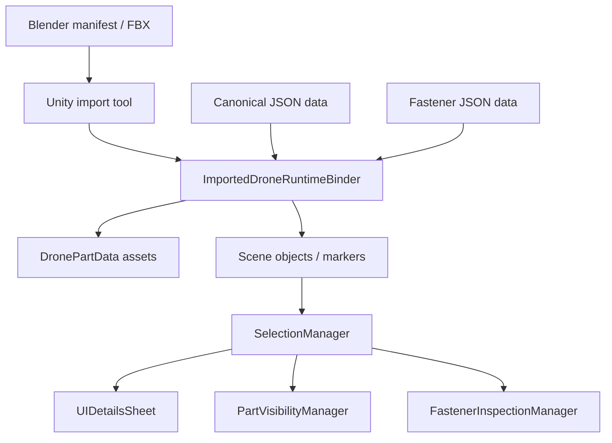

# WebGL Drone Viewer - System Architecture

This document describes the current architecture of the Holybro X500 V2 WebGL viewer. It intentionally separates visible product behavior from implemented-but-hidden or legacy systems.

## Scope Rule

The public app flow is:

```text
Hero -> Explore -> selection -> bottom sheet -> Inspect / Analyze / Studio
```

Any module outside that flow must be documented as hidden, legacy or future work unless the final UI exposes it.

## High-Level Architecture

```mermaid
graph TB
    subgraph "UI Layer"
        UXML["MainLayout.uxml"]
        USS["USS Styles"]
        DETAILS["UIDetailsSheet"]
        MODES["UIModeController"]
    end

    subgraph "Runtime Orchestration"
        UI["UIManager"]
        INPUT["InputManager"]
        STATE["AppStateMachine"]
    end

    subgraph "Scene Services"
        SEL["SelectionManager"]
        VIS["PartVisibilityManager"]
        EXP["ExplodedViewManager"]
        CUT["CrossSectionManager"]
        VIEW["ViewModeManager"]
        ENV["EnvironmentController"]
        HOT["HotspotManager"]
    end

    subgraph "Drone Systems"
        DRONE["DroneStateController"]
        THERMAL["ThermalSimulationManager"]
        THERMALVIEW["ThermalViewController"]
    end

    subgraph "Fastener Runtime"
        FREG["FastenerRegistry"]
        FINSP["FastenerInspectionManager"]
        FBUILD["FastenerBuilder"]
    end

    subgraph "Data"
        DPD["DronePartData"]
        PARTS["x500v2_parts_data.json"]
        FFAM["holybro_fastener_families.json"]
        FINST["holybro_fastener_instances.json"]
        FREC["holybro_fastener_reconciliation.json"]
        PARENT["holybro_parent_subpieces.json"]
    end

    subgraph "Import / Binding"
        FBX["x500v2_runtime_low_final.fbx"]
        BINDER["ImportedDroneRuntimeBinder"]
        IMPORTER["Tools > Import Final Runtime Drone Model"]
    end

    UXML --> UI
    USS --> UI
    UI --> DETAILS
    UI --> MODES
    UI --> INPUT
    UI --> STATE
    UI --> SEL
    UI --> VIS
    UI --> EXP
    UI --> CUT
    UI --> VIEW
    UI --> ENV
    UI --> HOT
    UI --> DRONE
    DRONE --> THERMAL
    THERMAL --> THERMALVIEW
    SEL --> DETAILS
    SEL --> FINSP
    FINSP --> FREG
    FINSP --> FBUILD
    PARTS --> DPD
    FFAM --> FREG
    FINST --> FREG
    FREC --> FREG
    PARENT --> DPD
    FBX --> IMPORTER
    IMPORTER --> BINDER
    BINDER --> SEL
    BINDER --> VIS
    BINDER --> EXP
    BINDER --> CUT
    BINDER --> VIEW
    BINDER --> FREG
    BINDER --> FINSP
```



## Visible Modes



Do not describe the UI as "7 public view modes." `Wireframe`, `Ghosted` and some Blueprint paths are implemented or legacy capabilities unless exposed in the current build.

## Functional Modules

| Module | Visible behavior |
|--------|------------------|
| `Inspect` | Pins, isolate, power, load. |
| `Analyze` | Explode, cross-section, category filters. |
| `Studio` | Visual modes, environment presets and lighting controls. |
| `Bottom sheet` | Identification, specifications, assembly, fastener metadata. |
| `Fasteners` | Proxy in rest state, modular detail under selection/isolate/context. |

## Fastener Architecture



Rules:

- Keep all fasteners lightweight in the resting scene.
- Replace only selected, isolated or context-relevant fasteners.
- Isolating a fastener must isolate the complete fastener, not a child mesh.
- Isolating a mother piece may include reconciled fasteners.
- Blender final modules should replace recipes/assets without changing `familyId` or `instanceId`.

## Blender-to-Unity Import

The final runtime model is not "instances only." The drone is formed by masters plus instances:

- `BAKE_MASTERS_LOW`
- `ASSEMBLY_INSTANCES_LOW`
- `PRIMITIVE_FASTENER_MASTERS`
- `PRIMITIVE_FASTENER_INSTANCES`

The Unity importer preserves the previous model under an inactive reference root, instantiates the final FBX as `x500v2_Drone`, normalizes propellers/fasteners and writes an import report for QA. The report must be used to verify hierarchy, instancing, group behavior, propeller axes and unresolved fastener parent candidates.

## Data Flow



## Thermal Scope

Thermal is a heuristic component-level visualization:

- Driven by `DroneStateController` load/state.
- Solved by `ThermalSimulationManager`.
- Rendered by `ThermalViewController` and shaders.
- Not FEA.
- Not calibrated thermography.

## Hidden Or Legacy Systems

| Category | Examples | Documentation rule |
|----------|----------|--------------------|
| Implemented but hidden | `MeasurementTool`, `Wireframe`, `Ghosted` | Mention only as hidden capacity. |
| Legacy/non-integrated | BOM, annotations, connection points, assembly checklist, old catalog UI | Keep as historical/future, not final flow. |
| Future/QA-dependent | Final Blender fastener meshes, measured KPIs, final texture compression decisions | Report only after import/build verification. |

## Key Metrics

Do not use hard-coded script counts, line counts, FPS or reduction percentages as final evidence here. The final report should use:

- Canonical counts from the report: `28` semantic parts, `30` scene anchors.
- Fastener data when applicable: `20` Unity baseline families, `168` Unity baseline instances, and Blender primitive counts only after manifest/import confirmation.
- Performance and usability values only after build freeze.

## Technologies

- Unity / URP / C#.
- WebGL 2.0 / WebAssembly target.
- UI Toolkit.
- Blender final runtime pipeline.
- External texture assets: BaseColor, Normal and packed Mask.
