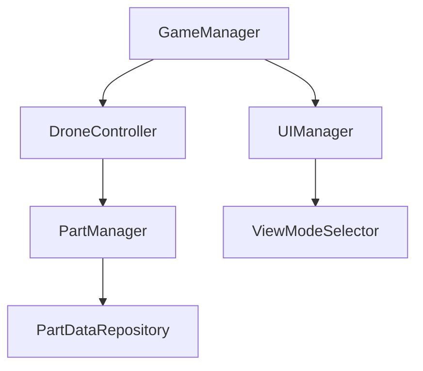

# Manual Técnico - WebGL Drone Viewer

## Stack Tecnológico

- **Motor**: Unity 6 (LTS)
- **Lenguaje**: C# (Scripting), HLSL (Shaders)
- **Plataforma**: WebGL 2.0 / WebAssembly
- **Frontend**: HTML5, CSS3, Vanilla JS

## Arquitectura del Proyecto

El proyecto sigue una **Clean Architecture** modificada para Unity:

### Capas Principales

1.  **Core**: Lógica de negocio pura (Stats, Data Models).
2.  **Infrastructure**: Implementación de repositorios y servicios externos.
3.  **Presentation (MonoBehaviours)**: Controladores de vista y componentes de Unity.

### Patrones de Diseño

- **Singleton**: Para Managers globales (`GameManager`, `UIManager`).
- **Observer**: Para el sistema de eventos (`EventBus`).
- **Factory**: Para la instanciación de piezas del dron.
- **Command**: Para el sistema de deshacer/rehacer acciones.

## Configuración de Build

Para compilar el proyecto en Unity:

1.  Abrir `Build Settings` (`Ctrl + Shift + B`).
2.  Seleccionar plataforma **WebGL**.
3.  Asegurarse de que `Code Optimization` esté en "Speed".
4.  Compresión: `Brotli` (o `Gzip` para iteración rápida).
5.  Dar clic en **Build And Run**.
